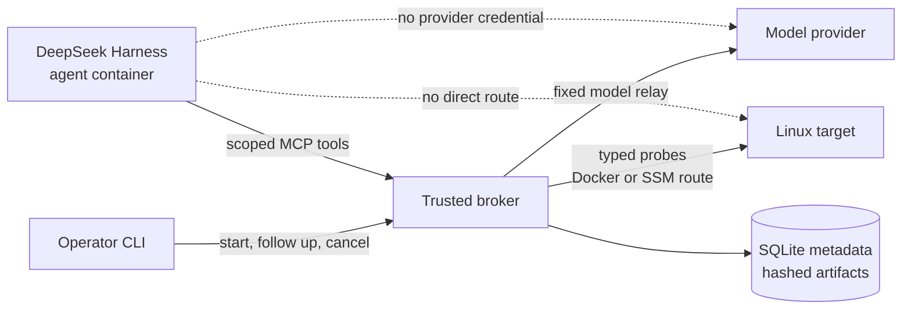

# Linux OnCall Agent

An evidence-driven Linux incident investigator that lets an AI agent adapt its diagnostic path without giving it a shell on the target.

I built Linux OnCall Agent to explore a practical systems question: how can an agent investigate a real Linux failure while the surrounding software still enforces authorization, time limits, output limits, and evidence quality? The result is a small end-to-end system for diagnosing CPU pressure, cgroup OOM events, filesystem exhaustion, and selected service failures on either a local Docker target or a disposable EC2 instance.

The agent chooses what to inspect and compares competing explanations. Trusted code decides what it may observe, performs typed read-only probes, stores the raw evidence, and checks that the final report cites measurements that actually exist. The current project diagnoses incidents; remediation remains an operator action.

## Choose a path

| If you want to… | Start here |
| --- | --- |
| Understand the whole system in ten minutes | [Architecture tour](docs/architecture-tour.md) |
| Run it on your laptop | [Local quick start](#local-quick-start) |
| Investigate a disposable EC2 target | [AWS fault lab](#aws-fault-lab) |
| Understand every probe and evidence type | [Capabilities and evidence](docs/capabilities-and-evidence.md) |
| Review the Python architecture and source map | [Python design](docs/python-design.md) |
| Review trust boundaries and failure handling | [Security and reliability](docs/security-and-reliability.md) |
| See how the MVP could become a hosted fleet service | [Production reference architecture](docs/production-architecture.md) |
| See measured checks and known gaps | [Requirements verification](docs/requirements-verification.md) |
| Browse every design document | [Documentation index](docs/README.md) |

## The big picture

The system separates reasoning from authority. DeepSeek Harness and the model run in an isolated agent container. They can request a fixed set of diagnostic capabilities from the broker, but they cannot reach the target, the model provider, or arbitrary network destinations directly.



- **CLI:** presents an incident session, progress, diagnoses, and report paths.
- **Agent runtime:** plans the investigation and chooses among approved tools.
- **Broker:** owns authorization, target identity, deadlines, budgets, evidence persistence, report validation, and the model relay.
- **Target probe service:** exposes six bounded Linux observations. There is no arbitrary command endpoint.
- **Evidence store:** keeps structured metadata in SQLite and larger raw payloads as content-addressed artifacts.

The target may be a Docker container on the same development machine or an EC2 host reached through an AWS Systems Manager tunnel. The trust model and agent-facing tools are the same in both cases.

## How an investigation works

1. The operator describes a symptom through `oncall`.
2. The broker creates a time-bounded investigation and gives the harness a scoped tool token.
3. The model selects a typed probe such as CPU sampling, process ranking, memory inspection, filesystem inspection, or bounded journal reading.
4. The broker checks scope and budget, then calls the target probe service.
5. The probe service reads approved Linux interfaces such as `/proc`, cgroup v2 files, `statvfs`, and selected journal units.
6. The broker records provenance, timing, quality, target identity, and a hash of the raw artifact.
7. The model updates competing hypotheses and submits a report whose factual claims cite evidence IDs.
8. The broker validates those citations and exports a Markdown report under `.local/reports/`.

Interactive follow-ups create child investigations in the same incident lineage. Earlier evidence is clearly marked as historical, while claims about current conditions require a fresh observation. See [Architecture](docs/architecture.md) for the full local and EC2 sequence diagrams.

## What it can investigate

| Area | Observations | Typical question |
| --- | --- | --- |
| CPU | Host utilization, cgroup quota and throttling, ranked processes | Is pressure host-wide or limited to one cgroup, and which process dominates? |
| Memory and OOM | Host memory, PSI, cgroup limits and events, bounded OOM journal evidence | Did this service experience a new cgroup OOM, or is the host under memory pressure? |
| Filesystems | Capacity, inodes, mount identity, and selected service journal entries | Which mount is constrained, and did the write fail with `ENOSPC`? |
| Service context | Bounded logs from an allowlist of units | Does the service log support or weaken the resource hypothesis? |
| Controls | Healthy and unavailable targets | Does the system preserve uncertainty when no fault exists or the target cannot be observed? |

Fault injection is a separate operator-only path. It uses leased workloads that expire automatically and can be stopped by an exact manifest. The model cannot invoke it.

## Local quick start

You need Python 3.12, [`uv`](https://docs.astral.sh/uv/), Docker Desktop, and Docker Compose. From the repository root:

```bash
uv sync --frozen --all-extras --dev
.venv/bin/python scripts/init_lab.py
docker compose build broker target agent
docker compose up -d --wait target broker
.venv/bin/oncall doctor
```

The default fixture provider needs no API key. It runs the real harness, MCP, sandbox, evidence, and report lifecycle with deterministic responses, which makes it useful for checking the plumbing.

To use a live model, copy `.env.example` to the ignored `.env` file and set:

```dotenv
ONCALL_PROVIDER=openai
ONCALL_MODEL=gpt-5.6-terra
OPENAI_API_KEY=<your key>
```

Only the broker receives the provider key. Recreate it after changing `.env`:

```bash
docker compose up -d --no-deps --force-recreate --wait broker
.venv/bin/oncall doctor
```

Start an interactive incident session:

```bash
.venv/bin/oncall
```

Messages remain in the current incident until `/new`. Use `/help` for local commands, `/status` for the latest diagnosis, `/verbose` for technical telemetry, and `/exit` to leave. For a single scripted run:

```bash
.venv/bin/oncall investigate --symptom \
  "Investigate the current CPU pressure, identify its scope and dominant processes, and cite evidence."
```

To create a bounded local CPU scenario first:

```bash
docker compose exec -d target \
  python -m oncall.lab_fault cpu --seconds 120 --workers 2

.venv/bin/oncall investigate --symptom \
  "Investigate the current CPU pressure, identify its scope and dominant processes, cite evidence, consider alternatives, and state limitations."
```

The default terminal view summarizes meaningful actions and observations in natural language. Add `--verbose` when you need timings, evidence IDs, byte counts, and model request counts. Complete JSON, evidence references, and Markdown reports are exported under `.local/reports/<investigation-id>/`.

Local Docker is the fastest development loop, but it shares Docker Desktop's VM kernel and does not provide the dedicated systemd cgroup used for safe OOM attribution. Use the disposable EC2 lab for the memory and filesystem demonstrations. The [evaluation and demo guide](docs/evaluation-and-demo.md) contains the full scenario catalog and expected outcomes.

## AWS fault lab

The AWS path provisions a small disposable EC2 target with Terraform, installs the current project wheel, attaches a dedicated lab volume, and enrolls a target credential. The broker remains local and reaches the target's loopback-only probe service through a fixed-port AWS Systems Manager tunnel. No inbound SSH or probe port is opened.

You need configured AWS credentials, AWS CLI, the Session Manager plugin, Terraform, and the ignored `terraform.tfvars` files described in [AWS and Terraform](docs/aws-terraform.md).

Provision and enroll the target:

```bash
scripts/aws_lab.sh setup
```

Keep the tunnel open in a dedicated terminal:

```bash
scripts/aws_lab.sh tunnel
```

In another terminal, start only the local broker, point it at the tunnel, and verify that `doctor` reports the EC2 instance rather than `docker-target`. The EC2 target was already created by `setup`; Compose does not provision it:

```bash
docker compose -f compose.yaml -f compose.aws.yaml \
  up -d --wait --force-recreate broker

.venv/bin/oncall doctor
```

Create a leased fault, investigate it, and clean up the exact workload:

```bash
.venv/bin/oncall lab-start cpu \
  --inventory .local/aws/inventory.json \
  --ttl-seconds 120

.venv/bin/oncall investigate --symptom \
  "Investigate the current CPU pressure, identify its scope and dominant processes, cite evidence, consider alternatives, and state limitations."

.venv/bin/oncall lab-stop \
  --inventory .local/aws/inventory.json
```

When finished, destroy the lab and its bootstrap resources:

```bash
scripts/aws_lab.sh teardown
```

The wrapper resets reachable faults, terminates project SSM sessions, removes local enrollment, destroys the EC2 lab, and then destroys the release bootstrap. Stopping the instance is insufficient because EBS and public IPv4 charges may continue.

## Design principles

- **Evidence before interpretation.** Reports cite immutable observations rather than relying on a model transcript.
- **Authority outside the model.** Trusted code enforces scope, deadlines, concurrency, call counts, output sizes, and target identity.
- **Typed capabilities.** Every target operation has validated parameters and a bounded result shape.
- **Explicit uncertainty.** Unavailable probes, partial output, stale evidence, and contradictory measurements remain visible.
- **Replaceable boundaries.** Domain models do not depend on AWS, MCP, or the harness SDK; protocols and dependency injection isolate I/O.
- **Reproducible failure scenarios.** Operator-owned leases make synthetic faults bounded, attributable, and reversible.

The architectural decisions and their tradeoffs are recorded in [Decision records](docs/decisions.md).

## Project map

```text
src/oncall/                 Python application and domain packages
tests/                      Parser, policy, lifecycle, and integration tests
scripts/                    Local initialization, evaluation, and AWS lifecycle tools
infra/terraform/            Bootstrap and disposable lab infrastructure
docker/                     Trusted and untrusted container definitions
docs/                       Architecture, operations, evaluation, and decisions
.local/                     Ignored reports, evidence exports, and AWS inventory
```

For code-level orientation, [Python design](docs/python-design.md) maps responsibilities to packages, classes, and protocols. [Architecture tour](docs/architecture-tour.md) starts at the operator command and follows one request through every component.

## Current scope and evidence

The core Python checks currently cover 72 tests plus Ruff, formatting, strict MyPy, package build, Compose validation, and Terraform validation. Retained AWS substrate trials cover three runs each of CPU, OOM, filesystem, healthy, and unavailable scenarios. Live model evidence includes a human-reviewed Terra CPU diagnosis and a retained semantic failure from a smaller model.

These results demonstrate the end-to-end mechanism and the fault substrate. A complete repeated same-model report-quality matrix is still open. The project also remains a single-operator, single-target MVP with local evidence storage and no automated remediation. [Requirements verification](docs/requirements-verification.md) separates current checks, retained measurements, and remaining gaps so that these claims stay auditable.

## Development checks

```bash
.venv/bin/ruff check src tests scripts
.venv/bin/ruff format --check src tests scripts
.venv/bin/mypy
.venv/bin/pytest -q
.venv/bin/python -m build --no-isolation
docker compose --profile agent config --quiet
terraform fmt -check -recursive infra/terraform
terraform -chdir=infra/terraform/bootstrap validate
terraform -chdir=infra/terraform/environments/lab validate
```

## Cleanup

Stop local containers while retaining named volumes:

```bash
.venv/bin/oncall cancel
docker compose down --remove-orphans
```

Remove local containers, networks, and named evidence and lab volumes:

```bash
docker compose down --volumes --remove-orphans
```

Host exports under `.local/reports/`, `.local/evaluation/`, and `.local/aws/` are separate from Docker volumes. Review them before removing data you still need. Both `.local/` and `.env` are ignored by Git.

Destroy AWS resources with the lifecycle wrapper:

```bash
scripts/aws_lab.sh teardown
```
