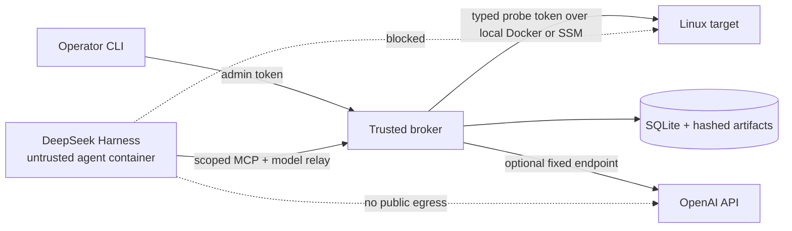

# Linux OnCall Agent

An evidence-driven Linux incident investigation system: a general-purpose agent reasons in its own sandbox and observes a target through typed, bounded diagnostic capabilities.

The project explores Linux diagnostics, Python domain design, constrained remote execution, and reproducible agent evaluation. It diagnoses; it does not autonomously remediate.

**Status:** Day 4 substrate reliability is implemented and verified. CPU, cgroup OOM, filesystem,
healthy, and unavailable scenarios each passed three AWS trials. The evaluator separates mechanical
evidence gates from human diagnostic review. Live DSH/OpenAI runs now include a passing
`gpt-5.6-terra` CPU diagnosis and a retained `gpt-4.1-mini` semantic failure. The repeated
report-quality matrix remains open.

Start with the [architecture tour](docs/architecture-tour.md), then use the
[documentation index](docs/README.md) to reach the detailed specifications, measured results, and
[MVP release hardening plan](docs/release-hardening-plan.md).

The first release targets CPU saturation, cgroup OOM, and filesystem capacity exhaustion. DeepSeek Harness is the current runtime; the Python capability layer remains independent of it.



## Quick start: local development

Requirements are Python 3.12, `uv`, Docker Desktop, and Docker Compose. Run commands from the
repository root.

```bash
# Install the locked application, harness, and developer dependencies.
uv sync --frozen --all-extras --dev

# Create random local broker/target tokens without displaying them.
.venv/bin/python scripts/init_lab.py

# Build the trusted target/broker image and untrusted DSH image.
docker compose build target agent
docker compose up -d --wait target broker

# Confirm the provider, target identity, protocol, and capabilities.
.venv/bin/oncall doctor
```

The default fixture provider needs no API key. It exercises the real DSH, MCP, sandbox, evidence, and
report lifecycle with deterministic responses; it is a plumbing test, not a reasoning-quality result.

For a live model, copy `.env.example` to the ignored `.env` and set:

```dotenv
ONCALL_PROVIDER=openai
ONCALL_MODEL=gpt-5.6-terra
OPENAI_API_KEY=<your key>
```

Only the broker receives the API key. For Terra, the broker removes the harness's incompatible
temperature and uses `reasoning_effort="none"`, which is required for function tools through Chat
Completions. Recreate the broker after changing `.env`:

```bash
docker compose up -d --no-deps --force-recreate --wait broker
```

The default interface is an incident session. Enter the first symptom, ask follow-up questions against
the same evidence lineage, and use `/new` when the next message belongs to a different incident:

```text
$ .venv/bin/oncall
Linux OnCall
Describe the incident. Follow-up messages stay in this incident; use /new to start another.

oncall> Investigate the service write failure and identify the constrained mount.
→ Checking capacity on the root mount…
✓ The root mount is 43.9% used with 3.8 GiB available.
→ Checking capacity on the lab mount…
✓ The lab mount is 99.6% used with 4.0 MiB available.
...
oncall> Is the capacity failure still present?
oncall> /new
oncall> Investigate current CPU pressure.
oncall> /exit
```

Each message is a new immutable run within the incident lineage. A follow-up receives trusted reports,
hypotheses, and evidence from earlier runs as historical context. It does not reuse hidden model
reasoning, and any claim about the target's current condition still requires a fresh observation. The
lineage is available for 24 hours and is limited to five generations; use `/new` after that bound.

Natural questions about the agent or session are answered by the configured model. A direct answer is
shown only when the turn used no tools and created no evidence, hypotheses, or report attempt; it does
not advance the incident lineage. `/help` remains the deterministic local command reference.

Use `/status` for the latest diagnosis and `/verbose` to toggle model request counts, timings, evidence
IDs, byte counts, and other technical telemetry. `oncall --verbose` starts with that view enabled.

`oncall investigate --symptom ...` remains the single-run interface for scripts and repeatable trials.
`--symptom` is optional because the command has a CPU-oriented default, but explicit symptoms give
memory, filesystem, and unavailable-target trials the correct starting context. Add `--verbose` when a
trial needs the complete progress and evidence metadata in the terminal.

### Create and investigate local scenarios

Healthy control—inject nothing after a clean start:

```bash
.venv/bin/oncall investigate --symptom \
  "Check whether the target shows CPU, memory, or filesystem pressure. Do not invent a fault."
```

Follow up on an existing result explicitly. This creates a child investigation; it does not silently
reuse a hidden model conversation:

```bash
.venv/bin/oncall continue <run-id> --message \
  "Explain why the earlier evidence ruled out host-wide CPU saturation."

# Inspect or close one run by ID.
.venv/bin/oncall status <run-id>
.venv/bin/oncall close <run-id>
```

Prior evidence is exposed with its age and `historical` scope. Retrospective findings may cite it.
Any finding about current conditions must cite fresh evidence collected by the child run. The first
new observation verifies the target identity and records whether the boot ID is unchanged or rebooted.
Continuation is available for 24 hours and is limited to five generations.

CPU pressure—two bounded workers share the target container's one-core quota and stop automatically:

```bash
docker compose exec -d target \
  python -m oncall.lab_fault cpu --seconds 120 --workers 2
.venv/bin/oncall investigate --symptom \
  "Investigate the current CPU pressure, identify its scope and dominant processes, and cite evidence."
```

Unavailable control—stop only the target, require an inconclusive result, then restore readiness:

```bash
docker compose stop target
.venv/bin/oncall investigate --symptom \
  "The target may be unavailable. Preserve uncertainty and do not report missing measurements as healthy."
docker compose start target
.venv/bin/oncall doctor
```

Local Docker shares a VM kernel, mounts the diagnostic lab volume read-only, and does not provide the
dedicated systemd cgroup needed for safe OOM attribution. Use the disposable AWS lab for the memory and
filesystem scenarios rather than weakening those safeguards:

```bash
# The inventory is produced by the AWS provisioning workflow.
.venv/bin/oncall lab-start memory --inventory .local/aws/inventory.json --ttl-seconds 120
.venv/bin/oncall investigate --symptom \
  "Investigate the service memory failure; distinguish a new cgroup OOM from host memory pressure."
.venv/bin/oncall lab-stop --inventory .local/aws/inventory.json

.venv/bin/oncall lab-start filesystem --inventory .local/aws/inventory.json --ttl-seconds 120
.venv/bin/oncall investigate --symptom \
  "Investigate the service write failure; identify the constrained mount and cite capacity evidence."
.venv/bin/oncall lab-stop --inventory .local/aws/inventory.json
```

`lab-start` verifies a new OOM counter or controlled `errno 28` before returning. Its 30–120 second
lease bounds the fault, and `lab-stop` removes only manifest-owned files/processes and verifies reset.
See [AWS and Terraform](docs/aws-terraform.md) for provisioning and the SSM tunnel workflow.

The default terminal view shows meaningful probe actions, interpreted observations, the diagnosis,
findings, limitations, next steps, and the Markdown report path. It omits transport and runtime noise.
Complete JSON, evidence references, and Markdown remain under `.local/reports/<investigation-id>/`.

## Quick start: disposable AWS fault lab

Requirements are configured AWS credentials, AWS CLI, the Session Manager plugin, Terraform, and the
ignored `terraform.tfvars` files described in [AWS and Terraform](docs/aws-terraform.md). Run setup once
from the repository root; it builds and uploads the current wheel, provisions the target, waits for
readiness, and enrolls its scoped credential and CA:

```bash
scripts/aws_lab.sh setup
```

Keep the fixed-port SSM tunnel open in a dedicated terminal:

```bash
scripts/aws_lab.sh tunnel
```

In another terminal, connect the broker to the AWS target and verify that readiness shows the new EC2
instance ID rather than `docker-target`:

```bash
docker compose -f compose.yaml -f compose.aws.yaml \
  up -d --wait --force-recreate broker

.venv/bin/oncall doctor
```

Use the `lab-start`, `investigate`, and `lab-stop` commands above to exercise CPU, memory, or filesystem
faults. When finished, reset any reachable fault, terminate target SSM sessions, remove enrollment, and
destroy the lab and bootstrap resources:

```bash
scripts/aws_lab.sh teardown
```

## Resource teardown

Stop local containers while retaining named volumes:

```bash
.venv/bin/oncall cancel  # safe no-op if the latest run already finished
docker compose down --remove-orphans
```

Remove all disposable local containers, networks, and named evidence/lab volumes:

```bash
docker compose down --volumes --remove-orphans
```

Host exports under `.local/reports/`, `.local/evaluation/`, and `.local/aws/` are not Docker volumes.
Review them first, then remove only the data you no longer need. `.local/` and `.env` are ignored by Git.

For AWS, use the lifecycle wrapper described above. It always destroys the lab before its state and
release bootstrap:

```bash
scripts/aws_lab.sh teardown
```

Terminate any remaining SSM tunnel process and verify there are no project EC2 instances, EBS volumes,
VPCs, security groups, SSM sessions/documents/parameters, IAM roles/profiles, or S3 buckets. Stopping an
instance is not teardown because EBS and public IPv4 charges may remain. The exercised Day 4 run was
destroyed and direct active-resource inventories were empty.

## Verify changes

```bash
.venv/bin/ruff check src tests scripts
.venv/bin/ruff format --check src tests scripts
.venv/bin/mypy
.venv/bin/pytest -q
.venv/bin/python -m build --no-isolation
docker compose --profile agent config --quiet
terraform fmt -check -recursive infra/terraform
terraform -chdir=infra/terraform/bootstrap validate
terraform -chdir=infra/terraform/environments/lab validate
```

Measured requirement-by-requirement results are recorded in
[Requirements verification](docs/requirements-verification.md).
