# Architecture tour: system to source code

This is the starting point for understanding Linux OnCall Agent. It begins with the product boundary,
then adds deployment, runtime, data, security, and implementation detail. Every major component links
to its source file and to the document that defines its behavior.

The system diagnoses one Linux target. A general-purpose model chooses what to inspect, while trusted
Python code decides what the model is allowed to observe, executes fixed collectors, preserves raw
evidence, and rejects unsupported conclusions. The agent can diagnose; it cannot run arbitrary target
commands or remediate the host.

## Level 1: the four-box view

At the highest level, an operator asks an isolated agent to investigate. The agent can reach only a
trusted broker. The broker mediates access to the Linux target and the model provider, then stores the
evidence and report.

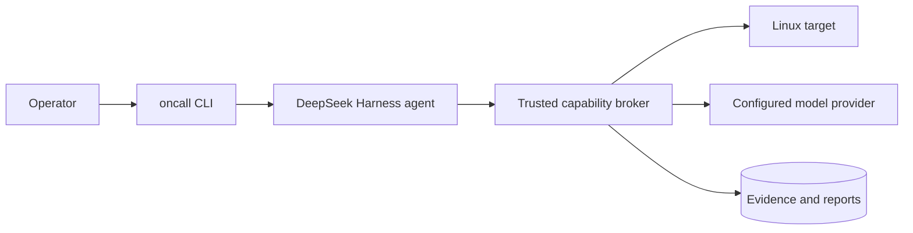

The responsibilities are deliberately separate:

| Component | Owns | Must not own | Primary code |
|---|---|---|---|
| Operator CLI | Run lifecycle, Docker launch, terminal presentation, report export | Linux interpretation or model credentials | [`cli.py`](../src/oncall/cli.py) |
| Harness agent | Diagnostic choices, hypotheses, cited report proposal | Target shell authority, AWS credentials, provider key | [`harness_runner.py`](../src/oncall/harness_runner.py), [`oncall.patch.yml`](../harness/oncall.patch.yml) |
| Trusted broker | Policy, budgets, MCP tools, model relay, evidence admission | Fault injection | [`broker.py`](../src/oncall/broker.py), [`service.py`](../src/oncall/service.py) |
| Target service | Fixed Linux observations with local deadlines and limits | Model runtime or generic shell API | [`target.py`](../src/oncall/target.py), [`probes.py`](../src/oncall/probes.py) |
| Evidence store | Immutable artifacts, typed metadata, events, hypotheses, reports | Diagnostic decisions | [`storage.py`](../src/oncall/storage.py) |

The product requirements behind these boundaries are in [Requirements](requirements.md). The design
decisions and rejected alternatives are in [Architecture decisions](decisions.md).

## Level 2: what actually runs

### Local Docker topology

`docker compose up` starts two long-running services: `target` and `broker`. The `agent` service has a
Compose profile and is started as a temporary container by `oncall investigate`. The CLI itself runs
on the developer workstation.

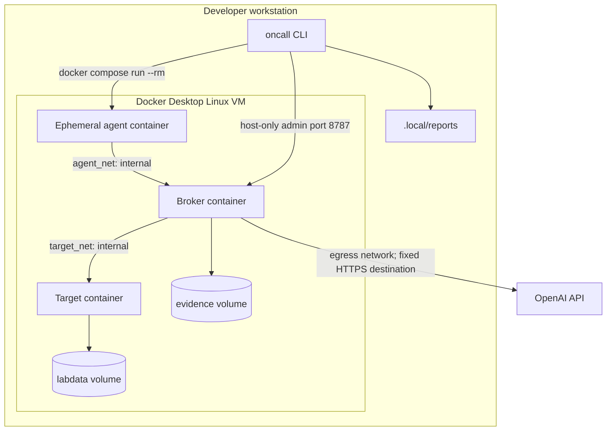

The agent has no Docker socket, provider key, AWS credential, direct target route, or public egress
network. It receives only the broker-scoped `agent_token`. The broker receives the provider key and
both application tokens. Container construction is in [`compose.yaml`](../compose.yaml) and
[`docker/Dockerfile`](../docker/Dockerfile).

The local target is a real Linux container with `/proc` and cgroup visibility, but it is not a full VM.
It is suitable for the healthy, CPU, and unavailable-target demonstrations. The systemd cgroup OOM
and dedicated-filesystem scenarios require the disposable EC2 target.

Containers are a deployment and isolation choice for the local control plane, not a requirement that
every diagnosed workload be containerized. The current deployment assumptions are:

| Component | Current runtime | Container required by its design? |
|---|---|---|
| CLI | Native process on the operator workstation | No |
| Broker and evidence store | Long-running local container plus named volume | No; packaged this way for reproducibility and secret/network isolation |
| Harness and DSH runtime | Ephemeral local container | Yes for the current sandbox boundary; another equivalent sandbox could replace it |
| Local target | Linux container | Yes for the local lab only |
| AWS target | Python service installed directly on EC2 and managed by systemd | No |
| Production target | One bounded probe service per Linux host or equivalent node-level deployment | No; it may be a native service, package, image-baked agent, or Kubernetes DaemonSet |

Collectors assume Linux interfaces such as `/proc`, cgroup v2, `statvfs`, and optionally systemd's
journal. A target service inside a container observes the namespaces and mounts granted to that
container. A native systemd service on EC2 observes the host according to its Unix permissions.

### AWS target topology

The control plane and harness remain local. Terraform replaces the local target container with one
disposable EC2 target. There is no inbound security-group rule and no SSH path. An operator-owned SSM
port-forward binds target port `8765` to local port `18765`; the broker uses the AWS Compose override
to reach that fixed local endpoint.

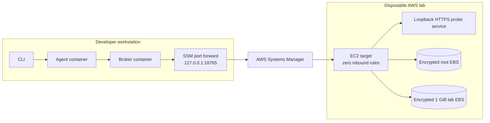

The target resources are defined in
[`infra/terraform/environments/lab/main.tf`](../infra/terraform/environments/lab/main.tf). Bootstrap
installs the wheel, creates credentials and TLS material, mounts the lab volume, and installs systemd
units through [`cloud-init.sh.tftpl`](../infra/terraform/templates/cloud-init.sh.tftpl). The current
SSM enrollment and tunnel lifecycle are implemented in [`aws_ssm.py`](../src/oncall/aws_ssm.py) and
used by the AWS acceptance scripts. [`compose.aws.yaml`](../compose.aws.yaml) switches the broker from
the Docker target to the local end of the tunnel.

See [AWS and Terraform](aws-terraform.md) for provisioning, state, IAM, cost, and teardown details.

## Level 3: one investigation from prompt to report

This is the complete runtime path for `oncall investigate`:

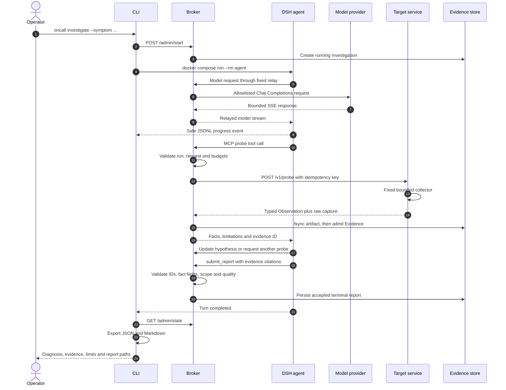

### Complete local Docker request path

The local path keeps every application component on the workstation. Docker Desktop supplies the
Linux VM on macOS; `agent_net` and `target_net` prevent the harness from bypassing the broker.

```mermaid
sequenceDiagram
    autonumber
    actor O as Operator
    participant C as oncall CLI<br/>macOS process
    participant D as Docker engine
    participant R as Agent runner<br/>ephemeral container
    participant H as DSH native runtime<br/>agent container child
    participant B as Broker API + MCP + relay<br/>broker container
    participant M as OpenAI API
    participant T as Target API<br/>target container
    participant K as Linux procfs/cgroups/filesystem<br/>target namespace
    participant E as SQLite + artifacts<br/>evidence Docker volume
    participant F as .local/reports<br/>host filesystem

    O->>C: oncall investigate --symptom ...
    C->>B: POST /admin/start using admin token
    B->>E: Insert running investigation
    C->>D: docker compose run --rm agent
    D->>R: Create isolated agent container
    R->>H: Start pinned DSH runtime and session

    loop Model step followed by zero or more tools
        H->>B: POST /v1/chat/completions using relay token
        B->>B: Authenticate; allowlist model fields; cap request
        B->>M: Fixed-destination model request
        M-->>B: Bounded SSE model response
        B-->>H: Relayed model stream
        H-->>R: Session lifecycle notification
        R-->>C: Sanitized oncall-progress-v1 JSONL on stdout

        opt Model chooses an observation
            H->>B: Authenticated MCP tool call
            B->>B: Validate schema, run state, deadline, call and byte budgets
            B->>T: POST /v1/probe with target token and idempotency key
            T->>T: Authenticate and select one fixed collector
            T->>K: Read bounded Linux counters or approved data
            K-->>T: Kernel/filesystem values
            T-->>B: Typed Observation plus bounded raw capture
            B->>E: Write and fsync immutable artifact
            B->>E: Commit typed Evidence and audit event
            B-->>H: Facts, limitations, quality and evidence ID
            H-->>R: Tool lifecycle notifications
            R-->>C: Safe parameters and selected typed facts
        end
    end

    H->>B: update_hypothesis via MCP
    B->>E: Append hypothesis version
    H->>B: submit_report with evidence IDs and fact fields
    B->>B: Validate citations, scope, target, boot and evidence quality
    B->>E: Persist accepted terminal report
    B-->>H: Report accepted
    H-->>R: Turn completed
    R-->>C: Final progress record; container exits
    C->>B: GET /admin/state using admin token
    B->>E: Read authoritative run, evidence and report
    E-->>B: Stored state
    B-->>C: Final investigation state
    C->>F: Write report.json and report.md
    C-->>O: Render diagnosis, evidence table, limits and paths
```

### Complete remote Linux request path through AWS SSM

The model, harness, broker, evidence store, and CLI stay local. Only the target observation crosses the
SSM port-forward. The EC2 target runs the Python probe service directly under systemd; it is not a
Docker container.

```mermaid
sequenceDiagram
    autonumber
    actor O as Operator
    participant C as oncall CLI<br/>macOS process
    participant D as Docker engine
    participant R as Agent runner<br/>ephemeral local container
    participant H as DSH native runtime<br/>agent container child
    participant B as Broker API + MCP + relay<br/>local container
    participant M as OpenAI API
    participant G as Docker host gateway<br/>host.docker.internal:18765
    participant P as Session Manager plugin<br/>127.0.0.1:18765 on Mac
    participant S as AWS Systems Manager
    participant A as SSM Agent<br/>EC2 process
    participant T as oncall-target.service<br/>127.0.0.1:8765 on EC2
    participant K as EC2 Linux kernel<br/>procfs, cgroup v2, journal, mounts
    participant E as SQLite + artifacts<br/>local evidence volume
    participant F as .local/reports<br/>host filesystem

    O->>P: scripts/aws_lab.sh tunnel
    P->>S: Start restricted port-forward session
    S->>A: Bind session to selected managed instance

    O->>C: oncall investigate --symptom ...
    C->>B: POST /admin/start using admin token
    B->>E: Insert running investigation
    C->>D: docker compose run --rm agent
    D->>R: Create isolated agent container
    R->>H: Start pinned DSH runtime and session

    loop Model step followed by zero or more tools
        H->>B: Model request through authenticated relay
        B->>M: Allowlisted fixed-destination request
        M-->>B: Bounded SSE response
        B-->>H: Relayed model stream
        H-->>R: Session lifecycle notification
        R-->>C: Sanitized oncall-progress-v1 JSONL

        opt Model chooses an observation
            H->>B: Authenticated MCP tool call
            B->>B: Validate schema, authority and budgets
            B->>G: HTTPS to host.docker.internal:18765<br/>target token + idempotency key
            G->>P: Deliver to Mac loopback listener
            P->>S: Encrypted SSM session payload
            S->>A: Forward session payload
            A->>T: HTTPS request on EC2 loopback
            T->>T: Authenticate and select one fixed collector
            T->>K: Read bounded host-level Linux data
            K-->>T: Kernel, process, cgroup, journal or filesystem values
            T-->>A: Typed Observation plus bounded raw capture
            A-->>S: Return through SSM session
            S-->>P: Return through Session Manager
            P-->>G: Return on local port 18765
            G-->>B: TLS-verified target response
            B->>E: Fsync artifact, then commit Evidence and audit event
            B-->>H: Facts, limitations, quality and evidence ID
            H-->>R: Tool lifecycle notifications
            R-->>C: Safe progress projection
        end
    end

    H->>B: submit_report with evidence citations
    B->>B: Validate citations, scope, target, boot and quality
    B->>E: Persist accepted terminal report
    B-->>H: Report accepted
    H-->>R: Turn completed
    R-->>C: Final progress record; agent container exits
    C->>B: GET /admin/state
    B->>E: Read authoritative result
    E-->>B: Stored state
    B-->>C: Final investigation state
    C->>F: Write report.json and report.md
    C-->>O: Render final result
```

The CLI orchestration is `investigate()` and `run_harness()` in
[`cli.py`](../src/oncall/cli.py). The broker composition root is `create_app()` in
[`broker.py`](../src/oncall/broker.py). The application lifecycle and report validation live in
`InvestigationService` in [`service.py`](../src/oncall/service.py).

## Level 4: authority and trust boundaries

The model is treated as an untrusted planner. Logs and artifacts are also untrusted data. Authority is
granted only by typed schemas and fixed server-side mappings.

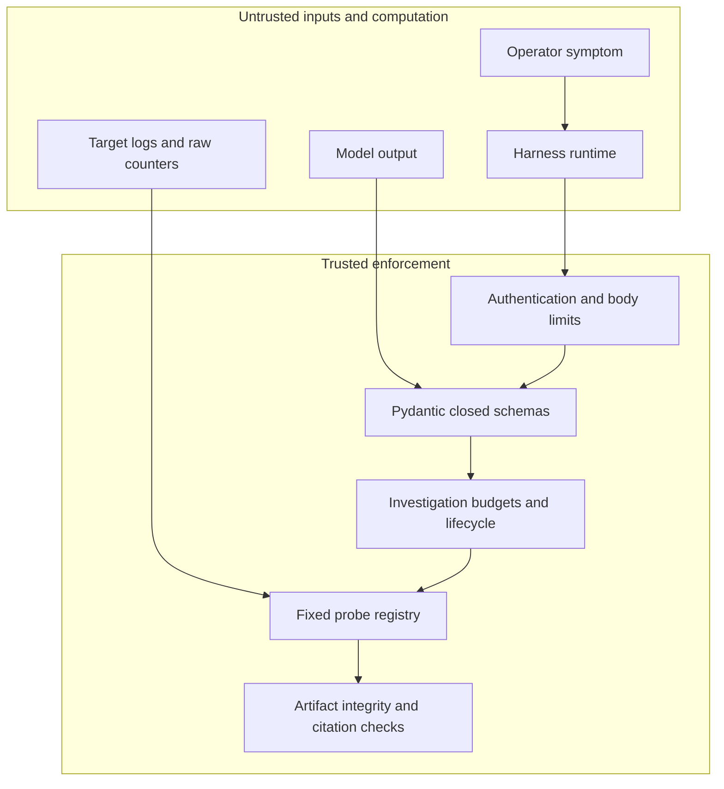

The important enforcement points are:

1. [`http_boundary.py`](../src/oncall/http_boundary.py) performs constant-time bearer-token checks and
   request-body limits before FastAPI or MCP receives a request.
2. [`domain.py`](../src/oncall/domain.py) rejects unknown fields, invalid probe combinations,
   non-finite values, inconsistent observation quality, and malformed evidence references.
3. [`service.py`](../src/oncall/service.py) enforces one active run, a 180-second deadline, at most 20
   probe calls, two concurrent probes, and a 10 MiB investigation capture budget.
4. [`target.py`](../src/oncall/target.py) requires an idempotency key, bounds in-flight calls, gives
   collectors seven seconds, and caches only matching retries.
5. [`transport.py`](../src/oncall/transport.py) fixes the target base URL at construction and caps both
   compressed and decoded responses.
6. [`storage.py`](../src/oncall/storage.py) writes and fsyncs an artifact before committing evidence
   metadata with its SHA-256 digest.
7. [`broker.py`](../src/oncall/broker.py) exposes only registered MCP tools and relays only allowlisted
   model fields to one fixed OpenAI endpoint.

Credentials flow in one direction:

| Credential | Present in CLI | Present in broker | Present in agent | Present in target |
|---|---:|---:|---:|---:|
| Admin token | Yes | Yes | No | No |
| Agent/MCP relay token | No | Yes | Yes | No |
| Target API token | No | Yes | No | Yes |
| OpenAI API key | No | Yes | No | No |
| AWS credentials | Operator environment | No | No | Instance role only |

The full threat model and failure expectations are in
[Security and reliability](security-and-reliability.md).

## Level 5: Python architecture and dependency direction

The Python package uses dependency inversion at I/O boundaries. Domain values do not import FastAPI,
MCP, AWS, Docker, the harness SDK, HTTPX, SQLite, or Linux filesystem APIs.

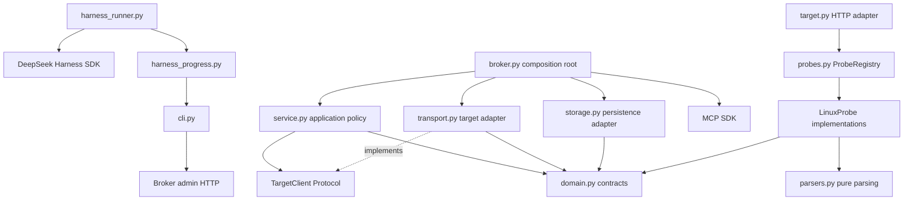

The design uses patterns where they carry a concrete boundary:

| Pattern | Where | Why it exists |
|---|---|---|
| Dependency inversion | `TargetClient` protocol in [`service.py`](../src/oncall/service.py) | Application policy can be tested without HTTP, Docker, or AWS |
| Template method | `LinuxProbe.collect()` plus subclass `_collect()` in [`probes.py`](../src/oncall/probes.py) | Provenance, timing, quality, and error conversion remain consistent across collectors |
| Registry | `ProbeRegistry` in [`probes.py`](../src/oncall/probes.py) | A closed capability name selects a fixed implementation without model-provided commands |
| Strategy | `FaultScenario` and CPU/memory/filesystem strategies in [`faults.py`](../src/oncall/faults.py) | Each fault has distinct setup, readiness, cleanup, and cleanup verification |
| Adapter | `HttpTargetClient`, `HarnessProgressAdapter`, and `SsmTunnel` | HTTP, DSH notifications, and AWS sessions stay outside the domain |
| Facade | `InvestigationService` and `FaultController` | Callers use a small lifecycle API while enforcement remains centralized |

Classes own state or interchangeable behavior. Stateless Linux decoding remains in pure functions in
[`parsers.py`](../src/oncall/parsers.py). [Python design](python-design.md) defines the detailed coding,
concurrency, persistence, and harness integration rules.

## Level 6: contracts and data flow

### Core domain types

All external data is validated through frozen Pydantic models in [`domain.py`](../src/oncall/domain.py):

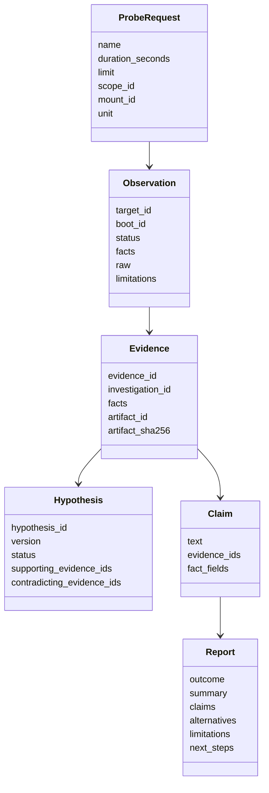

`Observation` is the target response and temporarily contains both compact facts and a bounded raw
capture. `Evidence` is the admitted broker record: the raw capture has moved to a hashed artifact and
the typed facts remain directly available to the model. `Hypothesis` is versioned interpretation.
`Report` is accepted only after every claim cites evidence owned by this investigation and every
completed finding names fact fields that actually exist in the cited evidence.

### Loss-aware evidence path

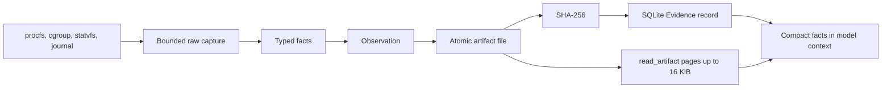

Current bounds are intentional: probe duration is at most five seconds, target raw capture is at most
1 MiB, decoded HTTP response is at most 2 MiB, artifact reads are at most 16 KiB per page, and one
investigation admits at most 10 MiB. Missing and denied data remain explicit statuses; they never
become zero-valued healthy evidence.

The schemas, Linux interpretation rules, and size limits are defined in
[Capabilities and evidence](capabilities-and-evidence.md).

## Level 7: target collectors

The target exposes `/health` and `/v1/probe`; it has no shell endpoint. `ProbeRegistry` dispatches one
of six names to a fixed collector.

| Capability | Implementation | Primary inputs | What it distinguishes |
|---|---|---|---|
| `sample_cpu_pressure` | `CpuPressureProbe` in [`probes.py`](../src/oncall/probes.py) | `/proc/stat`, load average, cgroup CPU files | Shared-kernel host activity from probe-cgroup quota and throttling |
| `rank_processes` | `ProcessRankingProbe` in [`probes.py`](../src/oncall/probes.py) | Bounded `/proc/<pid>` snapshots | Interval CPU consumers with PID reuse protection through start ticks |
| `inspect_memory_pressure` | `MemoryPressureProbe` in [`probes.py`](../src/oncall/probes.py) | meminfo, vmstat, optional PSI | Host availability, swap, faults, pressure, and optional kernel OOM count |
| `inspect_cgroup_memory` | `CgroupMemoryProbe` in [`probes.py`](../src/oncall/probes.py) | Opaque `self` or `lab` cgroup mapping | Current/limit/swap plus before-and-after OOM event deltas |
| `inspect_filesystem` | `FilesystemProbe` in [`probes.py`](../src/oncall/probes.py) | Opaque `root` or `lab` mount mapping | Blocks, inodes, filesystem type, and read-only probe view |
| `query_service_journal` | `JournalProbe` in [`probes.py`](../src/oncall/probes.py) | Two allowlisted systemd units | Bounded, boot-scoped, sanitized service events |

[`parsers.py`](../src/oncall/parsers.py) converts kernel text formats into typed values.
[`tests/test_parsers.py`](../tests/test_parsers.py) covers parsing edge cases;
[`tests/test_day3.py`](../tests/test_day3.py) covers memory, filesystem, journal, and artifact behavior;
[`tests/test_target.py`](../tests/test_target.py) covers the HTTP/idempotency boundary.

## Level 8: broker, harness, and model relay

The broker is one process with three surfaces:

| Surface | Caller | Authentication | Responsibility |
|---|---|---|---|
| `/admin/*` | Local CLI | Admin token | Start, inspect, cancel, and retrieve investigations |
| MCP tools | Harness | Agent token | Probes, artifact pages, hypotheses, and report submission |
| `/v1/chat/completions` | Harness provider plugin | Agent token | Fixed-destination, bounded model relay |

`create_app()` in [`broker.py`](../src/oncall/broker.py) wires these surfaces to one
`InvestigationService`, one `EvidenceStore`, and one fixed `HttpTargetClient`. The relay removes all
request fields outside its allowlist, caps model output, rejects a model other than the configured
one, limits calls, and never returns upstream error bodies. Terra compatibility is applied in
`provider_payload()`. Fixture mode uses [`fixture_provider.py`](../src/oncall/fixture_provider.py) to
exercise the real harness, MCP, evidence, and report path deterministically without claiming model
reasoning quality.

The isolated runner in [`harness_runner.py`](../src/oncall/harness_runner.py) launches the pinned DSH
SDK with the profile patch in [`harness/oncall.patch.yml`](../harness/oncall.patch.yml). That patch:

- disables DeepSeek provider and session-upload plugins;
- installs the OpenAI-compatible provider pointed at the broker relay;
- installs the oncall MCP client pointed at the broker;
- provides the diagnostic system prompt;
- keeps only a local sandbox shell, which is not the target shell.

DSH's notification callback contains assistant content and complete tool data. The
`HarnessProgressAdapter` in [`harness_progress.py`](../src/oncall/harness_progress.py) parses bounded
JSON through [`progress_projection.py`](../src/oncall/progress_projection.py), validates evidence and
hypotheses against the domain models, and emits a closed set of fields as JSONL. The projection includes
model request/retry counts, safe probe parameters, evidence quality, duration and byte count, selected
typed facts, hypothesis status changes, canonical report rejection reasons, and continuation target/boot
relationships. It never forwards assistant text or reasoning, prompts, raw artifacts, unrestricted tool
output, credentials, or unknown tool names.

`run_harness()` in [`cli.py`](../src/oncall/cli.py) accepts only that protocol and discards other
container output. The normal view passes each event through
[`operator_view.py`](../src/oncall/operator_view.py), which suppresses lifecycle and transport noise and
turns allowlisted typed facts into short natural-language observations. `--verbose` uses
`progress_message()` for the full safe technical projection. Both renderers validate projected fields
again, so a forged protocol line cannot become unrestricted terminal content. The progress stream
remains presentation data; broker events and admitted evidence are authoritative.

## Level 9: persistence and lifecycle

`EvidenceStore` in [`storage.py`](../src/oncall/storage.py) owns four SQLite tables and an artifact
directory:

| Storage | Mutability | Purpose |
|---|---|---|
| `runs` | Status and final report transition | Investigation identity, parent link, timestamps, and immutable terminal outcome |
| `evidence` | Append-only | Typed evidence metadata and artifact reference |
| `events` | Append-only | Ordered audit trail of policy and lifecycle events |
| `hypotheses` | Append-only versions | Current and historical diagnostic interpretation |
| `artifacts/` | Immutable files | Lossless bounded raw captures identified by SHA-256 |

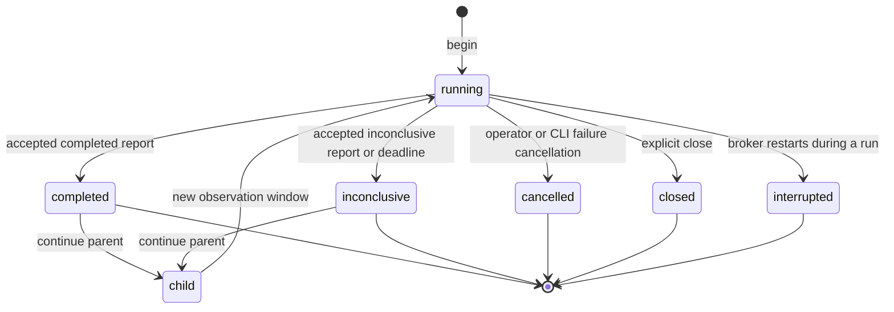

On broker startup, any previously `running` row becomes `interrupted`; stale authority is never
silently resumed. `oncall continue` creates a child run within 24 hours and at most five generations;
it never reopens an accepted report. Prior evidence includes its age and historical scope. Current
claims require child evidence, while retrospective claims may cite the parent lineage. The first new
probe enforces the same target identity and records same-boot versus rebooted status. A completed
report cannot rely on limited, denied, or unsupported evidence.

The interactive shell presents those immutable runs as one incident conversation:

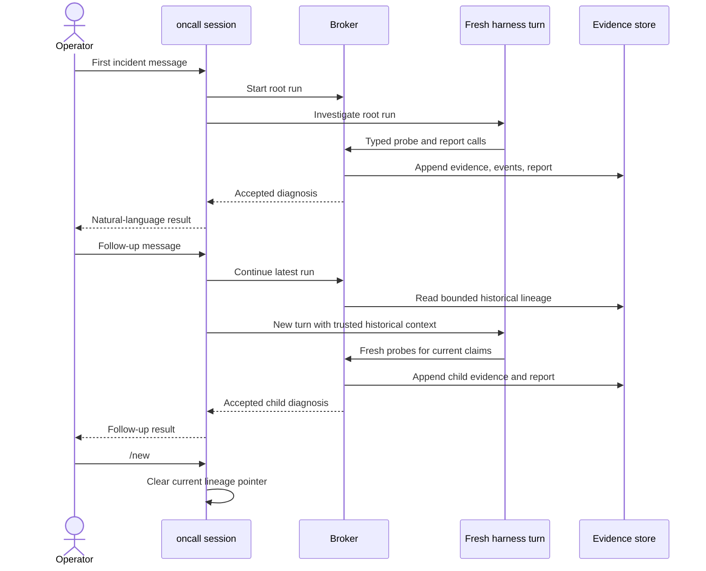

The CLI session remembers only the latest run ID. The broker and evidence store provide continuity;
the system never treats a hidden model transcript as operational memory. This keeps the conversational
interface compatible with immutable reports, target and boot checks, fresh-evidence rules, the 24-hour
TTL, and the five-generation bound.

## Level 10: fault lab and evaluation

Fault injection is a separate operator-only path. The model cannot call it. `FaultController` in
[`faults.py`](../src/oncall/faults.py) selects a scenario strategy, writes a local lease before
mutation, waits for a scenario-specific readiness condition, and verifies cleanup. Remote execution
uses SSM Run Command through `SsmOperatorExecutor`.

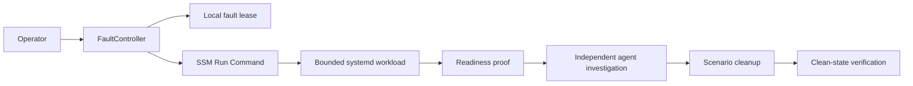

CPU uses two bounded workers. Memory uses a dedicated systemd slice with a 48 MiB limit and preserves
the pre-fault OOM counter. Filesystem fills only the dedicated lab EBS volume and proves controlled
`errno 28`. Implementations are in [`lab_fault.py`](../src/oncall/lab_fault.py) and
[`faults.py`](../src/oncall/faults.py).

Evaluation deliberately separates two questions:

1. **Substrate reliability:** did setup, collection, isolation, and cleanup work?
2. **Diagnostic quality:** did the model identify cause and scope, cite valid evidence, consider
   alternatives, state limits, and avoid unsupported claims?

`TrialScorer` and `EvaluationBundleWriter` in [`evaluation.py`](../src/oncall/evaluation.py) implement
the evidence gates and reproducible bundle. [`aws_day4_trials.py`](../scripts/aws_day4_trials.py) runs
the substrate matrix. [`evaluate_report.py`](../scripts/evaluate_report.py) scores a model report.
The methodology and demo sequence are in [Evaluation and demo](evaluation-and-demo.md); measured
results are in [Day 4 results](day-4-results.md) and
[Requirements verification](requirements-verification.md).

## Level 11: infrastructure as code

Terraform is split into bootstrap infrastructure and the disposable lab:

| Layer | Resources | Code |
|---|---|---|
| Bootstrap | Encrypted/versioned state and release S3 buckets, public-access blocks, TLS-only policies, one-day release lifecycle | [`infra/terraform/bootstrap/main.tf`](../infra/terraform/bootstrap/main.tf) |
| Lab network | VPC, public subnet, route, internet gateway, zero-ingress security group | [`infra/terraform/environments/lab/main.tf`](../infra/terraform/environments/lab/main.tf) |
| Target identity | EC2 IAM role/profile with SSM core, one pinned-release read, ephemeral enrollment write | [`infra/terraform/environments/lab/main.tf`](../infra/terraform/environments/lab/main.tf) |
| Target compute | Pinned Ubuntu AMI, small EC2 instance, IMDSv2, encrypted root disk | [`infra/terraform/environments/lab/main.tf`](../infra/terraform/environments/lab/main.tf) |
| Fault storage | Separate encrypted 1 GiB gp3 volume | [`infra/terraform/environments/lab/main.tf`](../infra/terraform/environments/lab/main.tf) |
| Remote transport | SSM Session document restricted to target port 8765 and local port 18765 | [`infra/terraform/environments/lab/main.tf`](../infra/terraform/environments/lab/main.tf) |

The lab output is a non-secret inventory consumed by trusted operator code. Per-target token and CA
enrollment happen after provisioning and are stored under ignored `.local/aws/`, never in Terraform
state. The target has a public IP for disposable bootstrap/SSM egress, but its security group has no
ingress rule.

## Documentation map

The documentation has four roles. Reading a status document as a design spec, or a future plan as
implemented behavior, creates avoidable confusion.

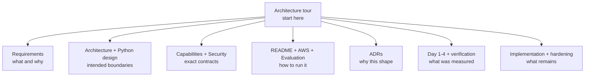

| Question | Read | Relationship to code |
|---|---|---|
| What problem and acceptance criteria define the MVP? | [Requirements](requirements.md) | Maps requirements to CLI, probes, evidence, AWS, and evaluation |
| What are the deployment and trust boundaries? | [Architecture](architecture.md) | Normative boundary for `compose.yaml`, broker, target, and harness |
| How should Python dependencies and responsibilities be structured? | [Python design](python-design.md) | Normative guide for `domain.py`, `service.py`, adapters, and storage |
| What can the model observe and how should Linux facts be interpreted? | [Capabilities and evidence](capabilities-and-evidence.md) | Contract for `domain.py`, `probes.py`, and `parsers.py` |
| What security and failure behavior must hold? | [Security and reliability](security-and-reliability.md) | Controls in boundary, service, transport, target, storage, Compose, and Terraform |
| Why were the major choices made? | [Architecture decisions](decisions.md) | ADRs explain separation, evidence immutability, harness choice, and fault strategy |
| How is AWS provisioned and destroyed? | [AWS and Terraform](aws-terraform.md) | Operator guide for `infra/terraform`, `aws_ssm.py`, and `compose.aws.yaml` |
| How are scenarios and reports scored? | [Evaluation and demo](evaluation-and-demo.md) | Guide for `faults.py`, `evaluation.py`, and scripts |
| What was implemented each day? | [Day 1](day-1-status.md), [Day 2](day-2-status.md), [Day 3](day-3-status.md), [Day 4](day-4-results.md) | Historical implementation evidence and measured results |
| Which requirements have fresh proof? | [Requirements verification](requirements-verification.md) | Commands, outputs, scenario construction, and teardown evidence |
| What remains before release? | [Release hardening](release-hardening-plan.md) and [pre-matrix review](pre-matrix-architecture-review.md) | Prioritized gaps; do not treat these planned fixes as current behavior |
| What was the phased build plan? | [Implementation plan](implementation-plan.md) | Completed and open phase checklist |

## Source-code map

Use this table when moving from a diagram or behavior to an implementation review.

| Area | Entry point | Supporting code | Focused tests |
|---|---|---|---|
| CLI and report presentation | [`cli.py`](../src/oncall/cli.py) | [`operator_view.py`](../src/oncall/operator_view.py), [`harness_progress.py`](../src/oncall/harness_progress.py), [`progress_projection.py`](../src/oncall/progress_projection.py) | [`test_cli.py`](../tests/test_cli.py), [`test_operator_view.py`](../tests/test_operator_view.py), [`test_harness_progress.py`](../tests/test_harness_progress.py) |
| Harness startup and policy | [`harness_runner.py`](../src/oncall/harness_runner.py) | [`oncall.patch.yml`](../harness/oncall.patch.yml), [`harness/skills`](../harness/skills) | Live DSH runs recorded in Day 1/4 docs |
| Broker and model relay | [`broker.py`](../src/oncall/broker.py) | [`http_boundary.py`](../src/oncall/http_boundary.py) | [`test_broker.py`](../tests/test_broker.py), [`test_boundary.py`](../tests/test_boundary.py) |
| Deterministic provider fixture | [`fixture_provider.py`](../src/oncall/fixture_provider.py) | Broker relay and real DSH runtime | [`test_broker.py`](../tests/test_broker.py), Day 1 acceptance evidence |
| Application lifecycle | [`service.py`](../src/oncall/service.py) | [`domain.py`](../src/oncall/domain.py) | [`test_service.py`](../tests/test_service.py) |
| Persistence | [`storage.py`](../src/oncall/storage.py) | Domain evidence/report models | [`test_day3.py`](../tests/test_day3.py), [`test_evaluation.py`](../tests/test_evaluation.py) |
| Target HTTP service | [`target.py`](../src/oncall/target.py) | [`transport.py`](../src/oncall/transport.py), [`http_boundary.py`](../src/oncall/http_boundary.py) | [`test_target.py`](../tests/test_target.py) |
| Linux collection | [`probes.py`](../src/oncall/probes.py) | [`parsers.py`](../src/oncall/parsers.py) | [`test_parsers.py`](../tests/test_parsers.py), [`test_day3.py`](../tests/test_day3.py) |
| Fault injection | [`faults.py`](../src/oncall/faults.py) | [`lab_fault.py`](../src/oncall/lab_fault.py), [`aws_ssm.py`](../src/oncall/aws_ssm.py) | [`test_evaluation.py`](../tests/test_evaluation.py), AWS acceptance scripts |
| Evaluation | [`evaluation.py`](../src/oncall/evaluation.py) | [`evaluate_report.py`](../scripts/evaluate_report.py), [`aws_day4_trials.py`](../scripts/aws_day4_trials.py) | [`test_evaluation.py`](../tests/test_evaluation.py) |
| Local deployment | [`compose.yaml`](../compose.yaml) | [`docker/Dockerfile`](../docker/Dockerfile), [`init_lab.py`](../scripts/init_lab.py) | Compose validation and live local runs |
| AWS deployment | [`lab/main.tf`](../infra/terraform/environments/lab/main.tf) | [`bootstrap/main.tf`](../infra/terraform/bootstrap/main.tf), [`cloud-init.sh.tftpl`](../infra/terraform/templates/cloud-init.sh.tftpl), [`compose.aws.yaml`](../compose.aws.yaml) | [`aws_acceptance.py`](../scripts/aws_acceptance.py), Day 3/4 acceptance scripts |

## Suggested review paths

For a ten-minute architecture review:

1. Read Levels 1–3 in this document.
2. Open [`compose.yaml`](../compose.yaml) to show process and network isolation.
3. Open `InvestigationService` in [`service.py`](../src/oncall/service.py) to show centralized budgets
   and report validation.
4. Open `ProbeRequest`, `Observation`, `Evidence`, and `Report` in
   [`domain.py`](../src/oncall/domain.py) to show the typed contract.
5. Open `LinuxProbe` and `ProbeRegistry` in [`probes.py`](../src/oncall/probes.py) to show the closed
   target capability boundary.
6. Open `EvidenceStore.add()` in [`storage.py`](../src/oncall/storage.py) to show artifact-before-record
   persistence and hashes.
7. Finish with the live `oncall investigate` progress stream and exported report.

For a code-quality review, follow the dependency diagram from `domain.py` outward, then inspect the
protocol and ABC seams in `service.py`, `probes.py`, and `faults.py`. For a security review, follow one
request through `http_boundary.py`, Pydantic validation, `InvestigationService`, `HttpTargetClient`,
and the target idempotency cache. For a Linux review, start with
[Capabilities and evidence](capabilities-and-evidence.md), then inspect each collector and parser.

## Current implementation limits

The architecture above describes the current core, with these release gaps kept visible:

- the CLI owns a foreground `docker compose run` process; durable background jobs, attach, and exact
  container recovery are not implemented;
- AWS enrollment and tunnel lifecycle are available through trusted scripts and classes, but there is
  no single `oncall aws-up`/`aws-down` command;
- the local container intentionally does not simulate the AWS systemd OOM and dedicated-EBS scenarios;
- all 15 AWS substrate trials passed, while the complete repeated live-model diagnostic-quality matrix
  remains open;
- multi-user identity, fleet scheduling, remote artifact storage, production mTLS rotation, and
  remediation are outside the MVP.

The prioritized fixes and acceptance gates are tracked in
[Release hardening](release-hardening-plan.md). This section should be updated when those gaps close so
the tour continues to describe observable behavior rather than intended future work.
