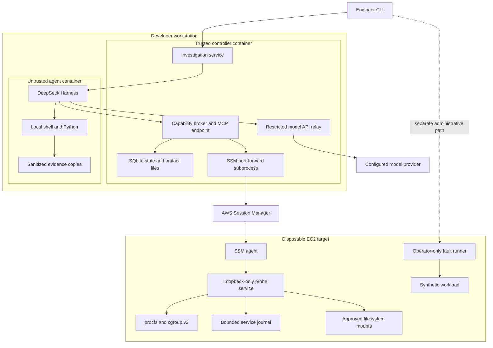
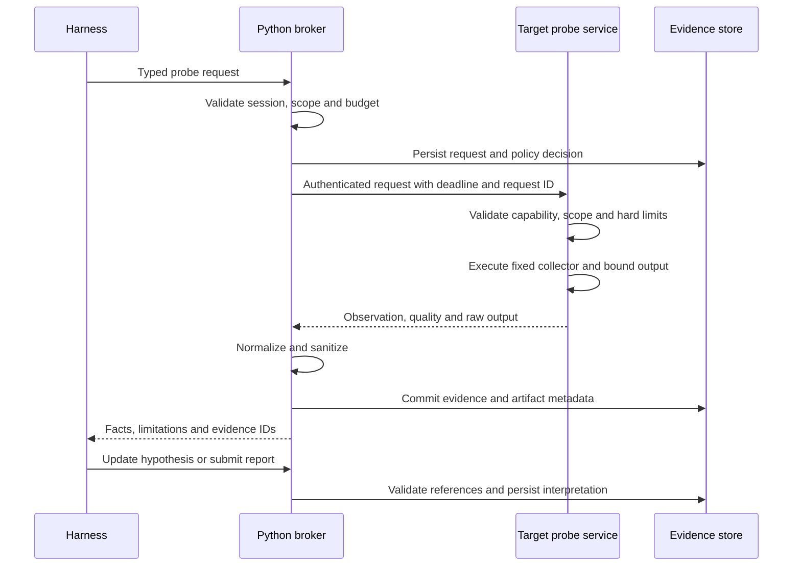
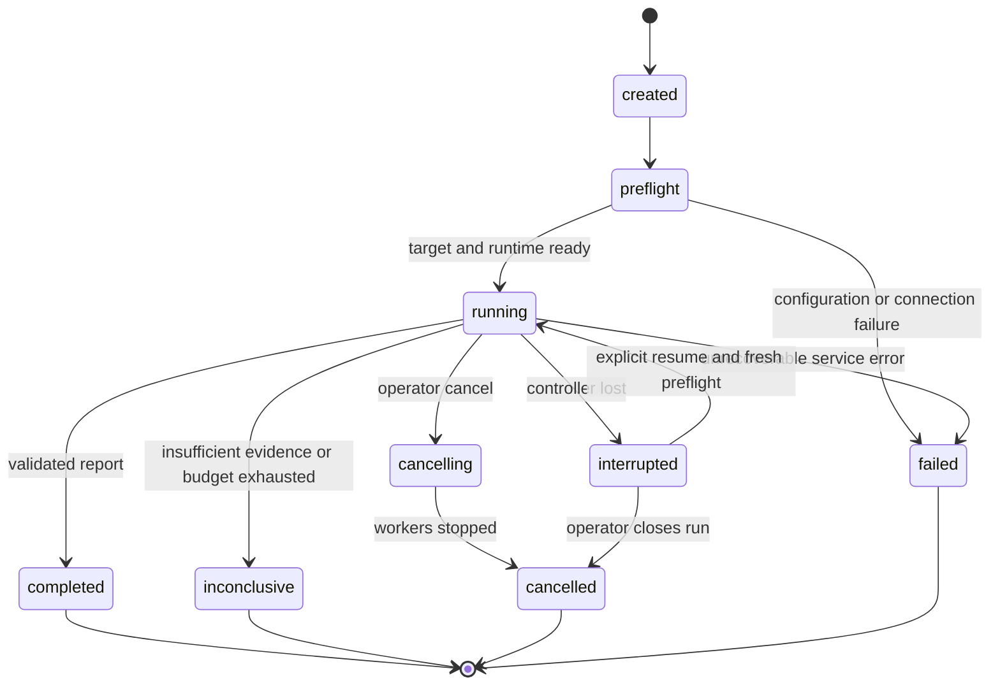

# Architecture

## Deployment and trust boundaries

One AWS EC2 target is enough for the MVP. The developer workstation hosts a trusted controller/broker and an isolated Linux container running the harness. The target runs a small deterministic Python service; it contains no model runtime. On macOS, use a Linux container VM such as the existing Docker environment, not macOS `/proc` substitutes.

The diagram shows logical components, not a requirement for a microservice per box. Controller, policy, storage and MCP live in one Python application. The relay is a small fixed-destination service or a proven equivalent, validated in Phase 0. No generic HTTP proxy or destination URL supplied by the model is allowed.

The agent container joins only an internal network shared with the broker. The broker has a separate egress interface for SSM and the configured model provider. Disable forwarding between interfaces; publish no administrative endpoints to the agent. The broker starts the SSM tunnel on its own loopback, so the agent cannot reach it. Local CLI administration uses a socket or host-only port not exposed on the agent network.

The agent receives only a short-lived investigation-scoped token. AWS credentials, target API credentials, provider keys, Terraform state and authoritative evidence storage belong to the trusted environment. The agent can write a temporary workspace, not controller files. Neither container gets a Docker socket through the application configuration; the operator launches containers outside the agent's control.

A thin runner inside the agent container launches the DSH SDK and its child runtime there. The trusted controller dispatches jobs and cancellation to that runner through the scoped control channel; it does not launch a harness subprocess in the credential-bearing controller container. The runner's results remain untrusted proposals until broker validation. For the first release, the operator starts the container pair and stops/replaces the agent container if graceful cancellation fails.

The runner also consumes DSH's session notification callback and projects it onto a versioned JSONL
progress channel for the operator CLI. Only lifecycle state, allowlisted oncall tool names, success or
failure, retries, and the turn finish reason cross this channel. Prompts, reasoning blocks, tool
arguments, tool results, and unknown tool names are discarded inside the agent container. This stream
is presentation data; persisted broker events and admitted evidence remain authoritative.

## Remote request flow

MCP is the harness-facing adapter. The target uses a simpler versioned HTTPS API over an SSM tunnel. This keeps MCP and harness lifecycle concerns off the degraded machine. Pin a target certificate in the broker and authenticate requests with a rotated per-target token; SSM is transport access control, not a substitute for application authorization.

Target authorization is enforced even if a caller bypasses MCP. The broker controls per-investigation budgets; the target independently controls per-host maxima. Harness policy hooks can improve behavior but do not grant access or override these controls.

## Lifecycle

The lifecycle controls resources, not diagnostic ordering. The model chooses which question to investigate next. No hardcoded CPU-to-memory-to-disk reasoning graph is required. A report validation failure returns structured feedback; allow at most one correction within the original budget, then export an inconclusive report.

Resume retains old evidence with timestamps and rechecks boot ID and process identity; it never silently treats old samples as current. Core release persists state and reports after crashes; seamless model-session resume is a follow-on.

## Data ownership

| Data | Owner | Agent access |
|---|---|---|
| Raw captured output | Trusted broker, restricted files | Sanitized copies only |
| Immutable parsed evidence | Trusted repository | Read through scoped API |
| Hypotheses and findings | Investigation service | Propose validated updates |
| Authoritative audit events | Broker and target | Read summaries, cannot overwrite |
| Temporary analysis scripts | Agent workspace | Read/write, disposable |
| Fault truth and reset handles | Operator/evaluator | Never mounted into agent |
| Credentials and Terraform state | Operator/trusted services | None |

## Extension path

Keep the same domain contracts when replacing the harness, moving the controller to a separate EC2 instance, or adding a remote artifact store. Add multi-user identity, mTLS lifecycle, production log handling, fleet scheduling and stronger sandbox isolation only after the single-host MVP is working. A container separates resources and credentials but shares a kernel with its Linux host; do not describe it as a formally verified hostile-code boundary.
