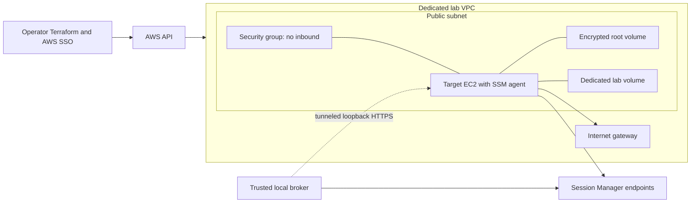

# AWS provisioning and Terraform design

## MVP topology

Terraform creates one disposable target in one availability zone. The exercised MVP defaults are
region `ap-southeast-1`, VPC `10.42.0.0/16`, public subnet `10.42.1.0/24`, Ubuntu 24.04 LTS x86_64,
`t3.micro`, an 8 GiB encrypted gp3 root disk and a separate 1 GiB encrypted lab volume. The small
burstable instance keeps the short-lived lab inexpensive; record CPU credits/throttling and choose a
non-burstable instance before making performance comparisons.

A public subnet with a public IPv4 address permits outbound package/SSM traffic without a NAT gateway. The security group has **zero inbound rules**. This is a cost/simplicity decision for a disposable lab, not a private-subnet claim. The API binds to loopback and is reached by SSM port forwarding. [AWS documents the tunnel and local Session Manager plugin prerequisite](https://docs.aws.amazon.com/systems-manager/latest/userguide/session-manager-working-with-sessions-start.html).



A later private variant requires SSM interface endpoints and a separate package/artifact delivery path, or NAT. Endpoint charges and package downloads must be included; a private subnet alone does not supply connectivity. [AWS endpoint guidance](https://docs.aws.amazon.com/systems-manager/latest/userguide/setup-create-vpc.html) describes the networking dependencies.

## Resource inventory

| Resource | Design |
|---|---|
| VPC/subnet/route table/IGW | Dedicated project network; no default-VPC dependency |
| Target security group | No inbound; outbound HTTPS and required package traffic; document broad egress as lab tradeoff |
| EC2 instance | Explicit AMI ID validated against Canonical owner/architecture; require IMDSv2; tag project, owner, environment and expiry |
| Instance profile | SSM managed-node permissions only; no infrastructure administration or model credentials |
| Root and lab EBS | Encrypted, bounded capacity; keep root free of fault writes; delete lab storage on teardown |
| SSM session document | Restrict broker tunnel to target loopback probe port, e.g. 8765; no arbitrary remote-host parameter |
| S3 state bucket | Separate bootstrap stack; encryption, versioning, block public access, TLS-only policy |
| Release bucket | Private, short-lived immutable wheel/config artifacts; instance can read its release prefix only |
| Optional budget alert | Operator-selected threshold/email; alert is not an automatic spending cap |

Do not add an ALB, EKS, RDS, NAT gateway, controller EC2, or public probe endpoint to the MVP. Existing account-level audit configuration can record AWS control-plane actions; application audit must still record every probe. Session Manager does not log port-forward payloads ([AWS limitation](https://docs.aws.amazon.com/systems-manager/latest/userguide/session-manager.html)).

## IAM and credentials

Separate principals by role:

- **Provisioner:** Terraform network/EC2/IAM/state permissions, including tightly scoped `iam:PassRole`; local AWS SSO credentials, never inside the agent.
- **Bootstrap/lab operator:** install and reset only tagged disposable targets; SSM administrative commands are outside diagnosis APIs.
- **Broker:** start the fixed-port session document on the selected tagged target, describe required metadata, terminate its own sessions. No `SendCommand` or interactive-shell document rights.
- **Target instance:** managed-node permissions and read-only release-prefix access. No provider key.
- **Agent:** no AWS identity. It has only the broker's scoped investigation credential.

SSM agent may run as root; the probe service does not inherit that authority. The local tunnel is owned by the broker and authenticated target requests still pass target policy. Validate IAM resource scoping in the implementation rather than relying only on tags.

## Terraform layout and state

```text
infra/terraform/
  bootstrap/          # state and release buckets; initially local state
  environments/lab/   # backend.tf, providers.tf, main.tf, variables.tf, outputs.tf
  templates/          # cloud-init and systemd unit templates
```

Start with a flat lab root; extract a target module only when there is a real second consumer. Pin Terraform/provider constraints and commit `.terraform.lock.hcl`. Resolve a supported AMI deliberately and record the ID; do not let an unreviewed latest-image lookup silently change evaluation machines.

Use S3 backend native locking with `use_lockfile = true`, plus bucket versioning. [HashiCorp documents required S3 permissions and locking](https://developer.hashicorp.com/terraform/language/backend/s3). Bootstrap begins with protected local state; after creating the bucket, migrate bootstrap state to a separate key. Lab state uses its own key. Keep credentials out of backend config, variables and user data. `sensitive = true` hides display but does not remove secrets from state.

Inputs: region, AZ, project/owner tags, expiry tag, instance type, AMI ID, allowed account ID, release digest/key, volume sizes, enable-lab flag and budget settings. Validate CIDRs, size bounds and account/environment. Outputs: instance ID, region, target alias, probe port and non-secret inventory. Do not output bearer tokens or private keys.

## Bootstrap and release path

1. Authenticate locally; verify AWS account/region and inspect planned cost components.
2. Build a versioned wheel and locked dependencies; upload immutable release artifacts with SHA-256 manifests to the private release prefix.
3. Apply the bootstrap stack, configure backend, then plan/apply the lab stack. Bootstrap/release upload ordering can use an initial bucket-only apply; avoid a circular dependency between wheel location and instance creation.
4. Cloud-init installs Python/runtime tools and SSM agent if needed, creates `oncall-probe`, downloads the pinned release, verifies hashes, and creates systemd services.
5. Generate per-target TLS certificate/key and API token on the target at runtime, outside Terraform. An operator-only enrollment step retrieves certificate fingerprint and token through the administrative path into a protected broker secret file; do not print secrets into CI or cloud-init logs. Rotate on rebuild; target fails closed without credentials.
6. Identify the lab EBS device by volume identity, not assumed `/dev/sdf` ordering; format only the verified empty lab device. Mount by UUID at `/var/lib/oncall-lab/data`. Never format a root or unknown device.
7. Start the unprivileged probe API on `127.0.0.1:8765`; allow read access only to selected journal data. Preserve procfs visibility needed for probes when hardening systemd.
8. Readiness checks verify SSM online, cloud-init completion, certificate/authentication, protocol version, boot ID, available probes, cgroup v2, mounted lab volume and baseline health.

Package installation success is not application readiness. Bootstrap scripts must be idempotent and emit versioned readiness status without secrets. Updating a release should be an explicit deployment/replacement step, not an assumption that changing user data reruns initialization.

## Operator workflow

After the Terraform files exist, the expected commands are:

```bash
terraform -chdir=infra/terraform/bootstrap init
terraform -chdir=infra/terraform/bootstrap plan -out=bootstrap.tfplan
terraform -chdir=infra/terraform/bootstrap apply bootstrap.tfplan
# Configure/migrate backend and upload the release before lab apply.
terraform -chdir=infra/terraform/environments/lab init -backend-config=backend.hcl
terraform -chdir=infra/terraform/environments/lab plan -out=lab.tfplan
terraform -chdir=infra/terraform/environments/lab apply lab.tfplan
```

Use `oncall doctor` to validate runtime readiness. The controller manages the fixed-document SSM
subprocess, captures its session ID, requests remote session termination on shutdown, then reaps the
local plugin. Provisioning remains an operator task; model output never triggers Terraform.

## Cost and teardown

Estimate before launch using current regional prices: instance-hours + EBS GiB-months prorated + public IPv4 hours + S3 storage/requests + any transfer + model tokens. No dollar quote is asserted here. An expiry tag alone does not delete anything; manually destroy at session end. Optional scheduled cleanup is later work with separately scoped permissions.

On teardown: cancel investigations, reset lab faults, export selected reports, stop tunnels, review and apply a destroy plan for the lab, then verify EC2, lab EBS and project networking are gone. Check for retained volumes, snapshots and public IP allocations. Stopping EC2 does not remove storage charges. Retain state bucket intentionally; deleting it requires separate state recovery/export and handling all object versions. Release objects need a short lifecycle policy. Keep bootstrap and lab destroy paths separate so normal cleanup cannot erase the state backend.

Acceptance: `terraform fmt -check`, `validate`, plan inspection, successful clean apply, authenticated probe, instance replacement, and clean destroy. Static validation alone does not establish working IAM, networking or bootstrap.
