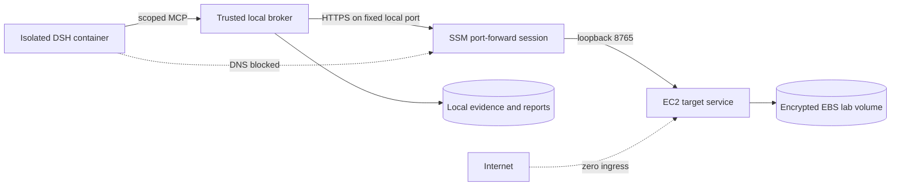

# Day 2 AWS boundary status

Day 2 is implemented and was exercised in `ap-southeast-1` on 2026-09-23. The run
provisioned a disposable EC2 target, moved the existing typed probe contract across a
TLS-protected Session Manager tunnel, attributed an injected CPU incident, tested failure paths,
and destroyed the AWS environment.

## Delivered boundary

- Two Terraform roots create temporary encrypted state/release buckets and the disposable lab.
- The lab creates a dedicated VPC, public subnet, zero-ingress security group, `t3.micro` Ubuntu
  target, IMDSv2 enforcement, an encrypted 8 GiB root disk, and an encrypted 1 GiB lab volume.
- The target package is built as a wheel, addressed by SHA-256, stored in the private release
  bucket, and installed into a dedicated virtual environment by cloud-init.
- The target runs as a constrained systemd service on loopback HTTPS. A random target token is
  enrolled through an SSM `SecureString`; it is never placed in Terraform state or agent storage.
- The instance role can read only the pinned release object, publish its own enrollment parameter,
  and register with Systems Manager.
- A per-instance Session Manager document fixes remote port `8765` and local port `18765`. A test
  request for port 22 was rejected.
- The target independently enforces probe names, duration, result limits, authentication, and
  request-ID deduplication. Replaying one request returns its original result; reusing its ID with
  different arguments returns HTTP 409.
- The agent container has neither AWS credentials nor the target token. A direct connection from
  that container to `host.docker.internal:18765` failed at DNS resolution.
- `oncall doctor` checks the broker and the remote target. Closing the tunnel makes readiness fail
  instead of silently switching to local data.

## Acceptance evidence

The final run used terminated target `i-01bd9cf9c4130ca4f`. The exported
[investigation report](../.local/reports/80677bd39c8748f48a8c3075e80a17ce/report.md) records a
two-vCPU target at 100% host busy and two injected Python workers at about 97.4% of one core each.
Every evidence item carries that EC2 instance ID and one boot ID.

| Check | Result |
|---|---|
| Cloud-init readiness, systemd service, mounted lab volume | Passed after the corrections below |
| Broker-to-target TLS and token authentication | Passed |
| Target request deduplication and hard duration limit | Passed |
| Complete DSH/MCP investigation and EC2 target provenance | Passed |
| Injected CPU worker attribution | Passed |
| Investigation cancellation | Passed |
| Readiness failure after tunnel closure | Passed |
| Fixed SSM document rejection of port 22 | Passed |
| Agent direct-bypass attempt | Blocked |

The report is deliberately marked **inconclusive** because the keyless fixture exercises the real
DSH and MCP lifecycle but does not perform model reasoning. A live OpenAI run remains a separate
model-quality evaluation.

## Provisioning defects found

The first clean apply exposed a wheel filename that `pip` could not parse after content-addressed
renaming. The replacement apply preserved the valid wheel filename and exposed missing directory
traversal permissions for the service group. The live replacement was repaired through SSM and the
final cloud-init template contains both corrections. The repaired target passed the full acceptance
run. Day 3 then provisioned `i-0bd3e77691d7ee668` from that final template without an interactive
repair and passed the complete readiness and fault acceptance, closing the unattended-bootstrap gap.

The acceptance run also showed that killing the local Session Manager plugin can leave the AWS
session active. `SsmTunnel` now captures the issued session ID and requests `TerminateSession`
during cleanup before reaping the local process group. The four sessions from the completed run
were explicitly terminated.

## Teardown evidence

Terraform reported `14 destroyed` for the lab and `11 destroyed` for the bootstrap layer. Direct
service inventories after teardown found:

- both test instances in `terminated` state;
- no matching EBS volumes, VPCs, security groups, IAM roles, SSM documents, active SSM sessions, or
  enrollment parameters;
- neither temporary S3 bucket.

The Resource Groups Tagging API still returned historical ARNs for the terminated instances and
deleted volumes. The direct EC2 inventories above are authoritative for whether those resources
still exist. Local reports and inventories remain under `.local/` for presentation evidence; they
are ignored by Git.

## Current limitations after Day 3

- The Day 2 report covers the CPU vertical slice. Day 3 added OOM and filesystem-full capabilities
  and direct AWS fault acceptance; live-model evaluation of all three remains Day 4 work.
- The public subnet supplies inexpensive outbound connectivity. The instance had a public address,
  but the security group had no ingress rules and the application listened only on loopback.
- The TLS certificate and enrollment token are bootstrap-grade, per-instance credentials. Managed
  certificate rotation is outside the disposable MVP.
- The local AWS credentials file was read through the AWS CLI and its values were never printed or
  copied into the project. Its observed mode is `0644`; the operator should tighten it to `0600`.
