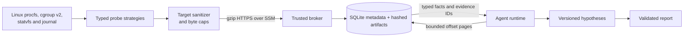

# Day 3 diagnostic MVP status

Day 3 is implemented and was exercised locally and on a clean disposable EC2 target in
`ap-southeast-1` on 2026-09-23. The work adds typed memory, cgroup OOM, filesystem and service
journal observations; versioned hypotheses; loss-aware artifact transfer; and an operator-only fault
lifecycle. The AWS and Docker environments were removed after acceptance.

## Data path

Large observations do not enter the model context in one response. The target caps data while it is
read, sanitizes journal messages before transport, and marks truncated captures. HTTP responses use
gzip when useful; the client independently limits compressed and decoded bytes. The broker stores the
sanitized raw observation as an immutable artifact and returns compact typed facts, provenance and an
opaque artifact ID. `read_artifact` returns at most 16 KiB with byte offsets, line bounds, total size,
EOF and SHA-256. Paging preserves UTF-8 boundaries, so concatenating successive pages reconstructs
the stored artifact exactly. Investigation-wide captured bytes remain capped at 10 MiB.

This keeps network traffic efficient without losing the data needed for later review: compression
reduces repeated procfs and JSON text, compact facts avoid repeatedly sending raw captures to the
agent, and stable digests make every retrieved page traceable to the persisted artifact.

## Implemented capabilities

| Capability | Typed result and scope | Hard boundary |
|---|---|---|
| `sample_cpu_pressure` | Host CPU deltas plus target cgroup CPU use | 1–5 second sample |
| `rank_processes` | PID/start identity, CPU and RSS ranking | 20 results, 2,048 processes scanned |
| `inspect_memory_pressure` | MemAvailable, swap, vmstat and optional PSI | Fixed procfs files |
| `inspect_cgroup_memory` | Current/max/swap and before/after memory events | Opaque `self` or `lab` scope |
| `inspect_filesystem` | Blocks, available bytes, inodes, type and read-only state | Opaque `root` or `lab` mount |
| `query_service_journal` | Counts plus sanitized JSON-lines artifact | Two units, 15 minutes, 500 lines, 256 KiB |

Every observation has `ok`, `partial`, `unsupported`, `denied`, or `output_limited` quality. A missing
journal in Docker, for example, persisted as `unsupported` with `source_unavailable` and `facts=null`;
it did not become a successful empty log. Report completion requires citations to evidence IDs and
named fact fields. Hypotheses persist support, contradiction and unresolved questions as immutable
versions, separately from observations.

## Object design

`LinuxProbe` is an abstract Template Method: it owns target identity, boot consistency, timing,
quality mapping and final output limits. CPU, process, memory, cgroup, filesystem and journal classes
implement only their collection strategy. `ProbeRegistry` is an explicit Strategy registry and never
loads model-supplied code. `JournalReader`, `Sanitizer`, `OperatorExecutor` and `FaultScenario` are
ABCs where implementations share a real behavioral contract. `FaultController` is a facade over the
CPU, memory and filesystem scenarios, their lease, TTL, readiness, cleanup and dirty-target state.
Parsers remain pure functions because inheritance would add no useful state or substitution point.

The diagnostic interface cannot start faults. Only the trusted CLI uses `FaultController`; it first
requires inventory marked `disposable=true`. Fault leases last 30–120 seconds, reset records the exact
scenario cleanup, and a failed reset marks the target dirty.

## Measured acceptance

The final clean deployment used terminated instance `i-0bd3e77691d7ee668` and wheel SHA-256
`8dea7b441601bfd7415333ff86de03f2858d6382057c314a8602959ab64099e5`.

| Check | Observed result |
|---|---|
| Clean unattended cloud-init and remote readiness | Passed |
| CPU fault attribution through full DSH/MCP path | Passed; two workers saturated two vCPUs |
| Cgroup memory fault | `oom_delta=1`, `oom_kill_delta=1` |
| OOM journal evidence | 4 bounded entries |
| Filesystem capacity fault | 4,190,208 bytes and 65,522 inodes remained; controlled write returned `errno 28` |
| Healthy memory control | `status=ok` |
| Missing journal control in Docker | HTTP success with observation `status=unsupported` |
| Target deduplication and hard limits | Passed |
| Cancellation, closed tunnel and fixed-port rejection | Passed |
| Fault cleanup and post-reset health | Passed |
| Gzip response and bounded decoding | Passed |

The full remote keyless harness report is
[stored locally](../.local/reports/d5ad3523f62a45b5aed3e7e6d2ada22e/report.md). It contains CPU,
process, memory, explicit unavailable cgroup, and filesystem evidence from the EC2 target. It is
correctly marked **inconclusive**: the fixture proves DSH startup, MCP calls, persistence, hypothesis
state and report validation, but it does not prove autonomous model reasoning. OOM and filesystem
acceptance used deterministic operator faults and direct typed target probes. A live OpenAI key is
still needed for Day 4 report-quality trials.

The Day 3 test suite has 21 passing tests, including parser semantics, redaction before persistence,
lossless UTF-8 paging, hypothesis versioning, fault lease cleanup and cross-capability authority
rejection. Ruff, strict mypy, package build, Terraform formatting/validation and Compose configuration
also pass in the final verification run.

## Teardown proof

Terraform destroyed 14 lab resources and 11 bootstrap resources. Direct AWS service inventories then
showed both Day 3 instance IDs terminated and no matching active SSM sessions, parameters, buckets,
EBS volumes, VPCs, security groups, IAM roles or SSM documents. `docker compose down --volumes`
removed the local containers, networks and named volumes. Local sanitized reports and acceptance JSON
remain under ignored `.local/` paths for presentation evidence.

## Day 4 boundary

Day 4 should run three independent live-model trials per incident plus healthy and unavailable
controls, score factual support, record latency/token/probe overhead, and produce sanitized evaluation
tables. The current results establish the observation and fault machinery; they do not yet establish
model diagnostic quality or production readiness.
