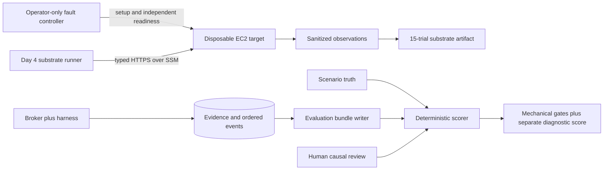

# Day 4 review and measured results

Day 4 closed the substrate reliability work and exposed the remaining release boundary precisely. The
typed target, fault controller, network failure handling, evaluation bundle, and teardown path passed.
All 15 AWS substrate trials passed. Two real DSH/OpenAI investigations used tools and exported accepted
reports. Both passed mechanical gates; human review failed the `gpt-4.1-mini` report and passed the
`gpt-5.6-terra` report. R05 is met; the repeated live-model matrix required by R16 remains open.

## What the core review changed

The review found several correctness issues worth fixing before evaluation:

- CPU cgroup fields implied container-wide attribution even though they describe the probe process
  cgroup. They are now named `probe_cgroup_*`, and their scope states that co-located processes may be
  included.
- The target now discovers its real cgroup-v2 membership from `/proc/self/cgroup`; it does not silently
  treat the hierarchy root as the probe service.
- Filesystem read-only state is now `probe_view_readonly`. The hardened systemd probe sees a read-only
  mount namespace even when the operator workload mount is writable, so the old name could support a
  false claim about the underlying filesystem.
- Observation construction now rejects byte-count mismatches, oversized captures, capability/fact
  type mismatches, invalid success/error combinations, and reversed timing.
- Concurrent retries with the same request ID share one target task; a different in-flight payload with
  that ID fails. Client disconnect cannot cancel the bounded target operation, replay remains possible,
  and no more than 64 requests can be in flight.
- Evidence budgets count the captured UTF-8 bytes rather than trusting a supplied counter. A report
  claim may cite fields distributed over several evidence records instead of requiring every cited
  record to contain every field.
- OOM readiness compares a new counter against an operator-only baseline. Historical OOMs can no
  longer make a trial pass. Cleanup resets the memory limit and verifies the marker is gone.
- SSM command polling tolerates `InvocationDoesNotExist`, tunnel startup failures close their process,
  and enrollment-token writes are atomic, flushed, and mode `0600`.
- The provider relay now establishes the upstream response before emitting HTTP 200. Rejected API
  requests produce a safe 502 with the upstream status instead of breaking an already-started stream.
- Strict mypy now checks all 17 runtime modules. The review also fixed an actual shadowed-variable type
  defect in the filesystem fault workload.
- Evaluation now permits zero observations only for the unavailable control. Manifests append `-dirty`
  to the source revision when the worktree is not clean.

The evidence schema, probe schema, parser version, and policy version are now version 3.

## Evaluation path



The separation is deliberate. Parser, identity, citation, cleanup, and budget checks are deterministic.
Whether a model's causal explanation is warranted remains a human-reviewed field. Fixture mode is
automatically labelled `not_applicable` for diagnostic quality.

## AWS substrate trials

The run used one disposable `t3.micro` in `ap-southeast-1`, release wheel SHA-256
`466b46f645c0df4814f8e37cddbf4fbee00491e1f03dce2b09a98ee9aa51d53d`, and three repetitions per
scenario. Scenario setup had to pass independent operator readiness before a trial entered the
denominator. Every fault cleanup passed before the next trial.

| Scenario | Result | Measured evidence |
|---|---:|---|
| CPU saturation | 3/3 | Host busy `100%` in all runs; dominant process `100.4871%`, `100.4545%`, `100.4879%` of one core |
| Cgroup OOM | 3/3 | Operator baselines/after counters `(0,1)`, `(1,2)`, `(2,3)`; cgroup limit `50,331,648` bytes |
| Filesystem full | 3/3 | Workload received `errno 28`; probe saw `4,190,208` bytes available and `950,210,560` after cleanup |
| Healthy control | 3/3 | Host busy `0%`, `0.5%`, `0.2506%`; probe cgroup OOM delta `0` in every run |
| Unavailable control | 3/3 | Closed tunnel produced bounded `ConnectError` in every run |

The OOM observation sampled the cumulative counter after readiness, so its within-observation delta is
zero. The operator-only before/after truth proves that each injection caused one new kill; a diagnostic
report must use the cumulative counter and time-bounded journal together and must not claim that the
probe itself observed a live transition.

Healthy CPU sampling measured the observer's cgroup at `0.0016808–0.0019894` cores with median
`0.0017902`. This is collector CPU during the sample, not a workload-latency comparison. Kernel version,
CPU-credit telemetry, model tokens, and application latency were not captured in this run.

The raw aggregate is stored locally at
`.local/aws/day4-substrate-i-092670022c28c6759.json` and is intentionally ignored by Git because it is
run output. It is labelled `substrate_reliability_not_model_quality`. That artifact recorded only the
repository HEAD even though new files were uncommitted; the review fixed future manifests to append
`-dirty`, but did not rewrite the original record.

## Evaluation artifacts

`oncall.evaluation` and `scripts/evaluate_report.py` write one private directory per scored run:

```text
run-manifest.json
scenario-truth.json
events.jsonl
evidence.json
report.json
report.md
score.json
```

One remote fixture report and one local fixture report were packaged successfully. The local report at
`.local/reports/52550304a05d41369134ad7e222a03a3/report.md` cites the sampled CPU, process, memory,
cgroup, filesystem, and journal evidence and exposes quality, errors, artifact size, truncation, and
limitations. Fixture reports validate orchestration and report enforcement; they do not count as live
model results.

## Adversarial coverage

| Security case | Evidence |
|---|---|
| Invalid capabilities, shell-shaped data, and extra fields | Typed request models and explicit registry reject them before collection |
| Traversal and cross-run artifact reads | Opaque artifact IDs, investigation ownership, bounded offsets, and store tests |
| Wrong credentials | Broker and target boundary tests return `401` |
| Duration, output, and concurrency floods | Independent target caps, semaphore of two, 64-request admission cap, and byte/deadline checks |
| Cancellation and disconnect | Service cancellation tests plus disconnect-shielded target task and idempotent replay |
| Prompt/log injection | Logs remain sanitized artifacts; agent network cannot reach target, metadata, or arbitrary provider URLs |
| Sandbox bypass | Local acceptance denied credentials, target network, Docker socket, and direct public egress |
| Fabricated citations | Report validator and deterministic scorer reject unknown evidence or missing cited fields |

The suite supports the documented disposable-lab boundary. It is not a penetration test or a production
security claim.

## Live provider result

The `.env` provider is `openai`. A bounded connectivity request using `gpt-4.1-mini` completed through
the fixed broker relay with HTTP 200, 969 streamed bytes, and an explicit stream terminator. The key
remained only in the broker.

The first `gpt-5.6-terra` harness request returned HTTP 400, but direct capability checks proved that
the model exists and accepts Chat Completions. The incompatibility was parameter-level: Terra accepts
only its default temperature, while DSH emitted a non-default value; Terra function tools on Chat
Completions also require `reasoning_effort="none"`. The relay now removes the harness temperature and
sets that reasoning mode for Terra. A direct tool-call check and the complete DSH investigation both
then returned HTTP 200.

Run `e572445745574c50bc5ce42186b888f0` sampled CPU and ranked processes through DSH, then submitted an
accepted report at `.local/reports/e572445745574c50bc5ce42186b888f0/report.md`. Its scored bundle is
`.local/evaluation/7fc79198eb014ca38e6b7150a3d64b87`.

| Live-run metric | `gpt-4.1-mini` | `gpt-5.6-terra` |
|---|---:|---:|
| Tool calls | 2 | 2 |
| Captured bytes | 3,716 | 2,864 |
| Evidence completeness | 100% | 100% |
| Citation integrity | Pass | Pass |
| Deterministic gate | Pass | Pass |
| Human diagnostic review | Fail | Pass |
| Unsupported material claims | 1 | 0 |

The evidence showed shared-kernel host CPU at `20.98%`, the probe/co-located cgroup consuming `1.007`
cores against a `1.0`-core quota with `6,001,965` throttled microseconds, and the one captured Python
process at `24.97%` of one core. The report cited the fields correctly but called that one process the
likely cause. That claim is not supported: the ranked process accounts for only part of the observed
cgroup CPU, one process disappeared during the scan, and the injected workload had multiple workers.
The run is retained as a failed semantic trial rather than being edited into a pass.

Terra run `ed9c2cd6672f4772b2c94043a5b3915e` is stored at
`.local/reports/ed9c2cd6672f4772b2c94043a5b3915e/report.md`; its evaluation bundle is
`.local/evaluation/c4ef7b0c9baf464c8ac9c980471bff2e`. It distinguished `28.38%` shared-host CPU
from the constrained cgroup, which consumed `1.0006` cores against a `1.0`-core quota and accumulated
`2,012,286` throttled microseconds. It correctly attributed about `92%` of one core to two Python
workers, retained the two-second sampling limitation, and made no unsupported material claim.

An earlier live attempt produced a useful diagnosis but failed report validation because the prompt did
not explain the exact `fact_fields` contract. The harness profile now gives a concrete top-level-field
example and tells the model to correct rejected submissions. Report rejections are also recorded in the
audit log.

## Teardown evidence and remaining gates

Remote post-trial checks found the workload and sentinel inactive, no fault payload/readiness/OOM
baseline markers, restored filesystem capacity, and no active SSM sessions. Terraform destroyed 14 lab
resources and then 11 bootstrap resources. Direct service inventories returned no active project
instances, volumes, VPCs, IAM roles, parameters, documents, buckets, or SSM sessions. The resource
tagging API still listed the just-deleted instance and volumes, which is eventual-consistency history;
the corresponding EC2 active-resource queries were empty.

The remaining release work is narrow:

1. Complete three same-model reports for each incident and both controls, retaining failures. Terra has
   one passing CPU trial so far.
2. Keep the mini-model failure as comparative evidence; do not combine models in one acceptance
   denominator.
3. Record token telemetry if the API exposes it, plus exact AMI/kernel/runtime versions in each manifest.
4. Compare workload latency with and without probes if a perturbation claim is needed.

R05 is now met. Until the repeated reports exist, the model-quality portion of R16 remains unmet. Day 4
substrate reliability, two honest live-model scores, and teardown are complete.
