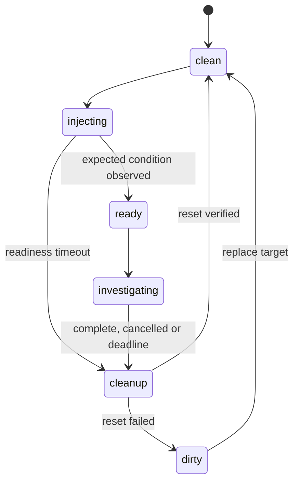

# Fault lab, evaluation and demo

## Scenario lifecycle

The lab controller is operator-only. Require both a disposable-target inventory flag and explicit lab enablement on the host. Target tags alone are not enough. The agent cannot read scenario truth, injection scripts, evaluator manifests or cleanup handles.



Run one scenario at a time. Every scenario has setup, readiness, ground truth, a maximum runtime, cleanup and a post-reset check. The target watchdog cleans up even if the operator connection disappears. Ground truth uses independent operator observations; do not score solely by the same parser being evaluated.

## Core scenarios

| Scenario | Injection | Required diagnostic evidence | Cleanup |
|---|---|---|---|
| CPU saturation | Bounded worker processes in a systemd lab slice, enough runnable work to produce sustained demand; retain capacity for probe service | Interval CPU utilization, CPU count, process attribution and relevant limitations | Stop exact lab unit/process group; check baseline recovery |
| Cgroup OOM | Dedicated lab service with a low memory limit and bounded allocator; keep cgroup observable after child failure | New OOM event during run, cgroup limit/identity, service failure, host availability | Stop allocator, retain counter snapshot, then remove/reset unit |
| Filesystem full | Fill only dedicated lab mount to configured ceiling; produce a controlled failed write | Correct mount available blocks/inodes and service write failure; distinguish root mount | Remove only manifest-owned files; check available capacity |
| Healthy control | No injected fault after verified reset | No unsupported primary fault; limitations of sampled health stated | Verify no leftover workers/files |
| Unavailable control | Stop tunnel or deny test capability in controlled configuration | Unavailable/inconclusive status and preserved prior evidence | Restore transport/configuration and recheck readiness |

Use neutral workload/unit names and randomized identifiers; names such as `oom-generator` leak the answer. Synthetic service failures should resemble observable incidents. Do not mount evaluator data into the agent. Never fill root, induce host-wide OOM or exhaust all host PIDs for the core demo.

Keep a sentinel process in the OOM cgroup or otherwise preserve its lifetime so counters are still available after the allocator is killed. Record before/after counters. Filesystem injection must distinguish reserved blocks and the workload user's available space; success requires demonstrating the write failure, not just reporting a chosen fill percentage.

## Experimental comparisons

| Variant | Priority | Question |
|---|---|---|
| Stock DSH loop + Python substrate | Core | Does the complete system diagnose the scoped incidents? |
| Codex + same substrate | Next | How much does runtime choice change quality? |
| DSH + one targeted native extension | Next | Does the measured behavioral fix help? |
| Codex or generic harness with target shell | Research | What does the constrained substrate change? |

Direct-shell baselines run only in separate disposable targets, with their different authority disclosed. Do not silently give them stronger logs, longer budgets or scenario names. Compare stock versus modified DSH with the same model first. Cross-harness runs with different models are system comparisons, not isolated measurements of harness quality.

Record git SHA, AMI/kernel, machine type, CPU credit state if applicable, package/runtime/model versions, prompts/skills, policy, scenario seed, start/end timestamps, budgets and provider settings. Independent repetitions use fresh sessions and reset targets; vary ordering. Replay tests verify plumbing and parsers, not live diagnosis quality.

## Scoring

| Metric | Definition |
|---|---|
| Diagnostic success | Correct condition and affected scope, plus required supporting evidence |
| Unsupported claims | Count material assertions not warranted by cited observations |
| Evidence completeness | Required scenario evidence present / required evidence count |
| Citation integrity | References resolve to correct investigation, target, interval and field/lines |
| Operational behavior | Successful forbidden actions, attempted forbidden actions, intrusive probe count |
| Efficiency | Wall time, remote calls, model tokens when available, captured bytes |
| Reliability | Tool failures, retries, premature termination, cancellation and cleanup outcomes |
| Perturbation | Probe CPU/RSS and workload latency change relative to matched baseline |

Use deterministic checks for identity/counter/citation validity, plus a human rubric for causal interpretation. An LLM judge may assist review but is not the sole ground truth. Missing token telemetry is `unavailable`, not zero. Report medians/ranges and individual outcomes for the small sample; avoid broad statistical claims.

Core minimum: 9 fault trials plus 3 healthy and 3 unavailable trials. [Requirements](requirements.md) defines release thresholds. Keep failed trials in the denominator and separately report invalid trials caused by unsuccessful fault setup.

Implemented result artifact per scored run:

```text
run-manifest.json
scenario-truth.json       # evaluator-only
events.jsonl
evidence.json
report.json
report.md
score.json
sanitized-artifacts/
```

The current writer emits the first seven files. Sanitized raw capture is already retained through
evidence artifact references; copying those artifacts into a portable bundle is a follow-on. See
[Requirements verification](requirements-verification.md) for the repeated substrate measurements and
explicit live-model gap.

## Ten-minute presentation

1. **One minute:** explain the problem—reasoning is useful, but target authority and evidence quality need explicit engineering.
2. **Two minutes:** show the deployment diagram and one Python collector/parser/service boundary. Explain why local shell and target shell have different authority.
3. **Three minutes:** inject a CPU or cgroup incident, run the CLI, inspect a finding and its original evidence, then show a competing explanation and uncertainty.
4. **One minute:** demonstrate a rejected out-of-scope request or target disconnection and the resulting honest failure state.
5. **Two minutes:** show measured evaluation results, one failed case and the change it motivated.
6. **One minute:** reset the fault, explain Terraform teardown, and state the next engineering decision.

Prepare a sanitized recorded run for network/provider failure and label replay clearly. Keep a healthy baseline report available. Do not present illustrative planning examples as measured results.

## Questions to defend with code

- Why not install a coding agent directly on the target? Show the authority boundary and measured tradeoffs, not an unsupported claim about model intelligence.
- Why AI? Parsers measure facts; the model chooses follow-up questions and explains competing hypotheses.
- Why Python OOP? Show interchangeable transport/storage/harness boundaries and pure parser functions.
- What if a PID disappears, a pipe fills, the controller crashes or the target reboots? Show the error and cleanup path.
- Does a citation prove a diagnosis? No; it proves provenance, with semantic support assessed separately.
- Why this cloud topology? Explain outbound access, absence of inbound ports, cost tradeoffs and the private-subnet extension.
- What did you omit? Remediation, fleet operation and advanced probes, to finish a credible end-to-end slice.
