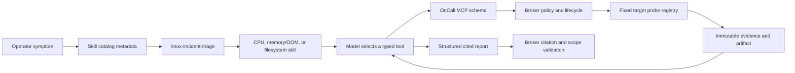

# Harness skills and tool design

The harness separates diagnostic judgment from operational authority. Skills teach the model how to
interpret Linux evidence and choose the next discriminating observation. MCP tools expose a small
typed interface. The broker and target enforce identity, scope, budgets, deadlines, output limits,
and evidence integrity regardless of whether the model follows the skill.

## Why the original files were insufficient

The original `harness/skills/*.md` files were short maintainer notes. The `sdk-minimal` DSH profile did
not install the skill catalog, filesystem discovery, or skill tool plugins, so the runtime never saw
them. All diagnostic instruction lived in one system prompt. That increased prompt size, mixed
resource-specific rules into every incident, and made it difficult to test whether guidance was
selected for the symptom.

The harness patch now installs three pinned DSH plugins:

- `@deepseek-ai/dsh-skill` owns the catalog and loaded-skill state;
- `@deepseek-ai/dsh-skill-filesystem` discovers local skill bundles; and
- `@deepseek-ai/dsh-tool-skill` gives the model a tool for loading one selected skill.

Discovery is restricted to `/app/harness/skills` with default roots disabled. Ambient user or project
skills therefore cannot enter the isolated runtime. The base system prompt carries only universal
constraints and routes incident work to the triage skill.

## Skill catalog

Each skill is a directory with a validated `SKILL.md` and discriminating YAML metadata. The description
is visible in the catalog; the body enters context only after the model loads it.

| Skill | Load when | Decisions it improves |
|---|---|---|
| [`linux-incident-triage`](../harness/skills/linux-incident-triage/SKILL.md) | Any incident, continuation, or unavailable target | Current versus historical scope, minimal probe sequence, competing hypotheses, stop conditions, retries, report outcome |
| [`linux-cpu-diagnosis`](../harness/skills/linux-cpu-diagnosis/SKILL.md) | Latency, saturation, throttling, hot process | Host versus cgroup scope, interval semantics, CPU denominators, attribution limits |
| [`linux-memory-oom`](../harness/skills/linux-memory-oom/SKILL.md) | OOMKilled, exit 137, allocation failure, memory pressure | Host pressure versus cgroup enforcement, cumulative counters, event deltas, PSI limits |
| [`linux-filesystem-diagnosis`](../harness/skills/linux-filesystem-diagnosis/SKILL.md) | ENOSPC, write failure, inode or read-only symptoms | Mount scope, blocks versus inodes, read-only state, journal correlation |

The skills use operational decision tables, evidence hierarchies, contradictions, and explicit stop
conditions. They avoid scripts because all target access must continue through the broker. They avoid
duplicating schemas and numeric policy limits already enforced by code.

## Tool contract

The six observation tools return typed `Evidence`; four lifecycle tools expose state, bounded artifact
pages, hypotheses, and report submission. Their MCP descriptions explain what each measurement can and
cannot establish. This matters because a model chooses tools partly from those descriptions.

| Layer | May decide | Must not decide |
|---|---|---|
| Skill | Which hypothesis and observation are useful; how to interpret returned facts | Authority, target, duration maximum, output maximum, evidence identity |
| MCP schema | Valid input shape and opaque scope identifiers | Arbitrary host, path, unit, command, or URL |
| Broker | Session authority, budgets, concurrency, lineage, evidence admission, report validity | Linux measurement values |
| Target | Fixed collector, independent bounds, local parsing and quality status | Model reasoning or remediation |

`get_investigation_state` includes a sanitized failure summary: count, exception class, capability,
attempt, and time. It never exposes transport error text. After repeated equivalent failures, the
triage skill directs the model to stop probing and submit an evidence-free `inconclusive` report.
`completed` reports still require at least one evidence-backed claim.

## Progressive disclosure and terminal output

Normal operator output suppresses skill loading as internal routing noise. Verbose mode reports only
an allowlisted skill name, such as `Loading diagnostic guidance · linux-cpu-diagnosis`. Unknown skill
names and raw arguments are removed by the progress projection. Skill bodies, model reasoning, raw
tool results, and prompts never cross the progress channel.

## Validation

The implementation has four complementary checks:

1. The skill validator checks metadata, naming, structure, and descriptions for every bundle.
2. Unit tests verify allowlisted skill progress, unknown-name redaction, failure summaries, and the
   completed-versus-inconclusive report invariant.
3. DSH configuration composition verifies the three plugins and the isolated discovery directory.
4. The keyless fixture calls the real `skill` tool before the CPU probe path, proving catalog discovery
   and loading through the containerized harness.

These checks establish wiring and deterministic boundaries. They do not establish that a model will
select the best skill or diagnose every incident correctly. The remaining evaluation is a held-out
same-model matrix across CPU, OOM, filesystem, healthy, ambiguous, and unavailable cases. Review
should score probe economy, correct scope, causal restraint, alternative handling, citation validity,
and whether the model stops when the available evidence cannot answer the question.

## Adding a skill safely

Add a new skill only when a distinct incident family needs interpretation that would make the base
prompt or an existing skill materially less precise. Give it a narrow trigger description, reuse only
existing typed tools, and state both supporting and contradicting observations. Validate it, add one
selection/loading fixture, and include held-out model cases. A skill cannot compensate for a missing
authorization or collection primitive; that requires a separately reviewed tool and policy change.
