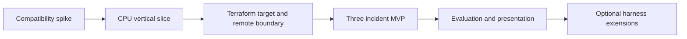

# Phased implementation plan

This is a four-day core plan with two optional extension days. Dates are relative so the schedule survives interruptions. Budget roughly 6–8 focused hours per day. If integration takes longer, keep the gates and move dates; do not expand scope to compensate.

This file also preserves the compact implementation chronology. Measured commands, trials, limitations,
and teardown evidence live in [Requirements verification](requirements-verification.md).

## Day 1 — Phase 0 and first vertical slice

**Phase 0, maximum two hours:**

- [ ] Confirm AWS account/region/access, model credential, Linux container runtime and available engineering time.
- [x] Pin Python, DeepSeek SDK/runtime and profile; verify launch, MCP call, structured response and cancellation.
- [x] Verify provider relay compatibility, internal-network isolation and disabled unwanted telemetry/session uploads.
- [x] Record selected versions and decisions in an execution manifest; keep credentials untracked.

If DSH integration cannot pass the spike, record the exact blocker and use a replay adapter to continue domain work. A Codex adapter using the same MCP interface is the practical fallback for a live demo; disclose the runtime substitution. Replay is not an autonomous-agent demonstration.

**Phase 1:**

- [x] Create package/build config, CLI skeleton, Ruff/type-check/pytest configuration and CI.
- [x] Implement immutable evidence models, target/process identity, typed errors and policy values.
- [x] Implement CPU collector/parser and bounded process attribution; use captured fixtures first.
- [x] Implement explicit registry, budget checks, artifact storage and SQLite repository.
- [x] Connect harness tool calls to the service and render an evidence-cited CPU report.
- [x] Use a disposable Linux development target; never interpret the developer's macOS host as Linux.

**Exit:** a CPU fault produces actual measurements and a cited diagnosis through the typed interface; parser and policy tests pass. An offline replay report is an intermediate checkpoint only.

**Observed Day 1 result:** the local platform gate passes with actual fault measurements and a
validated cited report. The deterministic provider fixture verifies the real DSH/tool lifecycle but is
not a diagnosis-quality test. A live OpenAI reasoning run remains pending a provider credential. AWS
access/model credential confirmation stays unchecked because the user explicitly moved provisioning to
Day 2 and requested a keyless local-first path.

## Day 2 — AWS and the execution boundary

- [x] Implement bootstrap/lab Terraform roots, backend locking, network, IAM, instance, EBS and fixed-port SSM document.
- [x] Build/install a pinned target wheel via private release artifacts and cloud-init/systemd.
- [x] Implement enrollment, target authentication and broker SSM tunnel lifecycle.
- [x] Enforce target-side limits independently of broker limits; implement request ID deduplication.
- [x] Configure agent sandbox and provider relay; prove credential and network isolation.
- [x] Implement `oncall doctor`, readiness failures and inventory export.
- [x] Run a complete remote CPU investigation; exercise cancel and a broken tunnel.
- [x] Destroy and reprovision once to expose undocumented setup dependencies.

**Exit:** Terraform creates a usable target from a clean environment; agent cannot bypass typed access; remote report and cleanup work. A successful Terraform apply alone is not this gate.

**Observed Day 2 result:** the repaired replacement target passed remote readiness, TLS/token access,
deduplication, hard limits, CPU attribution, cancellation, broken-tunnel failure, fixed-port rejection,
and sandbox isolation. Terraform then destroyed 14 lab and 11 bootstrap resources; direct AWS
inventories show no remaining billable project resources. The replacement exposed two bootstrap
permission defects that are corrected in the final template. Day 3 subsequently passed an unattended
clean apply with that template; see [Requirements verification](requirements-verification.md).

## Day 3 — Complete the diagnostic MVP

- [x] Add memory, process/cgroup, filesystem and bounded service journal collectors.
- [x] Add OOM and filesystem parser/contract fixtures, including missing permissions and historical events.
- [x] Add first-class hypotheses, contrary evidence and unresolved questions.
- [x] Add scoped artifact reading/export and final-report validation.
- [x] Implement operator-only fault runner with readiness, lease/TTL, reset and dirty-target detection.
- [x] Exercise CPU saturation, cgroup OOM, filesystem full and healthy/unavailable controls end to end.
- [x] Add concise CPU, memory/OOM and filesystem diagnostic skills; rules do not grant privileges.

**Exit:** all three incident classes work; evidence survives a harness reset; absent data does not become zero; no faults remain after reset.

**Observed Day 3 result:** a clean EC2 deployment recorded CPU attribution, a cgroup OOM and OOM-kill
delta of one with four matching journal entries, and a controlled filesystem write failure with
`errno 28`. Healthy memory and unavailable-source controls retained explicit quality states. The
operator runner reset every fault, the full fixture-driven harness report persisted five observations
and a versioned hypothesis, and direct inventories proved the AWS and Docker environments were
removed. The fixture validates orchestration rather than model judgment; live-model repeat trials
remain open. See [Requirements verification](requirements-verification.md).

## Day 4 — Reliability, evaluation and presentation

- [x] Run adversarial and cancellation tests from the security design.
- [x] Run three independent substrate trials per incident plus healthy/unavailable controls.
- [x] Save versioned evaluation bundles, raw results, scored fixture claims and failure notes.
- [x] Measure probe cgroup CPU against healthy samples and record its interpretation limits.
- [x] Fix demonstrated defects; do not rewrite the agent loop to make one demo prettier.
- [x] Produce a results Markdown document and sanitized example report from actual runs.
- [x] Rehearse the local demo, export an offline fixture report, verify clean apply and teardown.
- [x] Update README status, implementation checkboxes and ADRs to match reality.

**Exit:** core release gates in [requirements](requirements.md) pass, or the final report explicitly documents which remain unmet. Nothing is declared complete merely because four days elapsed.

**Observed Day 4 result:** all 15 AWS substrate trials passed and cleanup was verified. The strict
type boundary now covers the full runtime package, and the evaluator emits reproducible bundles. Live
DSH/OpenAI runs retained one `gpt-4.1-mini` semantic failure and one passing `gpt-5.6-terra` CPU report.
R05 is met; repeated model-quality trials required by R16 remain open. See
[Requirements verification](requirements-verification.md).

## Optional Day 5 — Baselines and usability

Add Codex with the same MCP capabilities, then compare it with stock DSH using identical scenario seeds and budgets. Explicit parent-linked continuation is implemented with historical/current evidence scopes, target/boot checks, TTL, lineage bounds, and immutable reports. Detached background worker/attach remains after core reliability: persist worker PID and start identity, own stdout/stderr, handle terminal exit, reap children, and detect stale leases. Do not use bare `fork()` as a substitute for lifecycle design.

## Optional Day 6 — One justified extension

Pick one measured failure: hypothesis context lost during compaction, premature completion, or poor probe scheduling. Add a small native context/policy/completion hook, rerun held-out cases, and retain it only if useful. Expand one diagnostic family if time remains. Full custom loops, tracing, PMU analysis and fleet features are later work.

## Practical task sizing and fallback

Each checkbox should be a reviewable change with a concrete observable behavior, relevant tests and updated docs. Do not create empty architecture layers just to match the proposed tree. Build contracts only as consumers appear.

If only two days remain, deliver one real CPU incident end to end with remote isolation, evidence export and teardown; label it a vertical slice rather than the three-incident MVP. Cut the web UI, background workers, baseline matrix, native plugins and advanced probes before cutting policy or provenance.

## Completion checklist

- [ ] P0 requirements pass with actual artifacts; live DSH report-quality trials remain.
- [x] Every changed boundary has meaningful failure tests.
- [x] Package, type checks and relevant tests pass on supported environments.
- [x] Cloud setup and cleanup verified; costs and retained resources documented.
- [x] Example reports contain synthetic data and no credentials.
- [x] Presenter can explain collector → parser → evidence → finding and one failure path.
