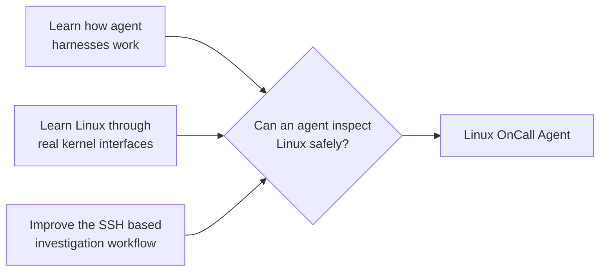
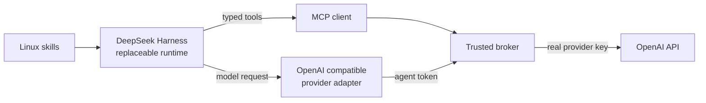
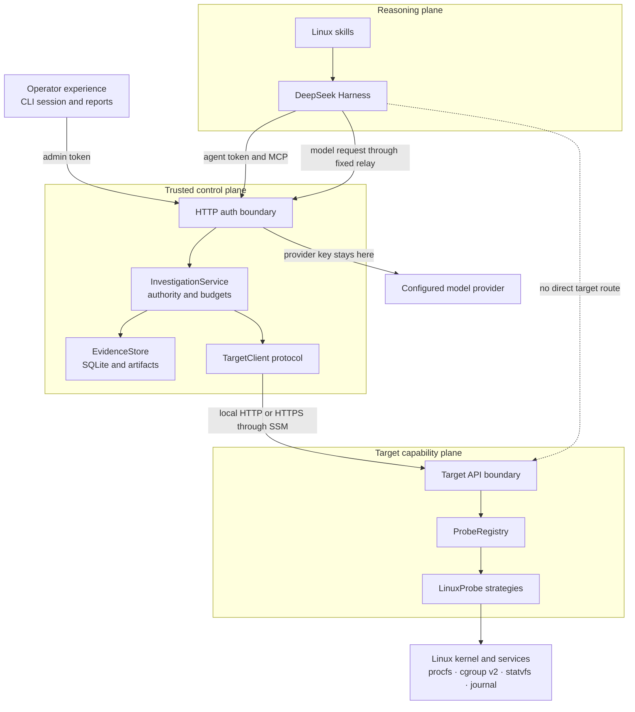
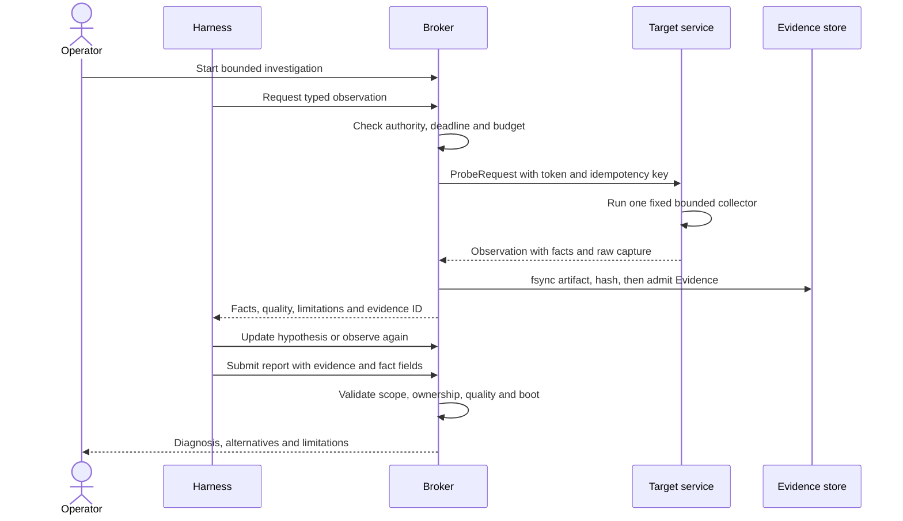
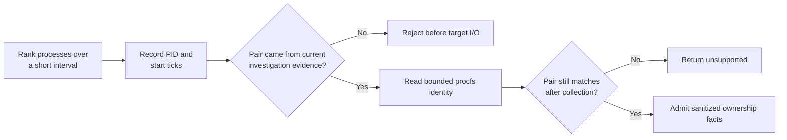
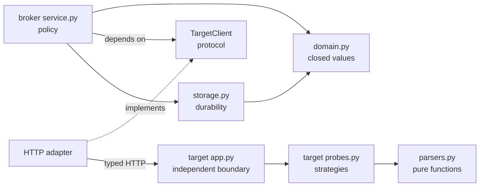
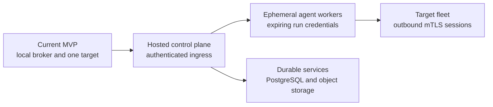

# Linux OnCall Agent

> Adaptive reasoning belongs inside deterministic authority, evidence, and failure boundaries.

**Presentation route:** motivation → harness choice → architecture → evidence → Linux detail → EC2 demo → code → results

---

## Why I built it



- **Agent engineering:** understand tools, skills, sessions, model relays, authorization, failure, and auditability beyond a model loop.
- **Linux:** work directly with `procfs`, cgroup v2, process identity, pressure, filesystems, `systemd`, and the journal.
- **Operational problem:** a general coding agent on an unhealthy host may need broad shell, filesystem, network, and credential access while consuming the resources being investigated.

The project keeps adaptive reasoning away from the target. The model chooses questions; trusted code
controls which observations exist, how much they cost, and what may become evidence.

---

## Why an agent?

| Deterministic software is good at | The model is useful for |
|---|---|
| Reading and parsing Linux counters | Choosing the next observation from the previous result |
| Enforcing schemas, limits, and identity | Comparing competing explanations |
| Preserving artifacts and provenance | Explaining scope, uncertainty, and next steps |
| Validating that citations exist | Forming a causal diagnosis for human review |

Static monitoring answers questions known in advance. Incident diagnosis is conditional: host CPU
pressure leads to process attribution, cgroup throttling leads to quota inspection, and filesystem
capacity must be correlated with a failed write before claiming causality.

---

## Why DeepSeek Harness first?



DSH exposed the integration points I wanted to study:

- an embeddable SDK and pinned runtime;
- a patchable provider and plugin graph;
- MCP and discoverable skills;
- lifecycle notifications for safe progress; and
- enough control to place the entire runtime inside an isolated container.

Codex remains a credible alternative and could consume the same MCP interface. It offers a ready-made
interactive coding workflow; DSH exposed more runtime composition for this experiment. This is not a
claim that DSH diagnoses better—I have not run a controlled Codex-versus-DSH benchmark.

Code: [`runner.py`](../src/oncall/harness/runner.py) ·
[`oncall.patch.yml`](../harness/oncall.patch.yml) ·
[`progress.py`](../src/oncall/harness/progress.py)

---

## The abstraction layers



The **domain layer** contains frozen request, observation, evidence, hypothesis, and report values. It
depends on none of AWS, MCP, HTTP, DSH, or Linux I/O. Adapters translate protocols; services enforce
policy; strategies collect one fixed class of observation.

On AWS, the target service runs directly under `systemd` on EC2. It is not a container. It binds only
to EC2 loopback, the security group has no inbound rules, and a fixed-port SSM tunnel originates from
the operator laptop.

---

## Decisions that shaped the design

| ADR | Decision | Tradeoff |
|---|---|---|
| 001 | Keep reasoning off the target | Deploy a small probe service and transport boundary |
| 002 | Keep Python policy independent of DSH | Maintain explicit harness adapters |
| 003 | Use MCP for the harness and typed HTTPS for the target | Two protocols with separate responsibilities |
| 006 | Store immutable evidence separately from interpretation | Own SQLite and artifact durability |
| 008 | Keep mutation operator-only | No automatic remediation |
| 009 | Prove boundaries in Docker, then preserve them on EC2 | Support local and remote transports |

Full rationale: [`decisions.md`](decisions.md)

---

## From symptom to admissible evidence



```text
ProbeRequest → Observation → immutable Evidence → cited Claim → validated Report
 model asks      target saw       broker owns       model proposes    operator reads
```

The evidence ID proves provenance and field availability. It does not prove that the model's causal
interpretation is correct. Mechanical validation and semantic evaluation remain separate.

Detailed path: [`investigation-sequence.md`](investigation-sequence.md)

---

## Linux detail: a PID is not an identity



Linux can reuse a PID. The broker therefore authorizes the exact PID and start-tick pair returned by
current ranking evidence. The target checks it before and after reading `stat`, `status`, `cmdline`,
`exe`, and `cgroup`. It never reads the process environment.

This one feature combines Linux semantics, a time-of-check/time-of-use race, evidence-derived
authorization, sanitization, output bounds, and explicit uncertainty.

Code: [`broker authorization`](../src/oncall/broker/service.py#L146) ·
[`process collector`](../src/oncall/target/probes.py#L270) ·
[`race and redaction test`](../tests/test_observation_pipeline.py#L39)

---

## Live EC2 investigation

| Moment | Command | What to show |
|---|---|---|
| Confirm scope | `.venv/bin/oncall doctor` | The target is an EC2 instance |
| Create condition | `.venv/bin/oncall lab-cpu --ttl-seconds 120` | Fault injection is operator-only and leased |
| Investigate | `.venv/bin/oncall` | Scope, dominant workload, alternatives, and limitations |
| Clean up | `.venv/bin/oncall lab-stop` | Exact workload removal is verified |

The workload creates genuine scheduler pressure through a controlled synthetic cause. The agent does
not know the scenario and cannot start or stop it. A retained report is the fallback if venue
networking prevents a live model request.

Runbook: [`evaluation-and-demo.md`](evaluation-and-demo.md)

---

## Show the actual code



| Review question | Open |
|---|---|
| How is model authority constrained? | [`ProbeRequest`](../src/oncall/domain.py#L13) |
| Where are deadlines, budgets, and evidence admission enforced? | [`InvestigationService.probe`](../src/oncall/broker/service.py#L105) |
| How does every collector share timing and boot identity? | [`LinuxProbe.collect`](../src/oncall/target/probes.py#L70) |
| How does raw evidence become durable before metadata? | [`EvidenceStore.add`](../src/oncall/broker/storage.py#L107) |
| How are duplicate requests and disconnects handled? | [`target.create_app`](../src/oncall/target/app.py#L19) |

The code discussion is the centre of the interview. The diagrams establish context; these links are
where implementation choices, failure paths, tests, and alternatives become concrete.

---

## Evidence and limits

| Result | Establishes | Does not establish |
|---|---|---|
| **86 automated tests** plus static checks | Parser, policy, storage, lifecycle, and boundary behavior | Live diagnosis quality |
| **15 of 15 AWS substrate trials** | Repeatable fault setup, observation, reset, and cleanup | Fifteen model successes |
| One retained Terra CPU report on Docker | One report passed evidence and causal review | EC2 reliability |
| One retained smaller-model semantic failure | Valid citations can accompany poor reasoning | General model ranking |

Current scope: one operator, one target, seven read-only observations, CPU/OOM/filesystem scenarios,
local evidence storage, and no remediation. The complete same-model reliability matrix remains open.

The main lessons are compact:

- Prompts guide behavior; systems code controls authority.
- Linux evidence is scoped, temporal, and sometimes unavailable.
- A valid citation proves provenance, not causality.
- Narrow tools improve auditability while reducing diagnostic reach.
- The harness should remain replaceable and be compared experimentally.

---

## Direction



The broker evolves into an application-level control plane rather than a generic proxy. Authority and
evidence remain independent of whichever model or harness performs the reasoning.

> I began by trying to understand agent harnesses and Linux internals. The project connected them:
> adaptive diagnosis is useful only when the surrounding system makes its authority and evidence
> explicit.

Further detail: [architecture tour](architecture-tour.md) ·
[security and reliability](security-and-reliability.md) ·
[production architecture](production-architecture.md)
