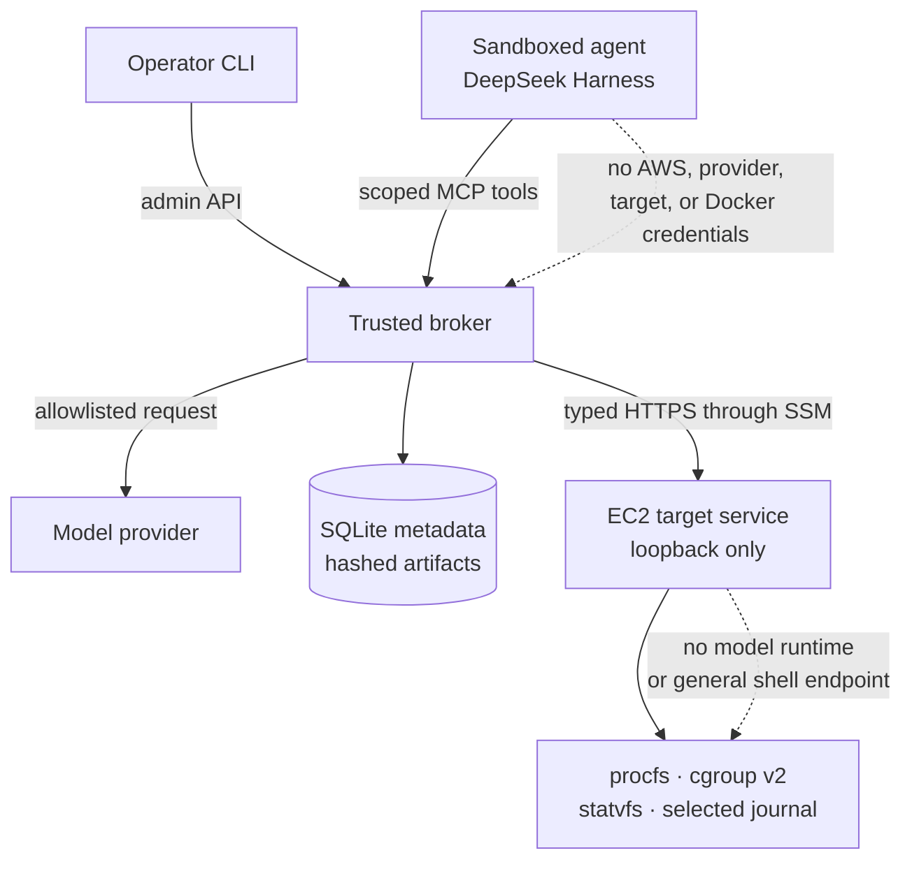
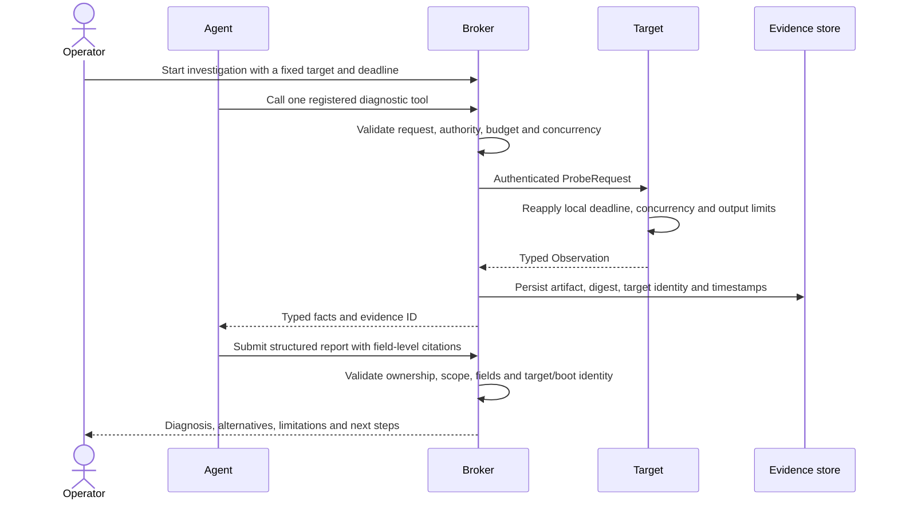
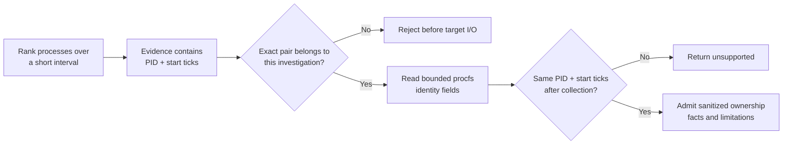

# Linux OnCall Agent

## Adaptive diagnosis inside deterministic boundaries

> The model may choose what to investigate. It cannot choose its authority or decide what counts as
> evidence.

I built this project to explore a practical systems question: how can an agent investigate a degraded
Linux host without giving probabilistic reasoning unrestricted production access?

Linux incidents are adaptive. A useful next measurement depends on the previous result. But commands
such as recursive searches, unbounded journal reads, tracing, or arbitrary shell execution can leak
data or make an incident worse. My design separates those concerns:

- the **agent** chooses among approved diagnostic observations;
- the **broker** owns authority, budgets, evidence, and report validation;
- the **target service** performs bounded Linux collection; and
- the **operator** alone controls fault injection and remediation.

---

## Architecture and trust boundaries

The EC2 security group has no inbound rule. The SSM tunnel originates from the operator workstation,
and the target service listens only on EC2 loopback. Locally, the same boundaries run as separate
containers. The agent cannot select a destination, submit a command, or widen a limit.

The target exposes seven observations: CPU pressure, process ranking, process identity, host memory,
cgroup memory, filesystem capacity, and a bounded service journal. Parameters use strict ranges and
opaque identifiers for approved mounts, cgroups, and units.

Code entry points: [`broker application`](../src/oncall/broker/app.py) ·
[`target application`](../src/oncall/target/app.py) ·
[`harness runner`](../src/oncall/harness/runner.py)

---

## From symptom to admissible evidence

The evidence ID proves where an observation came from and which fields existed. It does not prove the
model interpreted them correctly. That distinction shapes the evaluation: deterministic gates check
provenance and citations, while human review checks causal reasoning.

Code paths: [`ProbeRequest` and evidence schemas](../src/oncall/domain.py#L13-L65) ·
[`broker policy`](../src/oncall/broker/service.py#L105-L162) ·
[`evidence admission`](../src/oncall/broker/storage.py#L107) ·
[`target request boundary`](../src/oncall/target/app.py#L39-L104)

---

## One difficult detail: process identity

A CPU ranking that reports “Python, PID 2516” is rarely enough to act on. I added bounded workload
attribution without opening a generic process-inspection interface.

Linux can reuse a PID, so the broker authorizes the PID and process start ticks together. The target
checks that identity before and after reading bounded `procfs` fields. It limits argument count and
length, redacts recognized secret-bearing options, and returns missing metadata as a limitation.

Implementation: [`authorization`](../src/oncall/broker/service.py#L146-L162) ·
[`collector`](../src/oncall/target/probes.py#L270-L373) ·
[`policy test`](../tests/test_service.py#L163-L181) ·
[`PID reuse and redaction test`](../tests/test_observation_pipeline.py#L39-L72)

---

## Live EC2 investigation

The primary demonstration creates a leased CPU fault on a disposable EC2 host. The investigation must
determine whether pressure is host-wide or cgroup-local, identify the dominant processes and owning
workload, consider alternatives, and preserve the limits of a short sample.

| Step | Operator action |
| --- | --- |
| Create the condition | Run `.venv/bin/oncall lab-cpu --ttl-seconds 120` |
| Investigate | Run `.venv/bin/oncall`, then describe the CPU-pressure symptom |
| Clean up | Run `.venv/bin/oncall lab-stop` and verify the workload is gone |

During the result, I would pause on five things: the EC2 target identity, host versus cgroup scope,
throttling, the owning workload of the dominant processes, and the limitations. The lease and cleanup
are operator-only; neither is exposed to the agent.

The complete setup and recovery procedure is in the
[`AWS demonstration guide`](evaluation-and-demo.md). A retained report remains available if venue
networking prevents the live model call.

---

## Actual code walkthrough

At this point I would leave the Markdown preview and open the repository. Four locations tell the
implementation story without touring every file:

| Review question | Open | What to inspect |
| --- | --- | --- |
| How is authority represented? | [`domain.py`](../src/oncall/domain.py#L13-L65) | Closed names, strict fields, frozen values and conditional validation |
| Where is policy enforced? | [`broker/service.py`](../src/oncall/broker/service.py#L105-L162) | Deadline, atomic budget reservation, authorization, concurrency and evidence admission |
| How is Linux accessed safely? | [`target/probes.py`](../src/oncall/target/probes.py#L70-L137) | Shared probe lifecycle, error conversion, timing and output limits |
| How is one real race handled? | [`ProcessIdentityProbe`](../src/oncall/target/probes.py#L270-L373) | PID reuse checks, bounded reads, sanitization and explicit limitations |

If the discussion moves toward reliability, I would next open
[`EvidenceStore.add`](../src/oncall/broker/storage.py#L107),
[`the idempotent target endpoint`](../src/oncall/target/app.py#L39-L104), or
[`the package-boundary tests`](../tests/test_package_boundaries.py).

---

## Evidence, testing and tradeoffs

| Result | What it establishes | Limit |
| --- | --- | --- |
| **86 automated tests**, Ruff and strict MyPy | Parser, policy, persistence, lifecycle and boundary behavior | Does not measure live diagnostic quality |
| **15/15 AWS substrate trials** across five conditions | Repeatable setup, transport, observation, reset and cleanup | These were infrastructure trials, not fifteen model diagnoses |
| One retained Terra CPU report on local Docker | A human-reviewed report passed evidence and causal checks | It was not collected from EC2 and is not a reliability matrix |
| One retained smaller-model failure | Valid citations can accompany an unsupported causal conclusion | Deterministic validation cannot replace semantic review |

The main tradeoff is breadth versus control. Seven typed observations cover fewer situations than SSH,
but each has reviewable semantics, cost, timeout, output bounds, and failure behavior. Broker and target
limits duplicate some checks because they protect different failure domains. SQLite and local artifacts
fit one operator and one active investigation; a fleet design would require durable shared services.

Verification detail: [`requirements verification`](requirements-verification.md) ·
[`security and reliability`](security-and-reliability.md)

---

## Limits, evolution and conclusion

The current system is diagnosis-only, single-operator, and single-target. It covers synthetic CPU,
cgroup OOM, and filesystem incidents through seven observations. It does not provide arbitrary Linux
exploration, automated remediation, or a statistically complete model-quality result.

The next release gate is the complete same-model reliability matrix. A production evolution would put
the broker behind authenticated ingress, run ephemeral agent workers with expiring leases, move SQLite
metadata to PostgreSQL, move artifacts to encrypted object storage, and replace one-off SSM tunnels
with outbound mTLS target sessions. The broker remains a control-plane application rather than a
generic proxy.

The central result is architectural:

> Adaptive reasoning does not require adaptive authority. The investigation can change direction
> while access, evidence, and failure behavior remain deterministic and testable.

Further detail: [architecture tour](architecture-tour.md) ·
[Python design](python-design.md) ·
[production architecture](production-architecture.md)
