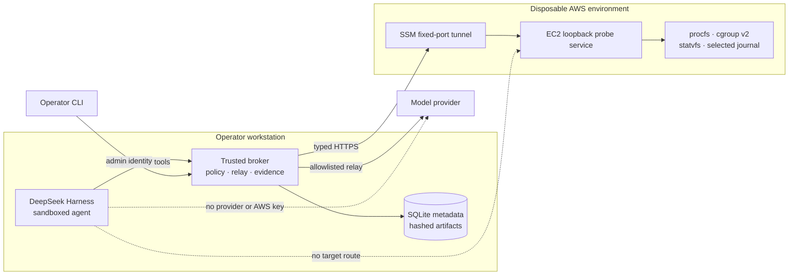
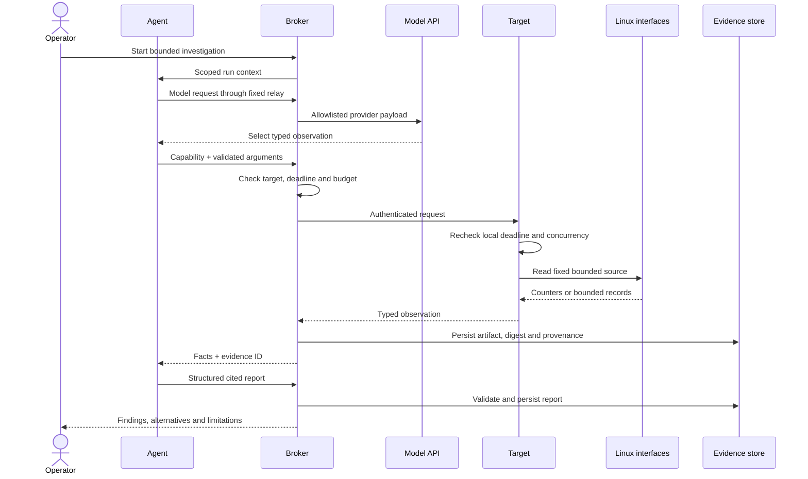
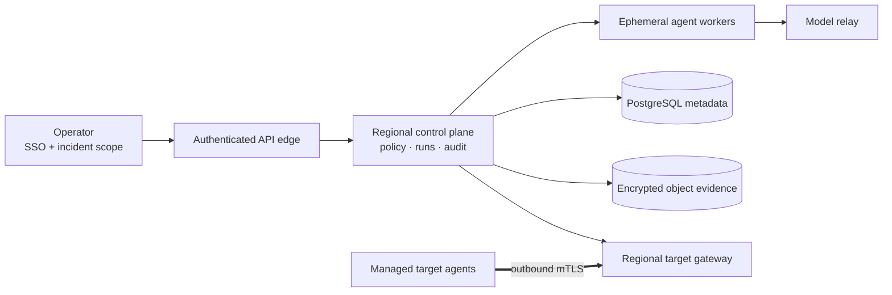

# Linux OnCall Agent

## Adaptive diagnosis inside deterministic boundaries

> The model may choose what to investigate. It cannot choose its authority or decide what counts as
> evidence.

An evidence-driven Linux incident investigator for local containers and disposable EC2 targets.

---

## The problem

Linux incidents require adaptive investigation, but unrestricted agent access creates three risks:

| Need | Engineering risk |
| --- | --- |
| Choose the next useful measurement | Fixed scripts cannot adapt to unexpected evidence |
| Protect a degraded target | A diagnostic command can block, leak data, or worsen impact |
| Preserve trustworthy evidence | A fluent answer can outlive or misrepresent its measurements |

My design separates adaptive reasoning from deterministic authority:

- The **model** chooses among approved observations and compares competing explanations.
- The **broker** enforces identity, policy, budgets, persistence, and report validity.
- The **target** independently bounds local collection.
- The **operator** alone owns fault injection and remediation.

---

## System and trust boundaries



The EC2 security group has no inbound rule. The model never receives AWS, provider, target, SSH, or
Docker credentials.

---

## A deliberately narrow target interface

The target exposes seven typed observations:

| Capability | What it establishes |
| --- | --- |
| CPU pressure | Host busy, iowait, steal, cgroup quota and throttling |
| Process ranking | Interval CPU/RSS consumers with PID/start-time identity |
| Process identity | Executable, bounded argv, UID, parent and systemd/cgroup ownership |
| Host memory | Availability, swap, VM counters and optional PSI |
| Cgroup memory | Current/maximum usage and OOM event deltas |
| Filesystem | Blocks, inodes, type and read-only state on configured mounts |
| Service journal | Sanitized, boot-scoped records from configured units |

There is no model-supplied command, path, host, cgroup, journal unit, fault, or remediation endpoint.

---

## From symptom to evidence-backed diagnosis



An evidence ID proves provenance and field existence. It does not automatically prove that the
model's causal interpretation is correct.

---

## Live investigation: CPU pressure on EC2

The operator starts two leased CPU workers on a disposable target. The agent must answer:

1. Is the pressure host-wide or scope-local?
2. Which processes dominate the interval?
3. Which workload owns those process identities?
4. Which alternatives remain plausible?
5. What can a short sample not establish?

```bash
.venv/bin/oncall lab-cpu --ttl-seconds 120

.venv/bin/oncall investigate --symptom \
  "Investigate the current CPU pressure. Identify whether it is host-wide or scope-local, the dominant processes and their owning workload. Cite evidence, consider alternatives, and state limitations."

.venv/bin/oncall lab-stop
```

The fault has a lease, exact cleanup, and independent readiness checks. Fault injection is not
available to the diagnostic agent.

---

## Code: make authority explicit in the type system

[`src/oncall/domain.py`](../src/oncall/domain.py#L17-L64)

```python
ProbeName = Literal[
    "sample_cpu_pressure",
    "rank_processes",
    "inspect_process_identity",
    "inspect_memory_pressure",
    "inspect_cgroup_memory",
    "inspect_filesystem",
    "query_service_journal",
]

class ProbeRequest(Value):
    name: ProbeName
    duration_seconds: Annotated[int, Field(strict=True, ge=1, le=5)] = 2
    ...
    pid: Annotated[int, Field(strict=True, ge=1, le=2**31 - 1)] | None = None
    start_ticks: Annotated[int, Field(strict=True, ge=1)] | None = None
```

- Models are frozen and reject unknown fields.
- Capability-specific validators reject hidden authority.
- Output bounds are part of the domain schema.
- Domain models import no MCP, AWS, HTTP, or harness SDK code.

---

## Code: policy before target I/O

[`src/oncall/broker/service.py`](../src/oncall/broker/service.py#L105-L162)

```python
async def probe(self, request: ProbeRequest) -> Evidence:
    run = self.active()
    if request.name == "inspect_process_identity":
        self._authorize_process_identity(run, request)
    if self.calls >= self.max_calls:
        raise PolicyError("Probe call budget exceeded")
    self.calls += 1
    ...

def _authorize_process_identity(self, run: str, request: ProbeRequest) -> None:
    ranked = any(
        item.status == "ok"
        and item.facts is not None
        and item.facts.kind == "processes"
        and any(
            process.pid == request.pid
            and process.start_ticks == request.start_ticks
            for process in item.facts.processes
        )
        for item in self.store.evidence(run)
    )
    if not ranked:
        raise PolicyError(
            "Process identity must come from current investigation ranking evidence"
        )
```

A PID alone is not an identity: Linux may reuse it. The broker requires the exact PID/start-ticks pair
from successful, current-run evidence before spending target or investigation budget.

---

## Code: bounded Linux collection

[`src/oncall/target/probes.py`](../src/oncall/target/probes.py#L270-L373)

```python
class ProcessIdentityProbe(LinuxProbe):
    name: ProbeName = "inspect_process_identity"
    maximum_cmdline_bytes = 16 * 1024
    maximum_arguments = 8
    maximum_argument_chars = 128

    async def _collect(self, request: ProbeRequest) -> Collected:
        assert request.pid is not None and request.start_ticks is not None
        path = self.proc / str(request.pid)
        before = parse_process_stat(read_bounded(path / "stat", 8192))
        if before.pid != request.pid or before.start_ticks != request.start_ticks:
            raise UnsupportedProbe("process identity is stale")

        ...

        after = parse_process_stat(read_bounded(path / "stat", 8192))
        if after.pid != before.pid or after.start_ticks != before.start_ticks:
            raise UnsupportedProbe("process changed during observation")
```

- No shell or caller-controlled filesystem path
- Fixed procfs sources and bounded output
- Recognized secret-bearing argv options redacted before admission
- PID/start-time identity checked before and after collection
- Missing optional fields retained as limitations

---

## Code: test the policy and race

[`tests/test_service.py`](../tests/test_service.py#L163-L181) ·
[`tests/test_observation_pipeline.py`](../tests/test_observation_pipeline.py#L39-L72)

```python
with pytest.raises(PolicyError, match="current investigation ranking"):
    await service.probe(request)
assert service.calls == 0

await service.probe(ProbeRequest(name="rank_processes"))
identity = await service.probe(request)
assert identity.facts is not None and identity.facts.kind == "process_identity"
```

The collector fixture also verifies:

- systemd workload attribution;
- command-line redaction;
- bounded output; and
- rejection when the same PID has different start ticks.

---

## Engineering choices

| Problem | Choice | Tradeoff |
| --- | --- | --- |
| Target authority | Seven typed capabilities | Less breadth than SSH; smaller auditable surface |
| Cross-boundary limits | Broker and target both enforce | Some duplicated checks; safer failure behavior |
| Retry ambiguity | Idempotency key + request fingerprint | Bounded replay state on the target |
| Client disconnect | Shield target work behind its own deadline | Work may finish after the caller leaves |
| Large evidence | Facts in context; artifacts by reference | More storage and paging logic |
| Missing telemetry | Explicit unavailable/partial states | More inconclusive answers; less false certainty |
| Python structure | Protocols, composition and small strategies | More explicit wiring than a framework container |
| Local persistence | SQLite WAL + immutable artifacts | Appropriate for one writer, not a hosted fleet |

DeepSeek Harness supplies the current tool-using loop and skill discovery. The domain, policy, target,
storage, evaluation and CLI layers remain replaceable and independently testable.

---

## Evaluation without inflated claims

| Evidence | What it establishes | What it does not establish |
| --- | --- | --- |
| **86 automated tests**, Ruff and strict MyPy | Parser, policy, persistence, lifecycle and boundary behavior | Live diagnostic quality |
| Three AWS substrate runs for five conditions | **15/15** setup, transport, observation, reset and cleanup trials | Fifteen successful model diagnoses |
| Retained Terra CPU report on local Docker | One human-reviewed pass with valid evidence and no unsupported claim | EC2 model reliability |
| Retained smaller-model report | Valid citations with one unsupported causal conclusion | That citations imply correct reasoning |

Retained Terra measurements:

- **1.0006 cores** used against a one-core quota
- **2,012,286 μs** throttled over two seconds
- **28.38%** shared-host utilization across ten logical CPUs
- two Python workers accounting for about **92% of one core** together

The report favored cgroup-local pressure over host-wide saturation and preserved its sampling limits.
The complete same-model 15-report reliability matrix remains open.

---

## From MVP to a hosted control plane



| MVP | Production direction |
| --- | --- |
| Local broker container | Hosted control plane behind authenticated ingress |
| Disposable agent container | Ephemeral worker with an expiring investigation lease |
| SQLite and local artifacts | PostgreSQL and encrypted object storage |
| One SSM tunnel | Fleet-managed outbound mTLS target sessions |
| Local secret files | Workload identity, managed secrets and certificate rotation |

The first hosted version can remain a modular monolith. Service separation should follow real scaling
or credential boundaries.

---

## Current limits

- Single operator and one active target
- Synthetic CPU, cgroup OOM and filesystem incidents
- Diagnosis only; no autonomous remediation
- Seven observations rather than complete Linux observability
- One passing live-model report, not a statistically complete quality claim
- Local control plane and single-writer evidence store

The next release gate is the complete same-model reliability matrix. Broader authority should follow
measured diagnostic need rather than precede it.

---

## Closing

The project combines:

- Linux resource semantics and process identity
- Python domain modeling and dependency inversion
- distributed deadlines, idempotency and cancellation
- evidence provenance and failure-aware storage
- sandboxing, AWS SSM and Terraform lifecycle
- honest separation of deterministic checks from model quality

> Adaptive reasoning does not require adaptive authority. The investigation can change direction
> while access, evidence and failure behavior remain deterministic and testable.

Further detail: [architecture tour](architecture-tour.md) ·
[security and reliability](security-and-reliability.md) ·
[requirements verification](requirements-verification.md) ·
[production architecture](production-architecture.md)
