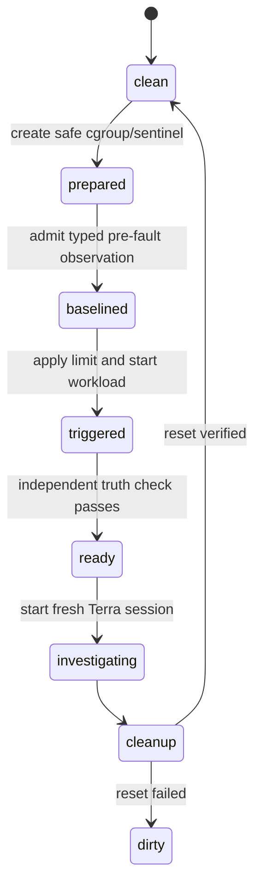

# Pre-matrix architecture review

This review covers the code path required for live Terra diagnosis of cgroup OOM and filesystem
capacity incidents, followed by the 15-trial model-quality matrix. The existing architecture has good
separation between immutable domain values, typed probes, policy, transport, evidence storage,
operator-only fault strategies, the harness adapter and evaluation. The remaining problems are in
cross-component lifecycle ownership and evaluation reproducibility, rather than the collector class
design.

## Findings to fix before live trials

### P0 — unavailable results contradict the report schema

`Report.claims` requires at least one evidence-backed claim, while the unavailable evaluator test
accepts an inconclusive report with no claims. A real unreachable-target run currently ends with tool
errors and the CLI changes its state to `cancelled`.

Fix the domain invariant so completed reports require claims and inconclusive reports may contain no
claims when they include a structured failure summary, limitations and next steps. Add distinct
failed, cancelled, deadline and insufficient-evidence terminal reasons. This is required for the three
unavailable trials in the matrix.

Review:

- `src/oncall/domain.py`: `Report` and claim invariants;
- `src/oncall/service.py`: `active`, `submit`, `cancel` and terminal-state transitions;
- `src/oncall/evaluation.py`: unavailable outcome and citation scoring.

### P0 — current OOM evidence can miss the actual OOM interval

The memory fault controller creates the cgroup, records an operator-only counter, triggers the OOM and
waits until `oom_kill` increases before returning. Terra starts afterward. `CgroupMemoryProbe` then
reads `memory.events`, sleeps for the requested duration and reads it again. A one-shot OOM that
happened before the first read correctly produces `oom_kill_delta=0` for the agent, even though the
operator setup proved that the event was new.

Do not expose evaluator truth or the `.oncall-oom-before` marker to the agent. Expand the operator
scenario lifecycle to:

For the memory trial, `prepare` creates the sentinel with an unlimited cgroup. The trusted coordinator
collects a typed cgroup baseline through the same `InvestigationService`. `trigger` applies the 48 MiB
limit and starts the 128 MiB allocator. The agent then sees the baseline in investigation state and
collects the post-fault counter and journal. Its report can cite both observations and establish a new
cgroup-scoped OOM without reading scenario truth.

Use the same pre-fault observation pattern for CPU and filesystem trials. It improves causal clarity
and keeps the comparison consistent. Healthy receives the same baseline without a trigger.

Review:

- `src/oncall/faults.py`: split `FaultPlan.start` into `prepare` and `trigger`;
- `src/oncall/probes.py`: cgroup counter semantics and explicit observation interval;
- `src/oncall/service.py`: trusted pre-observation admission through normal policy/budgets;
- `harness/oncall.patch.yml`: tell the agent to inspect existing run evidence before new probes.

### P0 — fault leases are shorter than the investigation budget

Fault TTL is capped at 120 seconds. The harness permits 150 seconds, the CLI waits 175 seconds and the
broker budget is 180 seconds. CPU workers or the OOM sentinel can expire while an otherwise valid
investigation is still running.

Choose one shared budget object. For the release matrix, use a 90-second agent deadline and a
120-second fault lease, leaving time for readiness and cleanup, or raise the lease cap while retaining
the target watchdog. Validate `lease_seconds >= agent_deadline + readiness_margin` before injection.

### P0 — the CLI does not own the agent container lifecycle

`subprocess.run(... docker compose run --rm ...)` has no deterministic container name. Killing or
timing out the Docker client does not prove the agent container exited. The exception path then calls
`/admin/cancel`, conflating harness/provider failures with operator cancellation.

Extract an `InvestigationRunner` with injected process, broker, clock and exporter ports. Give each
container a name derived from the run ID, retain bounded harness logs, stop/remove that exact container
in `finally`, verify removal, and call `fail` or `cancel` according to the actual cause.

Review:

- `src/oncall/cli.py`: `investigate` lines containing `subprocess.run` and the catch-all exception path;
- `src/oncall/harness_runner.py`: timeout and signal behavior;
- `src/oncall/storage.py`: persisted finish reason, timing and budgets.

### P0 — evaluation bundles are not portable after teardown

`EvidenceStore` writes raw captures into the broker volume. `EvaluationBundleWriter` copies evidence
metadata, report, events and score, but does not copy the sanitized raw files. Full Docker teardown
therefore deletes the bytes named by each artifact hash.

Add an admin-authenticated, run-scoped artifact export. Build a bundle in a temporary directory, copy
and verify every sanitized artifact, write `review.json` and `checksums.sha256`, then atomically rename
the completed bundle. The bundle validator must run before Docker or AWS teardown.

Review:

- `src/oncall/storage.py`: artifact ownership and hash verification;
- `src/oncall/broker.py`: admin export boundary;
- `src/oncall/evaluation.py`: atomic bundle writer and bundle validator.

### P0 — the current Day 4 runner does not execute model trials

`scripts/aws_day4_trials.py` correctly labels itself as substrate reliability. It calls target probes
directly and cannot satisfy the model-quality matrix. `scripts/evaluate_report.py` relies on manually
provided model, expected outcome, setup and cleanup flags, which makes a full matrix error-prone.

Create one trusted matrix coordinator that derives those fields from its scenario plan and recorded
runtime state. It must checkpoint after every cleanup, retain setup failures, and resume only between
trials. Scenario truth remains outside the agent environment.

### P1 — provider adaptation and metrics live in the broker composition root

The Terra rule is a model-name conditional in `provider_payload`. The relay records that a request
happened but not duration, byte count, upstream status, response ID or token usage. Its model-call
budget is in memory and resets with the broker.

Move compatibility into a small typed provider profile selected from an explicit registry. Persist
model-call reservations and results as run events. Enable streaming usage for profiles that support it
and record unavailable telemetry as unavailable, not zero. Keep the fixed provider endpoint and
request-field allowlist.

Review:

- `src/oncall/broker.py`: `provider_payload`, `model_calls` and `upstream`;
- `tests/test_broker.py`: compatibility and provider failure coverage.

### P1 — evaluation timing and review records are incomplete

`infer_interval` uses the first and last evidence timestamp, which produces a near-zero unavailable
trial and excludes model time. Human review is collapsed into `score.json`, and bundle creation is not
atomic.

Persist run start, harness start, report acceptance/failure and cleanup completion directly. Add a
first-class review record with rubric version, reviewer, timestamp, result, unsupported claims and
rationale. Aggregate output must reject pending reviews.

### P1 — scenario prompts currently reveal too much

Prompts such as “service memory failure” and “service write failure” disclose the diagnostic family.
Use a fixed, versioned neutral symptom bank for the matrix:

| Scenario | Neutral symptom |
|---|---|
| CPU | “The service is responding slowly and work is not completing at its normal rate.” |
| Cgroup OOM | “The service terminated unexpectedly and did not complete its work.” |
| Filesystem | “The service cannot persist new data and recent writes are failing.” |
| Healthy | “Check the target for current CPU, memory, or filesystem pressure and preserve uncertainty.” |
| Unavailable | “Investigate the reported service degradation and state what can and cannot be established.” |

Record the prompt-bank version and exact symptom in each manifest. Keep trial ordering deterministic
but randomized from a recorded seed.

## Focused implementation plan

### Gate A — architecture corrections

1. Fix report/terminal-state invariants and failure summaries.
2. Introduce the shared run/fault budget configuration.
3. Split fault strategies into prepare, trigger, ready, cleanup and verify-clean stages.
4. Add trusted, typed pre-fault observations to each available scenario.
5. Extract `InvestigationRunner` and prove exact container cleanup.
6. Add portable artifact export, atomic bundles, checksums and review records.
7. Add typed provider profiles and persistent model telemetry.

Exit criteria: unit/static checks pass; unavailable produces an accepted inconclusive result; a local
CPU fixture bundle remains verifiable after deleting Docker volumes.

### Gate B — matrix coordinator rehearsal

1. Implement a scenario registry containing lifecycle actions, neutral symptom, required facts,
   expected outcome and cleanup policy.
2. Implement a resumable matrix plan with three repetitions, deterministic shuffled order and a fresh
   harness session for every trial.
3. Run one fixture rehearsal for CPU, memory, filesystem, healthy and unavailable. Fixture mode checks
   orchestration only; it does not count toward model quality.
4. Inject controlled failures during rehearsal: setup failure, harness timeout, target disconnect,
   report rejection, bundle-write failure and cleanup failure.

Exit criteria: five portable rehearsal bundles, expected terminal states, no remaining container or
fault, and a valid aggregate summary.

### Gate C — Terra OOM and filesystem qualification

1. Provision one clean disposable AWS target and record its AMI, kernel, architecture, boot ID,
   instance type, EBS identity and CPU-credit state.
2. Run one Terra OOM qualification trial. Require evidence of the pre-fault cgroup counter, increased
   post-fault counter, 48 MiB cgroup limit, affected unit/journal and healthy host scope. Human review
   must reject exit-code-only reasoning.
3. Reset and verify clean. Run one Terra filesystem qualification trial. Require the dedicated mount,
   low available bytes, inode state, controlled `errno 28`, root/lab distinction and recovery proof.
4. Inspect both raw bundles and tune only scenario-neutral instructions or validated fact-field
   guidance. Do not encode the expected diagnosis into the prompt.

Exit criteria: one mechanically valid and human-passing Terra bundle for each scenario, followed by
verified cleanup. A failed qualification is retained and corrected before the matrix begins.

### Gate D — complete the 15-trial Terra matrix

1. Start from a clean target and a recorded matrix seed.
2. Run three repetitions each of CPU, cgroup OOM, filesystem, healthy and unavailable in the generated
   order. Stop immediately on dirty cleanup, target identity change or bundle-integrity failure.
3. Human-review every trial using the same rubric. Keep failures and invalid setups in the summary.
4. Require at least two of three diagnostic passes for each injected incident and correct behavior in
   all healthy/unavailable controls.
5. Generate per-trial bundles plus one Markdown/JSON aggregate containing latency, model calls, token
   usage when available, probe calls, captured bytes, unsupported claims, evidence completeness,
   target overhead and cleanup results.
6. Tear down the fault, tunnel, Docker resources, lab Terraform and bootstrap Terraform. Run the
   machine-readable clean inventory and retain the portable bundles locally.

Exit criteria: R01 and R16 can move from partial to pass without counting substrate trials as model
diagnoses.

## Suggested review order for the presenter

1. `src/oncall/domain.py` — decide what completed versus inconclusive means.
2. `src/oncall/faults.py` and `src/oncall/probes.py` — verify the OOM before/after semantics and fault
   safety.
3. `src/oncall/service.py` — inspect budgets, evidence admission and terminal state transitions.
4. `src/oncall/evaluation.py` — agree on mechanical gates versus human judgment.
5. `src/oncall/cli.py` and the planned runner — confirm process ownership and cleanup.
6. `src/oncall/broker.py` — confirm the provider/key boundary and Terra adaptation.
7. `harness/oncall.patch.yml` — review the exact behavior requested from the model.
8. The final OOM and filesystem bundles — trace one claim from report to typed fact to raw artifact.

The most important design decisions for human review are the neutral symptom wording, required fact
sets, the prepare/baseline/trigger lifecycle, the human scoring rubric, and whether the presentation
makes any latency or low-overhead claim.
