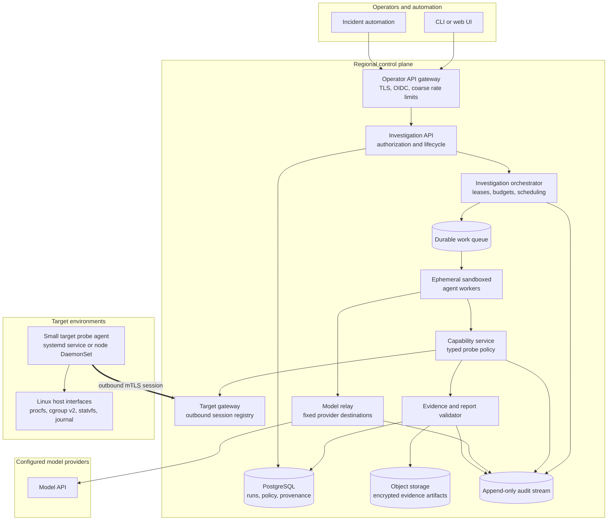
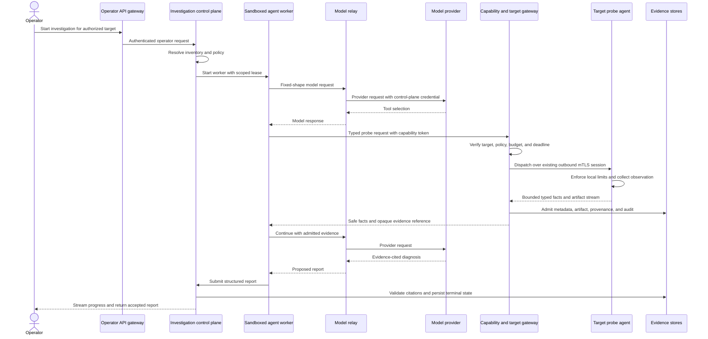

# Production reference architecture

This document describes a possible production destination for Linux OnCall Agent. It is a reference
design, not the currently implemented deployment. The current system is intentionally a
single-operator, single-target MVP with a local broker, local evidence storage, an ephemeral agent
container, and one target reached directly or through an SSM tunnel.

## Recommendation

In production, the broker responsibilities should move into a hosted regional control plane. The
operator API should sit behind an authenticated edge gateway, while target traffic should enter
through a separate capability gateway. Sandboxed investigation workers should receive short-lived
authority to one incident and one target; they should never receive target credentials, cloud
credentials, or provider API keys.

The broker is therefore a control-plane application, not a generic reverse proxy:

- it authenticates operators and workloads;
- resolves target identity from trusted inventory;
- issues short-lived investigation authority;
- enforces capability policy and resource budgets;
- dispatches typed probe requests;
- admits and stores evidence;
- relays fixed-shape model requests;
- validates evidence-cited reports; and
- records an authoritative audit trail.

An API gateway or load balancer should handle TLS termination, OIDC integration, coarse rate limits,
and request routing in front of the broker. It should not decide Linux probe policy. A separate
target gateway should terminate target connections and route bounded probe requests without exposing
individual machines to inbound Internet traffic.

## Logical architecture

The boxes are logical responsibilities. The first hosted version can remain a modular monolith plus
managed storage and a worker service. Separate services are justified when they need independent
scaling, distinct credentials, or a stronger security boundary.

## Four distinct planes

### Operator plane

The CLI and any future web UI call a versioned HTTPS API through the edge gateway. Human identity
comes from the organization's SSO provider. RBAC or ABAC determines which environments, services,
targets, probes, and evidence an operator may access. Production investigations should also carry a
ticket, incident, or change identifier where organizational policy requires one.

The edge gateway handles authentication integration and coarse abuse protection. The investigation
API performs the domain authorization because it understands target scope, incident state, probe
sensitivity, and evidence ownership.

### Reasoning plane

Each investigation runs in a short-lived sandboxed worker. The worker receives:

- an investigation ID;
- the operator's symptom and approved context;
- an expiring capability token scoped to one tenant, target, and policy version;
- a broker MCP endpoint; and
- a relay token restricted to the selected provider profile.

The worker receives no target route, cloud identity, evidence-store credential, or provider key.
Workers should have CPU, memory, wall-clock, call-count, and output limits. Their network policy should
allow only the capability service and model relay. Completion, timeout, cancellation, or loss of the
lease destroys the worker.

### Target capability plane

Production targets run a small deterministic probe agent, not the model runtime. A VM deployment can
use a native systemd service installed through the normal fleet-management system. Kubernetes can use
one node-level DaemonSet. An environment may instead supply an equivalent trusted node service as long
as it implements the same capability and evidence contracts.

The target agent establishes an outbound mTLS session to the nearest target gateway. This avoids
public inbound ports and removes the need for one long-lived SSM port-forward per machine. Enrollment
binds a short-lived certificate to tenant, environment, target ID, image or package version, and
policy. Certificates rotate automatically and revocation disconnects the target.

Every probe still has two enforcement points:

1. the capability service verifies investigation scope and remaining central budget; and
2. the target agent independently enforces local capability names, parameters, deadlines,
   concurrency, byte limits, and source allowlists.

The model cannot choose a hostname, URL, shell command, file path, cgroup path, or journal unit outside
the registered schema. Intrusive probes and remediation belong to separate approval-gated services
and credentials.

### Evidence plane

PostgreSQL holds investigation state, leases, hypotheses, evidence metadata, report structures,
policy decisions, and target identity. Object storage holds bounded sanitized artifacts under
content-addressed keys with encryption, retention policy, and tenant isolation. An append-only audit
stream records authorization, dispatch, target response, provider usage, report validation, and
administrative actions.

Large target responses should stream through a bounded ingestion path directly into trusted artifact
storage. The reasoning worker receives compact typed facts and paged sanitized excerpts rather than
the entire capture. Each metadata row records the artifact digest, size, truncation state, collection
interval, parser version, target identity, boot ID, and policy decision.

## Request sequence

Progress shown to the operator should come from trusted lifecycle and capability events. Raw prompts,
unrestricted tool payloads, provider credentials, sensitive evidence, and private model reasoning do
not belong in that stream.

## Component responsibilities

| Component | Owns | Must not own |
| --- | --- | --- |
| Operator API gateway | TLS, OIDC integration, coarse limits, routing | Probe policy or target credentials |
| Investigation API | Operator authorization, incident lifecycle, target selection | Linux collection implementation |
| Orchestrator | Leases, deadlines, cancellation, worker scheduling | Model-generated policy decisions |
| Agent worker | Investigation strategy and report proposal | Durable authority, provider keys, target routes |
| Capability service | Typed tool contract, policy, budgets, dispatch | Arbitrary command execution |
| Target gateway | Authenticated session registry and bounded transport | Interpretation of Linux evidence |
| Target probe agent | Local collection and independent safety ceilings | Model runtime or general remote shell |
| Model relay | Provider profiles, fixed destinations, usage accounting | Target access or evidence mutation |
| Evidence services | Provenance, artifacts, citations, retention | Unvalidated model claims as facts |

## Identity and authorization

Use a separate identity for each actor:

- operators authenticate through SSO and receive tenant- and environment-scoped permissions;
- control-plane services use workload identity rather than shared static keys;
- every target has a unique, short-lived mTLS identity;
- every investigation receives a short-lived capability token bound to its target and policy version;
- every agent worker receives a separate model-relay token; and
- artifact reads use investigation-owned references and server-side authorization.

Authorization should be deny-by-default and evaluated again at each boundary. Target identity comes
from inventory and the authenticated target session, never from model input. Tenant, environment,
target, investigation, boot, and evidence identities remain attached to every record.

## Availability and scaling

The control-plane API and capability service can be stateless replicas behind private load balancers.
PostgreSQL provides transactional state, while a durable queue and expiring leases allow another
worker to mark or resume interrupted work without duplicating authority. Object storage absorbs larger
artifacts independently of API instance lifetime.

Regional target gateways should keep connection ownership and routing metadata in a shared registry.
A gateway loss causes targets to reconnect and investigations to receive an explicit transport
failure; it must never turn missing evidence into a healthy result. Idempotency keys prevent an
ambiguous retry from becoming a second expensive probe.

Backpressure applies per tenant, operator, target, capability, and provider. Limits should protect a
degraded host from a surge of investigations as well as protect the service from one noisy tenant.

## Mapping from the MVP

| Current MVP | Production destination |
| --- | --- |
| Local broker container | Regional investigation and capability control plane |
| Host-only broker port | Authenticated operator API gateway |
| `docker compose run` agent | Ephemeral sandbox job on a worker platform |
| Broker model endpoint | Dedicated fixed-destination model relay |
| SQLite metadata | PostgreSQL with transactional leases and tenant scope |
| Local hashed artifact files | Encrypted object storage plus digest metadata |
| One SSM port-forward | Outbound mTLS target sessions through regional target gateways |
| Local token files | SSO, workload identity, certificate lifecycle, and secrets manager |
| One systemd target service | Fleet-managed systemd package or node DaemonSet |
| Terminal-only operation | Same CLI plus optional web and incident-system integrations |

The domain models, typed probe schemas, evidence records, report validation, and independent target
limits should survive this transition. Deployment adapters and persistence implementations change;
the core safety contract does not.

## Incremental adoption

### Stage 1: hosted single-tenant control plane

Move the broker and evidence volume to one private hosted environment. Put the operator API behind
SSO, use managed PostgreSQL and object storage, and keep SSM transport for a small fleet. Run one
ephemeral sandbox job per investigation. This removes workstation availability from the critical path
without immediately introducing a custom target gateway.

### Stage 2: durable execution

Add the queue, expiring worker leases, deterministic cancellation, portable evidence bundles,
provider telemetry, and resumable investigation state. Scale API and workers independently.

### Stage 3: fleet connectivity

Replace per-target SSM tunnels with outbound mTLS target sessions, certificate enrollment and
rotation, trusted inventory, regional routing, and fleet health. Preserve the same six core probe
contracts before adding more capabilities.

### Stage 4: multi-tenant operation

Add tenant isolation, per-tenant encryption keys and quotas, regional placement, retention controls,
audited administrative access, disaster recovery, and approval workflows for higher-risk operations.
Only split logical components into additional deployables when scale or credential isolation requires
it.

## Deliberate exclusions

This reference design does not make unrestricted SSH or shell execution an agent capability. It does
not place the model runtime on target hosts, expose target probe ports publicly, treat model output as
evidence, or combine diagnosis and remediation authority. Those choices preserve the central property
of the MVP: adaptive reasoning operates inside deterministic, auditable boundaries.
