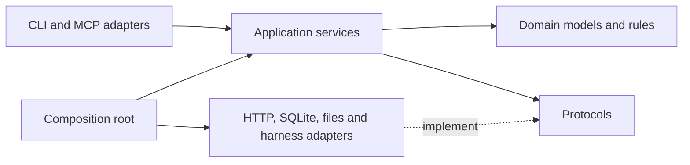

# Python design

## Structure and dependencies

Use Python 3.12 as the initial application target, `uv` for environments and a committed lockfile, Pydantic for external schemas, Typer for CLI, asyncio for bounded I/O, SQLite for local persistence, HTTPX for target transport, and a small ASGI service for target/broker endpoints. Pin actual compatible versions during Phase 0. Use the official Python MCP SDK behind one adapter. The target wheel should not depend on the harness SDK; split optional dependency groups or packages when packaging makes that necessary.

Current layout:

```text
src/oncall/
  config.py          # immutable runtime defaults and environment parsing
  domain.py          # frozen schemas, evidence, reports, policy errors
  parsers.py         # pure Linux-format parsing functions
  probes.py          # bounded /proc and cgroup observations
  service.py         # lifecycle, budgets, cancellation, report validation
  storage.py         # SQLite repository and atomic hashed artifacts
  transport.py       # fixed-destination target client
  target.py          # authenticated typed target API
  broker.py          # composition root, MCP tools and fixed model relay
  fixture_provider.py# keyless protocol fixture; not model reasoning
  harness_runner.py  # DSH SDK entry point for the sandbox container
  http_boundary.py   # authentication and request-size boundary
  faults.py          # operator-only fault strategies, leases and cleanup facade
  lab_fault.py       # bounded target-side CPU, memory and filesystem workloads
  evaluation.py      # deterministic gates and private run bundles
  cli.py             # trusted operator interface and report rendering
tests/                # parser, policy, boundary and lifecycle tests
harness/              # pinned DSH patch profile
docker/               # multi-stage local images
  infra/terraform/      # disposable AWS target and bootstrap roots
docs/
```



The domain imports neither SDKs nor subprocess/network libraries. Parsers accept captured text/bytes and return typed values. A class is justified by owned state or an interchangeable behavior; a parser does not need an abstract factory.

## Responsibilities

| Component | Responsibility | Deliberately excluded |
|---|---|---|
| `RuntimeConfig` | Parse deployment environment once and provide immutable runtime limits | Reading environment variables throughout domain and adapter code |
| `InvestigationService` | Lifecycle, budgets, cancellation, harness orchestration | Linux parsing and HTTP details |
| `ProbeService` | Authorize, reserve budget, collect, persist and return evidence | Model reasoning |
| `PolicyEngine` | Pure decision over caller, capability metadata and request | Executing probes |
| `ProbeRegistry` | Explicit mapping of known names to collectors and schemas | Runtime loading of model-provided code |
| `LinuxProbe` ABC | Shared identity/timing/quality/output Template Method | Persistence and interpretation |
| Probe subclasses | CPU, process, memory, cgroup, filesystem and journal strategies | Cross-capability authority |
| `BoundedCommandRunner` | Fixed executable/argv, pipe limits, deadlines, process cleanup | Accepting arbitrary model commands |
| `EvidenceRepository` | Immutable observations and transactional state updates | Model prompts |
| `ArtifactStore` | Atomic writes, digest, size limits, scoped retrieval | Arbitrary filesystem paths from clients |
| `HarnessAdapter` | Translate start/events/cancel to a runtime | Owning authoritative investigation state |
| `ReportValidator` | Validate schema, citations, target/time scope and uncertainty | Proving semantic truth automatically |
| `FaultController` | Operator lease, TTL, readiness, exact reset and dirty state | Any agent or diagnostic access |
| `TrialScorer` | Identity, required-fact, citation, outcome, cleanup and budget metrics | Judging causal reasoning |

Prefer constructor injection and `typing.Protocol` for structural I/O boundaries. Use ABCs where a
shared lifecycle is enforced: `LinuxProbe`, `JournalReader`, `Sanitizer`, `OperatorExecutor` and
`FaultScenario`. The probe base class applies the Template Method pattern; its subclasses and the
explicit registry apply Strategy. `FaultController` is a facade around scenario lifecycle. Avoid
service locators, global mutable registries and inheritance where pure parser functions suffice.

`RuntimeConfig.from_env()` is called only at process composition roots. Broker, target, transport,
service, probe registry, and harness receive typed values from that immutable object. Deployment
coordinates and credentials can come from environment variables; security limits stay code-owned and
can be overridden explicitly in tests without giving the environment authority to relax them.

The installed application boundary retains this structural contract:

```python
from typing import Protocol

class Probe(Protocol):
    @property
    def metadata(self) -> "ProbeMetadata": ...

    async def collect(self, request: "ProbeRequest",
                      context: "ProbeContext") -> "Observation": ...

class TargetClient(Protocol):
    async def collect(self, request: "AuthorizedProbeRequest") -> "Observation": ...

class EvidenceRepository(Protocol):
    async def append(self, evidence: "Evidence") -> None: ...
    async def get(self, investigation_id: str, evidence_id: str) -> "Evidence": ...

class HarnessAdapter(Protocol):
    async def run(self, context: "InvestigationContext") -> "ProposedReport": ...
    async def cancel(self, investigation_id: str) -> None: ...
```

Use frozen dataclasses for internal value objects and validated discriminated unions at untrusted boundaries. Avoid a universal `dict[str, Any]` for probe facts: define `CpuSample`, `MemorySnapshot`, `CgroupMemorySnapshot`, `FilesystemSnapshot` and corresponding schemas. Use enums for status and error codes; preserve optional values as missing, never zero-fill them.

Scope-sensitive names are part of correctness. CPU fields use `probe_cgroup_*`; filesystem state uses
`probe_view_readonly` because systemd hardening can make the collector namespace read-only while the
operator workload mount remains writable.

## Concurrency and lifecycle

One event loop owns one investigation. Use a semaphore for at most two low-risk target observations. Reserve budget atomically before dispatch; a failed call still consumes its attempt. Target service has an independent semaphore and deadline cap. Intrusive operations, when added, take an exclusive target slot.

Cancellation propagates through the service to transport and local child processes. A lost client must not leave a target command running indefinitely: target deadlines are mandatory even if cancellation RPC fails. Use process groups for subprocess collectors, drain stdout/stderr concurrently, kill on output limit or timeout, then reap. Never use `shell=True`; arguments derive from validated typed fields and fixed templates. `/proc` reads also need byte and traversal limits.

The repository serializes its one SQLite connection with a re-entrant lock because MCP sync tools
run in FastAPI worker threads. Transactions are small and never span an awaited target probe. Measured
storage operations remain negligible for one active investigation; move them to a dedicated DB worker
if evaluation shows event-loop latency. The synchronous DSH SDK runs in the separate agent process. No
Redis/Celery is needed.

## Persistence

The schema contains `runs`, immutable `evidence`, append-only `events`, and versioned `hypotheses`;
artifact bytes live in the filesystem and their hashes/IDs live in evidence. Foreign keys validate
ownership, and hypothesis updates insert a new version instead of mutating observations. WAL is
appropriate for the local Docker volume, not a network filesystem.

Write artifacts to a temporary file, cap size, hash, atomically rename, then commit metadata and evidence together. A crash between rename and commit may leave an orphan file; a later sweep removes only unreferenced files older than a grace period. If storage fails, do not return an unpersisted evidence ID as a successful observation. Persist hypotheses as versioned interpretations, not edits to evidence.

Export ordered audit JSONL and JSON/Markdown reports from stored state. A content hash detects corruption; it does not make the local store tamper-proof against its administrator. Keep schema migration scripts small and versioned.

## Large observation flow

The target caps procfs and journal reads before materializing an observation. Journal data is sanitized
there, then the HTTPS layer compresses JSON with gzip. `HttpTargetClient` bounds the compressed
`Content-Length` and streams at most 2 MiB of decoded data. The broker persists raw sanitized text once
and returns typed facts plus an evidence/artifact reference to the agent. Artifact reads are scoped to
the active investigation and paged by byte offset, at most 16 KiB, with SHA-256, total bytes, UTF-8-safe
next offset and line bounds. This is a Claim Check pattern: large payloads stay in the trusted store
while messages carry stable references. It avoids repeated transfer without dropping the captured data.

## Harness integration contract

Phase 0 must demonstrate launch, one MCP tool call, structured output, cancellation, isolated home/workspace, and explicit provider configuration. Use a fresh harness session per independent evaluation. Keep diagnosis state in Python and expose `get_investigation_state`, `update_hypothesis`, and `submit_report` alongside probes.

The controller-facing harness adapter dispatches to a thin sandbox runner. The SDK wrapper and the bundled runtime execute inside the agent container, never beside AWS credentials in the broker. Operator-started containers communicate over a scoped job/event channel; the runner cannot submit arbitrary broker jobs, change its target or increase budgets. If the SDK needs a provider credential value, use only a relay-scoped token accepted by the fixed-destination relay; the real provider key remains outside the sandbox.

A stock loop plus a constrained profile is the initial implementation. The official [DeepSeek Python SDK guide](https://github.com/deepseek-ai/deepseek-harness/blob/master/docs/user/guide/python-sdk.md) documents packaged runtime execution; its minimal profile lacks compaction and permits broad shell access to visible files. It is not the final sandbox policy. Verify and disable any session-log upload behavior before using incident data. Pin the tested runtime and profile together.

Native TypeScript context/policy hooks may be added after a reproducible failure is recorded. Python services remain authoritative. Codex can consume the same MCP interface; [official MCP documentation](https://developers.openai.com/codex/mcp) describes stdio and Streamable HTTP support. Exact runtime APIs belong in adapters and must be checked against the pinned release.

## Code quality checks

Use Ruff, a type checker, pytest and package-build checks. Fixtures test semantics rather than mocking every method. Contract tests verify the same JSON schemas at broker and target. Linux integration tests run in a Linux VM/EC2 target; macOS unit success does not validate host diagnostics. CI defaults to offline fixtures, never provisioning AWS or calling paid models on every pull request.
