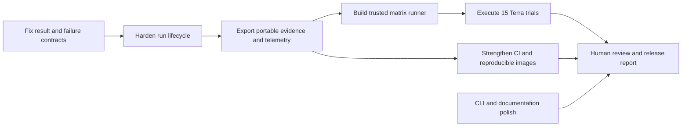

# MVP release hardening plan

This plan converts the current Day 4 prototype into a defensible MVP release. It starts from the
measured state on 2026-09-24: substrate trials pass 15/15, one Terra CPU report passes human review,
one mini-model report is retained as a failure, and P0 requirements R01 and R16 remain partial.

The release target is one reproducible, same-model matrix containing three CPU, three cgroup-OOM,
three filesystem, three healthy, and three unavailable trials. Every trial must have an explicit
terminal result, independent scenario truth, exact environment metadata, portable evidence, cleanup
proof, deterministic scoring, and a retained human review. Failed and invalid trials stay visible.

## Dependency order

Do not spend API or EC2 time on the release matrix until the first four stages pass locally. Existing
live runs remain development evidence; the clean matrix should be generated by the final runner.

## Gap register

| ID | Priority | Current rough edge | Release finish condition |
|---|---|---|---|
| H01 | Blocker | R01/R16 have one passing Terra CPU trial rather than a 15-trial same-model matrix | All 15 planned trials run with Terra; individual and aggregate results retain every failure |
| H02 | Blocker | An unavailable target produces repeated tool exceptions and a cancelled state; `Report` requires at least one cited claim, while evaluation expects an inconclusive report with no observations | An unavailable trial ends in a valid, explicit insufficient-evidence result and scores without invented evidence |
| H03 | Blocker | Evaluation bundles contain evidence metadata and hashes but not `sanitized-artifacts/`; deleting the Docker volume removes the raw captures | Each bundle contains sanitized captures whose SHA-256 values match its evidence index and a bundle checksum manifest |
| H04 | Blocker | Substrate trials, live investigations, evaluation packaging, and cleanup are separate manual commands | One trusted operator runner owns setup, readiness, investigation, export, scoring, cleanup, recovery, and resume state |
| H05 | Blocker | Harness timeout or CLI interruption can kill the Docker client without proving that its `compose run` container exited; CLI converts harness failures to `cancelled` | Each run has a deterministic container identity, bounded logs, `finally` cleanup, and distinct completed/inconclusive/failed/cancelled terminal states |
| H06 | Blocker | The manifest omits image digests, lock/profile hashes, harness version, AMI/kernel, architecture, credit mode, and provider compatibility settings | A fresh bundle is sufficient to identify the exact code, runtime, target, prompt, policy, images, and model request configuration |
| H07 | Blocker | Provider stream usage, per-call latency, response bytes, retries, and upstream failure class are not recorded | Run metrics contain model calls, latency, bytes and tokens when returned; unavailable fields are explicitly `null` with a reason |
| H08 | Blocker | Human review is folded into `score.json`; reviewer, rubric version, timestamp, and notes are not retained as a first-class artifact | Every live trial has immutable `review.json`; aggregate generation refuses pending reviews |
| H09 | Must fix | `doctor` proves target readiness but not OpenAI key/model/tool compatibility; Terra behavior is selected by a model-name conditional | A typed provider profile owns payload adaptation, and a safe opt-in provider preflight validates one minimal tool-capable request |
| H10 | Must fix | `status`, `report`, and `cancel` operate on the active/latest run while the requirements show run IDs; failures can still surface rough HTTP/Docker errors | Commands accept an optional run ID where meaningful, expose `--json` for automation, and print concise remedies and stable exit codes |
| H11 | Must fix | CI installs default dependencies while the documented command uses all extras; CI omits Compose, Terraform, image build, and fixture smoke checks | CI uses the frozen full dependency set and checks Python, package install, Compose, Terraform, Docker build, and one keyless fixture run |
| H12 | Must fix | Docker rebuilds do not consume the complete `uv.lock`; transitive dependencies may drift, and image tags still say `day1` | Images are built from the frozen lock, labeled with revision/version, and tagged `mvp` or the release version |
| H13 | Must fix | Compose silently reads a developer `.env`, so the README's nominal fixture quick start may launch a paid live provider; provider/model are not prominent in readiness | Fixture and live startup commands choose their env file explicitly, and `doctor` displays provider, model, target and storage health without secrets |
| H14 | Must fix | Teardown proof is a manual list of AWS queries and local checks | A read-only `verify-clean` command emits machine-readable Docker/AWS inventory results and fails if a project resource remains |
| H15 | Polish | Source-revision metadata can be `dirty`, CLI proposal differs from implementation, and historical documents contain phase-specific wording | Cut from a clean tagged revision; update the CLI contract, screenshots/output examples, status pages, and demo script from final artifacts |
| H16 | Measure or disclaim | Probe CPU is measured, but RSS, EC2 CPU credits, provider tokens, and workload-latency perturbation are absent | Record RSS and credit state. Record workload latency only if the presentation makes a latency/low-overhead claim; otherwise keep it explicitly unmeasured |

## Stage 1 — make terminal results honest

Estimated effort: 2–3 focused hours.

1. Change the report domain contract so `completed` requires one or more evidence-backed claims, while
   `inconclusive` may contain zero claims. A zero-claim result must contain limitations and next steps.
2. Expose a sanitized run-level failure summary through `get_investigation_state`: failure class,
   affected capability, attempt count and timestamps. Do not turn transport errors into target facts.
3. Teach the harness prompt to stop after a bounded number of connection failures and submit a
   zero-claim inconclusive result.
4. Add `InvestigationService.fail(reason_code)` and reserve `cancelled` for an operator cancellation.
   A harness crash, provider rejection, timeout, and target unavailability must remain distinguishable.
5. Update `TrialScorer` to score the unavailable control from the inconclusive terminal result plus
   recorded connection failures. Citation integrity is valid for an empty claim list only in this
   result form.

Acceptance:

- A stopped target yields one accepted inconclusive result, zero evidence claims, a non-empty failure
  summary, and no healthy assertion.
- A user cancellation yields `cancelled`; a harness crash yields `failed`; a deadline yields
  `inconclusive` with a deadline reason.
- Tests cover unavailable, permission-denied, provider failure, timeout, user cancellation, and a
  model that incorrectly tries to submit a completed zero-claim report.

## Stage 2 — own the complete run lifecycle

Estimated effort: 3–4 focused hours.

Introduce a small `InvestigationRunner` application service behind the CLI. It should use injected
process, broker, clock, and artifact-export ports rather than embedding more subprocess logic in the
Typer command.

1. Give the agent container a name derived from the investigation ID. Capture bounded stdout/stderr to
   the run directory while keeping raw harness JSON out of the terminal.
2. On success, timeout, interrupt, or exception, stop and remove that exact container, cancel or fail
   the exact broker run, and verify no matching container remains.
3. Record start and finish times directly. Do not infer an unavailable trial's duration from an empty
   evidence list.
4. Make CLI exit codes stable: success, inconclusive, operator cancellation, configuration error,
   target/provider unavailable, and internal failure.
5. Add `oncall runs`, `oncall status [RUN_ID]`, `oncall report RUN_ID`, and
   `oncall cancel [RUN_ID]`. Preserve readable output and add `--json` for scripts.

Acceptance:

- Kill the terminal, exceed the harness timeout, reject a provider call, and disconnect the target;
  every case leaves no agent container and retains a queryable terminal state.
- Recreating the broker marks a running investigation interrupted while preserving its prior events,
  evidence, failure reason, budgets, and timing.

## Stage 3 — make every trial portable and measurable

Estimated effort: 4–5 focused hours.

1. Add an authenticated admin artifact-export endpoint scoped by investigation and artifact ID. Export
   after report acceptance and before deleting the evidence volume.
2. Copy each sanitized raw capture into `sanitized-artifacts/`, verify it against
   `artifact_sha256`, and write `checksums.sha256` for every bundle file. Never export credentials,
   scenario truth into the agent view, or unsanitized journal fields.
3. Expand `TrialManifest` with:
   - Git revision and dirty/diff digest;
   - `uv.lock`, harness patch, policy and system-prompt hashes;
   - Python, DSH, package and schema versions;
   - broker/agent/target image IDs and Compose configuration hash;
   - provider API mode, requested model, reasoning effort and output limit;
   - AWS region, AMI, kernel, architecture, instance type and CPU-credit mode;
   - run start/end, budgets, randomized order, scenario seed and cleanup result.
4. Add relay metrics without changing streamed content: request count, HTTP status class, duration,
   response bytes, provider request ID when safe, retry count, and final usage fields. Request streaming
   usage when the selected provider profile supports it.
5. Record probe CPU and RSS plus EC2 credit balance/state. Use `null` plus an explanation for a metric
   the API/runtime does not expose.
6. Write `review.json` separately with rubric version, reviewer identifier, timestamp, diagnostic
   result, unsupported-claim count and concise rationale.

Acceptance:

- Extract a bundle after `docker compose down --volumes`; every checksum still verifies and a reviewer
  can inspect the cited raw lines.
- A no-usage fixture run records token telemetry as unavailable rather than zero.
- Bundle validation rejects missing artifacts, identity mismatch, dirty cleanup, pending review, or a
  checksum mismatch.

## Stage 4 — automate the release matrix

Estimated effort: 4–6 hours to implement and rehearse; 5–8 hours wall time for the live matrix,
depending on Terraform, SSM and provider latency.

Create a trusted `oncall evaluate-matrix` command or equivalent script. It is operator-only and never
appears in the agent MCP registry.

1. Preflight credentials by presence only, provider/tool compatibility, Terraform outputs, target
   identity, boot ID, protocol, capabilities, clean fault state, artifact capacity and expected model.
2. Generate a deterministic randomized order from a recorded seed for the 15 trials.
3. For each trial: verify reset, inject or establish the condition, independently verify readiness,
   start a fresh model session, export the terminal state and artifacts, clean up in `finally`, verify
   reset, score mechanical gates, then checkpoint the matrix manifest.
4. For unavailable trials, close the SSM tunnel only after recording the expected target identity;
   restore it and pass readiness before proceeding.
5. Resume only at a trial boundary. A setup failure creates an invalid trial entry and remains in the
   denominator report; it is never silently retried into a pass.
6. Stop the matrix on failed cleanup or identity/boot change. Mark the target dirty and replace it
   before any further trial.
7. Generate `matrix-summary.json` and `matrix-summary.md` with per-scenario pass counts, individual
   failures, evidence completeness, unsupported claims, calls, bytes, tokens, latency, target overhead
   and cleanup status.

Acceptance:

- A fixture rehearsal completes one trial of every scenario, including unavailable, with five valid
  bundles and verified cleanup.
- The live Terra matrix contains exactly 15 planned trials. CPU, OOM and filesystem each meet at least
  two of three diagnostic passes; healthy and unavailable each behave correctly in three of three.
- All material claims resolve to the bundled evidence and every live trial has completed human review.

## Stage 5 — provider, CI and build hardening

Estimated effort: 3–4 focused hours.

1. Replace the Terra string conditional with a typed provider-profile protocol or strategy selected
   from an explicit registry. The profile owns supported API, temperature behavior, reasoning effort,
   streaming usage and tool-call compatibility.
2. Add `oncall doctor --provider` as an opt-in paid preflight. It sends one minimal bounded request,
   reports model/tool compatibility and safe HTTP status, and never displays the key.
3. Build images from the frozen lock rather than resolving transitives with bare `pip install .`.
   Label images with package version, source revision and lock digest. Rename `:day1` tags.
4. Change CI to `uv sync --frozen --all-extras --dev`, then run Ruff, formatting, strict mypy, tests,
   package build/install smoke, Compose config, Terraform format/validate, Docker image build, and a
   fixture-mode end-to-end smoke investigation with teardown verification.
5. Add a matrix-independent release gate that scans tracked paths for `.env`, Terraform state/plan,
   private keys, provider tokens and exported incident artifacts.

Acceptance:

- A clean clone builds the same locked images and runs the fixture investigation from README commands.
- CI fails on missing harness dependencies, invalid Terraform/Compose, stale formatting, failed
  teardown, or accidentally tracked secret/state patterns.

## Stage 6 — operator and presentation polish

Estimated effort: 2–3 focused hours.

1. Make environment selection explicit:
   - fixture: `docker compose --env-file .env.example ...`;
   - live: `docker compose --env-file .env ...`.
2. Enhance `doctor` with provider, model, target ID, protocol, storage writability/free space, active
   run and last terminal run. Keep provider connectivity opt-in to avoid surprise API spend.
3. Add a read-only `oncall verify-clean` that checks matching Docker resources locally and all tagged
   AWS resources in the configured region. Emit both a Rich table and JSON.
4. Align README and requirements with the implemented CLI. Add one final terminal-output example, one
   passing report, one retained failure, the matrix summary, exact teardown, and a presentation runbook.
5. Cut the MVP from a clean revision, tag it, rebuild artifacts, run the release checklist, and record
   the tag and image digests in the final matrix.

Acceptance:

- A new developer can follow only the README to run fixture mode without an API key and without
  accidentally selecting the live provider.
- The demo can switch to a clearly labelled offline bundle if AWS or the provider is unavailable.
- Final teardown returns empty Docker and AWS inventories while retaining portable evaluation bundles.

## Final release gate

The MVP is ready to present when all of the following are true:

- H01–H15 are closed. H16 is either measured or explicitly excluded from release claims.
- The 15-trial Terra matrix is complete, human-reviewed and checksum-valid.
- R01–R18 are reported from final artifacts; no substrate trial is counted as a model-quality pass.
- Unit/static/build/fixture integration checks pass from a clean clone.
- Fault cleanup and Docker/AWS teardown checks pass.
- The release is tied to one clean Git tag and immutable image/bundle digests.
- Known limitations state that the system diagnoses synthetic single-host incidents, does not
  remediate, and makes no workload-latency claim unless H16 is measured.

## Scope held for after the MVP

R19–R24 remain later work: the Codex comparison, detached/background operation, approval-gated
intrusive probes, native harness hooks, custom agent loops, direct-shell baselines, advanced Linux
signals, fleet operation and a web UI. None is required to close the current release evidence gap.

The immediate critical path is H02 → H05 → H03/H06/H07/H08 → H04 → H01. This sequence prevents an
expensive matrix from producing incomplete or non-portable evidence.

The [pre-matrix architecture review](pre-matrix-architecture-review.md) applies this sequence to the
Terra OOM/filesystem path and records the required before/after OOM evidence design.
