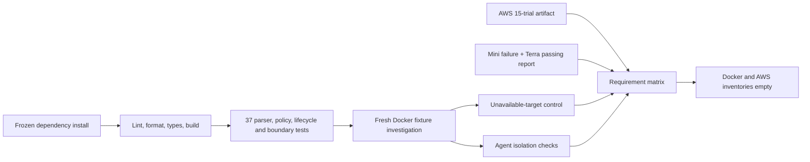

# Requirements verification — 2026-09-24

This document records the executable verification run after the Day 4 core review and CLI display
work. It separates fresh checks, retained measured trials, and incomplete release gates. All incident
data is synthetic. No credential value appears in this file.

## Verification flow



## Fresh command results

| Check | Command | Result |
|---|---|---|
| Frozen install | `uv sync --frozen --all-extras --dev` | Pass; project rebuilt and installed from the lockfile |
| Lint | `.venv/bin/ruff check src tests scripts` | `All checks passed!` |
| Formatting | `.venv/bin/ruff format --check src tests scripts` | `30 files already formatted` |
| Strict typing | `.venv/bin/mypy` | `Success: no issues found in 17 source files` |
| Automated tests | `.venv/bin/pytest -q` | `37 passed in 0.95s` |
| Package | `.venv/bin/python -m build --no-isolation` | sdist and wheel built successfully |
| Compose | `docker compose --profile agent config --quiet` | Pass |
| Terraform format | `terraform fmt -check -recursive infra/terraform` | Pass |
| Bootstrap Terraform | `terraform validate` in `infra/terraform/bootstrap` | `Success! The configuration is valid.` |
| Lab Terraform | `terraform validate` in `infra/terraform/environments/lab` | `Success! The configuration is valid.` |
| CLI contract | `.venv/bin/oncall investigate --help` | `--symptom` present with its documented default |

The 37 tests include malformed schemas, policy and artifact ownership, UTF-8 paging, hypothesis
versioning, citation validation, storage recovery, deadlines, cancellation, concurrent budget
reservation, target concurrency of two, in-flight idempotency, disconnect shielding, wrong target
credentials, observation byte integrity, fault readiness/cleanup plans, evaluator controls, Terra
provider adaptation, and terminal-summary redaction.

## Fresh local end-to-end evidence

The lab was rebuilt from current source and started in keyless fixture mode. `oncall doctor` reported:

```text
Broker        ready
Provider      fixture
Target        docker-target
Protocol      3
Capabilities  inspect_cgroup_memory, inspect_filesystem,
              inspect_memory_pressure, query_service_journal,
              rank_processes, sample_cpu_pressure
```

A 90-second/two-worker CPU condition was created with:

```bash
docker compose exec -d target \
  python -m oncall.lab_fault cpu --seconds 90 --workers 2
```

Fixture run `83df0d492d504051922990e0f8bc797d` completed through DSH and MCP in 10.3 seconds:

```text
Outcome      inconclusive
Probe calls  5
Captured     8,178 bytes
Evidence     CPU, process, host memory, self cgroup memory, root filesystem
```

The fixture intentionally returns `inconclusive`; its purpose is to prove tool transport, local sandbox
computation, evidence admission, hypothesis persistence, report validation, and export. The report is
stored under `.local/reports/83df0d492d504051922990e0f8bc797d/`.

For the unavailable control, the target container was stopped while the broker and agent remained up.
Run `e2f260ca5a6d46cdb0ae4108f76389a8` produced no evidence, recorded five bounded `ConnectError` probe
failures, saved `failed-state.json`, and did not emit a healthy report. The target was restarted and
`oncall doctor` returned ready again. This is an explicit failed investigation rather than an
inconclusive report because the report schema currently requires at least one evidence-backed claim.

## Fresh sandbox boundary evidence

The untrusted agent container passed these assertions:

```text
credentials_absent=pass
docker_socket_absent=pass
root_filesystem_readonly=pass
direct_target_access=denied
metadata_access=denied
broker_only_route=pass
```

The agent receives a broker token only. It has no provider/AWS credential, target network, Docker
socket, writable image filesystem, metadata route, or arbitrary target connection.

## Retained live-model evidence

Both live runs used the same typed capabilities and report validator:

| Run | Model | Mechanical gate | Human review | Unsupported claims |
|---|---|---:|---:|---:|
| `e572445745574c50bc5ce42186b888f0` | `gpt-4.1-mini` | Pass | Fail | 1 |
| `ed9c2cd6672f4772b2c94043a5b3915e` | `gpt-5.6-terra` | Pass | Pass | 0 |

The Terra report correctly distinguished 28.38% shared-host utilization from the one-core cgroup
quota, cited 2,012,286 throttled microseconds, and attributed about 92% of one core to two Python
workers. Its bundle is `.local/evaluation/c4ef7b0c9baf464c8ac9c980471bff2e`.

The mini-model report passed schema/citation checks but made one unsupported causal claim. It remains a
failure in `.local/evaluation/7fc79198eb014ca38e6b7150a3d64b87`; it was not edited into a pass.

## Retained repeated AWS evidence

The ignored raw artifact `.local/aws/day4-substrate-i-092670022c28c6759.json` contains three independent
repetitions of each scenario on a disposable `t3.micro`:

| Scenario | Result | Independent condition check |
|---|---:|---|
| CPU | 3/3 | 100% host busy and one dominant worker near 100% of one core |
| Cgroup OOM | 3/3 | New operator truth counters `(0,1)`, `(1,2)`, `(2,3)` at a 48 MiB limit |
| Filesystem full | 3/3 | Controlled write `errno 28`; 4,190,208 bytes remained |
| Healthy | 3/3 | Host busy 0–0.5%; self-cgroup OOM delta zero |
| Unavailable | 3/3 | Closed SSM tunnel returned bounded `ConnectError` |

Probe cgroup CPU during healthy sampling ranged from 0.0016808 to 0.0019894 cores, median 0.0017902.
These are substrate-reliability results. Only the two reports above are model-quality trials.

## How scenario conditions are created

| Scenario | Operator action | Readiness/ground truth | Cleanup |
|---|---|---|---|
| Healthy | Start from a verified reset; inject nothing | Target ready, no active workload/sentinel, self-cgroup OOM delta zero | No fault cleanup; readiness rechecked |
| CPU | Local bounded workers or AWS transient systemd unit with two workers and TTL | Unit active; interval CPU/process samples must show the condition | Stop exact unit/process group; verify inactive |
| Cgroup OOM | AWS sentinel keeps `oncall-lab.slice` alive; set `MemoryMax=48M`; allocate 128 MiB | Operator stores the prior `oom_kill` value and requires the new value to be greater | Stop units, reset `MemoryMax=infinity`, remove baseline marker, verify clean |
| Filesystem full | Write only the marked 1 GiB dedicated lab EBS mount, reserving 4 MiB | Marker must match; workload write must return `errno 28`; available bytes must be below 32 MiB | Remove only manifest-owned files and verify more than 32 MiB recovered |
| Unavailable | Stop local target or close the fixed SSM tunnel | Connection must fail within its deadline; missing observations cannot become zero/healthy | Restart target/tunnel and rerun readiness |

Fault injection is reachable only from the trusted operator path. The diagnostic MCP registry contains
no mutation capability. AWS `lab-start` accepts only `cpu`, `memory`, or `filesystem`, enforces a
30–120 second lease, verifies readiness, and records dirty state if exact cleanup fails.

## P0 requirement matrix

| ID | Status | Evidence and remaining work |
|---|---|---|
| R01 | Partial | CPU has a passing Terra diagnosis; memory and filesystem have repeated substrate evidence but still need same-model report trials |
| R02 | Pass | Fresh sandbox checks prove agent/target separation and broker-only routing |
| R03 | Pass | Typed validation, unknown-field, shell-shaped input, traversal, and registry tests pass |
| R04 | Pass | Strictly typed Python domain/parsers/policy run without harness/AWS imports |
| R05 | Pass | Terra used DSH tools and exported a validated report; SDK/runtime are pinned |
| R06 | Pass | Fixture lifecycle executed local sandbox Python analysis over admitted state |
| R07 | Pass | Parser/quality fixtures cover reset, malformed, absent, partial, unsupported, and scope cases |
| R08 | Pass | Report citations resolve to immutable evidence and artifact hashes |
| R09 | Pass | Captures, decoded responses, and UTF-8 artifact pages have independent hard limits |
| R10 | Pass | Versioned hypotheses and ordered events survive harness turns and reconstruct reports |
| R11 | Pass | Policy, privilege, sensitivity, duration, output, concurrency, and target caps are enforced outside the model |
| R12 | Pass | Budget/cancellation tests and disconnect-shielded target execution pass |
| R13 | Pass | Fresh unavailable run retained five `ConnectError` events and no fabricated report |
| R14 | Pass | Clean AWS apply, replacement, second clean deployment, and destroy were exercised in Days 2–4 |
| R15 | Pass | CPU/OOM/filesystem setup, independent readiness, TTL, reset, and cleanup passed repeatedly |
| R16 | Partial | Raw repeated substrate trials and scored live bundles exist; the 15-report same-model matrix is incomplete |
| R17 | Pass | 37 tests, Ruff, strict mypy over 17 modules, and package build pass |
| R18 | Pass | README quick start/teardown, Mermaid designs, ADRs, demo plan, measured results, and this matrix exist |

P1 requirements R19–R22 and P2 requirements R23–R24 remain follow-on scope and were not relabelled as
core passes.

## Core release-gate conclusion

Policy, provenance, fault safety, teardown, packaging, and infrastructure gates pass. The core release
is not yet statistically complete: the project needs three same-model reports for each of CPU, OOM,
filesystem, healthy, and unavailable scenarios, with all failures retained and human-scored. Terra has
one passing CPU trial. Token usage is still unavailable from the current relay, and workload-latency
perturbation has not been measured.

## Resource teardown proof

After verification, `docker compose down --volumes --remove-orphans` removed the target, broker,
networks, and both named volumes. `docker compose ps --all --format json` returned no rows.

Fresh AWS service inventories all returned `[]` for active project instances, EBS volumes, VPCs,
security groups, IAM roles, instance profiles, SSM parameters, SSM documents, active SSM sessions, and
`linux-oncall-*` S3 buckets. No project cloud resource remains active.
